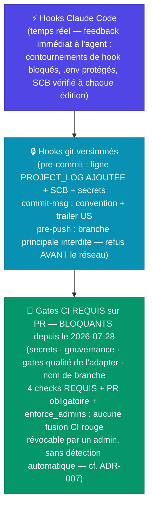
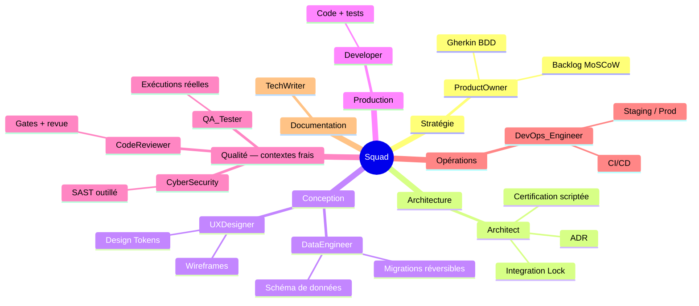
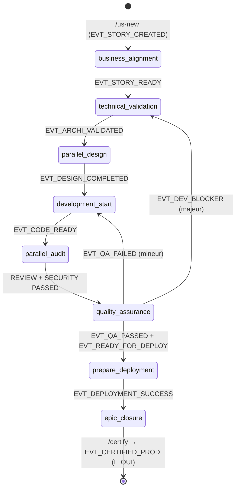

# 📖 Guide de la Squad — Concentration

> **Audience** : tout intervenant rejoignant le projet — développeur, agent LLM, auditeur externe.
> **Objectif** : comprendre comment fonctionne la factory, comment tracer ses actions, et comment
> faire évoluer ce système.
> **Compléments** : [`docs/governance/CONSTITUTION.md`](governance/CONSTITUTION.md) (principes
> non-négociables) · [`docs/governance/TRACKS.md`](governance/TRACKS.md) (workflow scale-adaptive)
> · [`docs/governance/STACK_PROFILE.md`](governance/STACK_PROFILE.md) (normes de la stack)

---

## Table des matières

1. [Vue d'ensemble](#1-vue-densemble)
2. [L'équipe — 10 agents](#2-léquipe--10-agents)
3. [Workflow de production](#3-workflow-de-production)
4. [Détail des phases](#4-détail-des-phases)
5. [Gouvernance et traçabilité](#5-gouvernance-et-traçabilité)
6. [Forces, faiblesses et axes d'amélioration](#6-forces-faiblesses-et-axes-damélioration)
7. [Faire évoluer la factory / démarrer un nouveau projet](#7-faire-évoluer-la-factory--démarrer-un-nouveau-projet)

---

## 1. Vue d'ensemble

Cette factory est une **software factory pilotée par des agents LLM spécialisés**. Chaque agent a
un rôle précis et un périmètre non-négociable, issue du gabarit `factory-starter-kit`.

Principe cardinal : **une règle sans mécanisme d'application est un vœu, pas une règle**. Chaque
règle de gouvernance a donc **3 étages d'enforcement** :

> ✅ **Depuis le 2026-07-28, l'étage 3 BLOQUE — et c'est la première fois.** La protection de branche est
> **APPLIQUÉE** : **4 status checks REQUIS**, **PR obligatoire**, `enforce_admins` en vigueur
> (`enforcement_level: "everyone"`). L'étage 3 est bien, lui, **insensible aux bypass locaux** — il vit
> côté serveur. Preuves brutes : [`reports/US-00.7/applied_state/`](../reports/US-00.7/applied_state/) —
> dont 3 refus émis par le serveur depuis un clone sans hooks. Par le principe cardinal ci-dessus,
> l'enforcement de la branche principale **n'est plus un vœu**.
>
> ⚠️ **Quatre bornes, à ne pas franchir dans la lecture.** (0) **Ce qui est PROUVÉ est que les 4 contextes
> sont REQUIS** — état de l'API, et lecture directe du serveur (« *4 of 4 required status checks are
> expected* »). Qu'**une tentative de fusion** avec un contexte non vert soit **refusée** en découle
> logiquement, mais **n'a pas encore été observée** sur ce dépôt : c'est la tâche **T11** d'US-00.7,
> **non exécutée** à ce jour. Écrire « aucune fusion possible avec la CI rouge » est donc une **inférence
> raisonnée**, pas une preuve — et doit être lue comme telle. (1) Ce qui est acquis se limite à : **4 gates
> requis + PR obligatoire + `enforce_admins`, à la date de la mesure, pour les contextes effectivement
> rapportés et pour l'acteur employé** — rien n'est prouvé pour un jeton d'application, l'interface web,
> une PR de fork ou réouverte. (2) La règle est **révocable** par un administrateur **sans aucune
> détection automatique** : la garantie est « contrainte de plateforme **+ audit périodique** », pas
> davantage. (3) Tout ceci est **conditionné à la visibilité PUBLIQUE** du dépôt — un retour en privé
> ramènerait le 403, et la **dérogation `EVT_WAIVER_GRANTED`** (US-00.4), **éteinte le 2026-07-28**,
> redeviendrait ouverte. Voir [ADR-007](adr/ADR-007-application-protection-branche.md) *(remplace
> ADR-006)* et [`GIT_PROTECTION.md`](GIT_PROTECTION.md).
> *(Constat inverse du 2026-07-26 — « l'étage 3 ne bloque rien », 3ᵉ fausse affirmation corrigée alors
> dans ce fichier — **exact à sa date**, levé le 2026-07-27 par le passage du dépôt en public.)*

**Deuxième principe cardinal (Constitution Art. 2)** : *celui qui produit ne certifie pas*.
Les audits sont réalisés par des **subagents à contexte frais** (ils n'ont pas accès à la
conversation qui a produit le code) et leurs verdicts s'appuient sur des **exécutions d'outils**,
jamais sur une opinion seule.

L'@Architect reste le chef d'orchestre — mais son pouvoir de certification est lui-même
**scripté** : `Certifié Prod = 🚀 OUI` n'est possible que si le rituel `/certify` passe.

---

## 2. L'équipe — 10 agents

> **Règle d'or** : aucun agent ne sort de son périmètre. Le modèle LLM **réellement utilisé** est
> enregistré dans chaque événement de trace (`docs/trace/US-XXX/events.jsonl`, champ `model`).

Chaque agent est défini en **un seul endroit** : son subagent natif `.claude/agents/<agent>.md` —
outils restreints, contexte d'entrée scopé, normes du rôle, sorties obligatoires. Les commandes
qualité (lint, typecheck, tests…) n'existent qu'à un seul endroit : `factory.config.json` →
`adapter.components.*.gates`, exécutées via `python scripts/run_gates.py`.

### Les 5 rituels (slash-commands `.claude/commands/`)

| Rituel | Usage |
|---|---|
| `/us-new <EPIC> <titre>` | Crée une US complète : branche, Story File, ligne SCB, Gherkin, track, gates clarify/checklist/analyze, trace. **Élimine les story files rétroactifs.** |
| `/audit-us <US-ID>` | Lance code-reviewer + cyber-security **en parallèle, contextes frais** ; rapports dans `reports/US-XXX/` ; met à jour SCB + trace |
| `/certify <US-ID>` | Gate scripté de certification : conformité SCB + chaîne d'événements + rapports + DoD + gates + déploiement effectif |
| `/sprint-status` | Synthèse lecture seule (SCB, traces, blocages, dettes) |
| `/audit-methodo` | Audit périodique : métriques réelles vs `docs/audit/METRICS.md`, veille bonnes pratiques |

---

## 3. Workflow de production

### Tracks scale-adaptive ([`docs/governance/TRACKS.md`](governance/TRACKS.md))

Le workflow ci-dessous est le track **STANDARD**. Deux variantes existent :
- **QUICK** (fix ≤ 3 fichiers, pas de schéma/API/surface sécurité) : @Developer direct + CI + audit groupé a posteriori ;
- **FULL** (EPIC, migration, surface auth/sécurité/paiement) : STANDARD + ADR obligatoire + designs obligatoires + E2E dédiés + revue humaine de PR.

Le track est choisi à la création (`/us-new`) sur critères objectifs et tracé `EVT_TRACK_SELECTED`.

### Diagramme (track STANDARD)

```mermaid
graph LR
    A[Brief] --> B{"/us-new"}
    B --> C[PO: Story File + AC + Gherkin]
    C --> D[Architect: Validation + ADR + Track]
    D --> E{Design parallèle}
    E --> F[UXDesigner: Wireframes + Tokens]
    E --> G[DataEngineer: Schéma + Migration]
    F --> H["Architect: Integration Lock<br/>EVT_DESIGN_COMPLETED"]
    G --> H
    H --> I["Developer: Code + Tests<br/>EVT_CODE_READY"]
    I --> J{"/audit-us — contextes frais"}
    J --> K[CodeReviewer: gates + revue]
    J --> L[CyberSecurity: SAST outillé]
    K --> M[QA_Tester: exécutions réelles]
    L --> M
    M --> N{Verdicts OK?}
    N -- Échec mineur --> I
    N -- Échec majeur --> O[Architect: Arbitrage]
    O --> I
    N -- EVT_QA_PASSED --> P[Architect: EVT_READY_FOR_DEPLOY]
    P --> Q1[DevOps: Staging → Prod + health-check]
    Q1 --> R[TechWriter: Docs + CHANGELOG]
    R --> S{"/certify — gate scripté"}
    S --> Z[Certifié Prod 🚀 OUI]

    classDef arch fill:#764ba2,stroke:#4f46e5,stroke-width:3px,color:#fff
    classDef gate fill:#343a40,stroke:#232729,stroke-width:3px,color:#fff
    class B,J,S gate
    class D,H,O,P arch
```

### Les étapes et leurs événements (catalogue : [`scripts/events_catalog.json`](../scripts/events_catalog.json))

| # | Agent | Action | Événement émis |
|---|---|---|---|
| 0 | rituel `/us-new` | Story File + SCB + Gherkin + track | `EVT_STORY_CREATED`, `EVT_TRACK_SELECTED` |
| 1 | @ProductOwner | AC détaillés + Gherkin, PO Visa ✅ | `EVT_STORY_READY` |
| 2 | @Architect | Validation technique + ADR | `EVT_ARCHI_VALIDATED` |
| 3a | @UXDesigner | Wireframes + tokens | `EVT_UX_DESIGN_COMPLETED` |
| 3b | @DataEngineer | Schéma + migration | `EVT_DATA_DESIGN_COMPLETED` (+ `EVT_MIGRATION_SCRIPT_READY`) |
| 4 | @Architect | **Integration Lock** | `EVT_DESIGN_COMPLETED` |
| 5 | @Developer | Code + tests | `EVT_CODE_READY` |
| 6 | rituel `/audit-us` | Audits parallèles, contextes frais | `EVT_CODE_REVIEW_PASSED/FAILED`, `EVT_SECURITY_AUDIT_PASSED/FAILED` |
| 7 | @QA_Tester | Exécution des suites | `EVT_QA_PASSED` / `EVT_QA_FAILED` |
| 8 | @Architect | Autorisation de déploiement | `EVT_READY_FOR_DEPLOY` |
| 9 | @DevOps_Engineer | Staging puis prod + health-check | `EVT_STAGING_DEPLOYED`, `EVT_DEPLOYMENT_SUCCESS/FAILURE` |
| 10 | @TechWriter | Docs + CHANGELOG | `EVT_DOCS_UPDATED` |
| 11 | rituel `/certify` | Gate scripté final | `EVT_CERTIFIED_PROD` |

**La machine à états est appliquée par le code** : `scripts/trace_append.py` refuse d'émettre un
événement dont les préconditions ne sont pas dans la trace (ex. `EVT_QA_PASSED` sans les deux
audits). Seule une dérogation **humaine** tracée `EVT_WAIVER_GRANTED` peut court-circuiter — avec
justification obligatoire.

### Boucles de correction

- **Échec mineur** (bug, test) → retour direct @Developer (`EVT_CODE_REVIEW_FAILED` / `EVT_QA_FAILED`)
- **Échec majeur** (architecture, incohérence Data/UX) → @Architect arbitre (`EVT_DEV_BLOCKER`)
- **Échec staging** → `EVT_STAGING_FAILED` → arbitrage @Architect

---

## 4. Détail des phases

*(Les pré-conditions ci-dessous ne sont pas auto-déclarées : elles sont vérifiées par
`scripts/validate_trace.py` — préconditions d'événements — et `scripts/check_scb_compliance.py` —
règles croisées du SCB, exécutés en PostToolUse, pre-commit et CI.)*

| Phase | Agent(s) | Pré-conditions vérifiées | Livrables |
|---|---|---|---|
| `business_alignment` | @PO | brief suffisant (gate *clarify* de `/us-new`) | Story File (métier), `.feature`, MoSCoW |
| `technical_validation` | @Architect | `EVT_STORY_READY` + `.feature` présent | Section technique du Story File, ADR, consignes |
| `parallel_design` | @UX + @Data | `EVT_ARCHI_VALIDATED` | Wireframes/tokens ; schéma + migration réversible |
| `integration_lock` | @Architect | `EVT_UX_DESIGN_COMPLETED` + `EVT_DATA_DESIGN_COMPLETED` (ou N/A justifiés) | `EVT_DESIGN_COMPLETED` |
| `development_start` | @Developer | `EVT_DESIGN_COMPLETED` (le subagent **refuse** sinon) | Code + tests, branche dédiée, 1 tâche = 1 commit |
| `parallel_audit` | @CodeReviewer + @CyberSecurity | `EVT_CODE_READY` | `reports/US-XXX/{code_review,security}.md` avec sorties d'outils |
| `quality_assurance` | @QA_Tester | les deux `*_PASSED` | `reports/US-XXX/qa.md` (décompte passed/**skipped**/failed) |
| `prepare_deployment` | @DevOps | `EVT_READY_FOR_DEPLOY` | staging → prod → health-check |
| `epic_closure` | @Architect via `/certify` | TOUS les gates (dont `🚀 DEPLOYED`) | `EVT_CERTIFIED_PROD`, `Certifié Prod 🚀 OUI` |

---

## 5. Gouvernance et traçabilité

### 5.1 Les deux vues de la traçabilité

| Vue | Fichier | Public | Validation |
|---|---|---|---|
| **Humaine** | `PROJECT_LOG.md` — tableau unique `\| Date \| @Agent \| Modèle \| Action \| Statut \| Fichiers \|` (blocs narratifs interdits) | relecture rapide | format vérifié par `validate_trace.py` |
| **Machine** | `docs/trace/US-XXX/events.jsonl` — 1 ligne JSON par événement : `ts`, `event`, `us`, `agent`, **`model` réel**, `files`, `evidence{report, commands}`, `rationale` | scripts, audits, CI | schéma + catalogue + machine à états + existence des preuves |

Écriture : `python scripts/trace_append.py --us US-XXX --event EVT_* --agent <role> --model <modèle> --rationale "..." [--report ...] [--command "..."]`
Validation : `python scripts/validate_trace.py --staged|--us US-XXX|--all`

**Cohérence croisée SCB ↔ trace** : une US qui possède un répertoire de trace doit avoir un
événement pour chaque visa affiché dans le SCB (un `✅ 🔍` sans `EVT_CODE_REVIEW_PASSED` tracé est
une violation).

### 5.2 Story Certification Board (SCB)

Matrice de qualité par US — colonnes : PO Visa → Design Data → Design UX → Code (Dev) →
Audit Rev 🔍 → Audit Sec 🛡️ → QA Status → Déploiement (DevOps) → Certifié Prod.

- `Certifié Prod = 🚀 OUI` **exige** `Déploiement = 🚀 DEPLOYED` ;
- `N/A` est un statut légitime **explicite et justifié** dans les Détails des Visas ;
- chaque agent ne modifie que sa colonne, avec preuve dans « Détails des Visas » ;
- cohérence vérifiée **à chaque édition** (hook PostToolUse), au commit et en CI.

### 5.3 Story Files

Document de référence autonome d'une US (`docs/stories/US-XXX-titre.md`, template
[`STORY_FILE_TEMPLATE.md`](stories/STORY_FILE_TEMPLATE.md)). **Le Story File précède le code**
(Constitution Art. 8) — il est créé par `/us-new`, jamais rétroactivement. @Developer refuse de
démarrer si les sections @Architect sont vides.

### 5.4 ADR

Une décision structurante = un ADR immuable (`docs/adr/ADR-XXX-*.md`, template
[`ADR_TEMPLATE.md`](adr/ADR_TEMPLATE.md)), remplacé plutôt que modifié. Le track FULL rend l'ADR
**obligatoire**.

### 5.5 Enforcement automatique — les 3 étages

#### Étage 1 — Hooks Claude Code (`.claude/settings.json` + `.claude/hooks/`)

| Hook | Événement | Effet |
|---|---|---|
| `block_dangerous_bash.sh` | PreToolUse(Bash) | Bloque `--no-verify`, commit/push sur la branche principale, force-push, filter-repo, dé-config `core.hooksPath`, écriture `.env` |
| `protect_files.sh` | PreToolUse(Edit\|Write) | Fichiers `.env` et d'enforcement (hooks, `.claude/settings.json`, `.gitleaks.toml`, `factory.config.json`) modifiables uniquement par l'humain |
| `post_scb_edit.sh` | PostToolUse(Edit\|Write) | Toute édition du SCB déclenche `check_scb_compliance.py` — feedback immédiat |
| `session_start.sh` | SessionStart | Injecte les 5 dernières lignes du PROJECT_LOG + conformité SCB ; alerte si hooks git non installés |
| `check_traceability.sh` | Stop | Rappel traçabilité en fin de tour |

#### Étage 2 — Hooks git versionnés (`scripts/githooks/`, installés par `sh scripts/install_hooks.sh` → `core.hooksPath`)

| Hook | Vérifie |
|---|---|
| `pre-commit` | branche ≠ principale · code staged ⇒ **ligne AJOUTÉE** au tableau PROJECT_LOG · `check_scb_compliance.py` · `validate_trace.py --staged` · synchro config (`factory_sync.py --check`) · `gitleaks protect` |
| `commit-msg` | `type(scope): description` + trailer `US: US-XX.X` (ou `US: none — justification`) |
| `pre-push` | refuse la branche principale |

#### Étage 3 — CI sur PR (`.github/workflows/ci.yml`) — ✅ **REQUISE et BLOQUANTE**

Jobs **requis** par la protection de branche (source des status checks = `factory.config.json`) :
`secrets-scan` (gitleaks) · `governance` (SCB + trace + synchro config) · gates qualité de l'adapter
(`python scripts/run_gates.py`) · `check-branch-name`. Les E2E tournent à part (`e2e.yml` — voir
[`docs/qa/E2E_RUNBOOK.md`](qa/E2E_RUNBOOK.md)) et **ne sont pas** un contexte requis.

> ✅ **Depuis le 2026-07-28, ces 4 jobs SONT des status checks REQUIS** — état de l'API, et lecture directe
> du serveur, qui les énumère lui-même : « *4 of 4 required status checks are expected* ». La fusion en est
> **conditionnée**, **administrateur inclus** (`enforce_admins`). ⚠️ **Borne** : le refus d'une **tentative
> de fusion** n'a **pas encore été observé** sur ce dépôt (tâche **T11** d'US-00.7, non exécutée) — il
> **découle** de l'état constaté, il n'en est pas la preuve. Vérification de l'état :
> `python scripts/factory_sync.py --check-remote` (**exit 0** attendu).
> *(Constat inverse du 2026-07-26 — « aucun de ces jobs n'est requis », trouvé alors par un balayage par
> **motif** après qu'une relecture par liste de fichiers l'avait manqué — **exact à sa date**, levé le
> 2026-07-27.)*
>
> ⚠️ **Conséquences opérationnelles à connaître** : une branche hors `^feat/US-[0-9]+\.[0-9]+.*$` rend sa
> PR **définitivement infusionnable** (`check-branch-name` requis) — donc `chore/`, `docs/`, `hotfix/`, et
> cela touche le **track QUICK** ; `strict: true` **sérialise** les merges ; une seule discussion non
> résolue bloque la fusion. ⛔ **Ne jamais modifier un `name:` de job sans mettre à jour
> `factory.config.json` dans le même changement** : un libellé divergent produit un **verrouillage**.
> Détail : [`GIT_PROTECTION.md`](GIT_PROTECTION.md) §Conditions de fusion et §Plan de retour arrière ·
> [ADR-007](adr/ADR-007-application-protection-branche.md) *(remplace ADR-006)*.

---

## 6. Forces, faiblesses et axes d'amélioration

> Section maintenue par le rituel `/audit-methodo` (périodique, métriques dans
> [`docs/audit/METRICS.md`](audit/METRICS.md)). Vide à l'initialisation — se remplit avec l'usage
> réel du projet.

### 6.1 Forces

| Force | Détail |
|---|---|
| **Gouvernance exécutable** | Chaque règle a 3 étages d'enforcement (agent → git → CI), vérifiables par des tests négatifs (voir `.github/workflows/kit-selftest.yml` côté kit). |
| **Séparation des pouvoirs** | Les auditeurs sont des subagents à contexte frais, leurs verdicts exigent des sorties d'outils. |
| **Traçabilité double vue** | PROJECT_LOG (humain) + JSONL machine-parsable, validation croisée SCB ↔ trace ↔ rapports. |
| **Spec-driven réel** | Story Files créés avant le code, machine à états qui interdit de coder sans design verrouillé. |
| **Proportionnalité** | Tracks QUICK/STANDARD/FULL : le process lourd est réservé aux US à risque. |
| **Cœur stack-agnostique** | La gouvernance ne dépend d'aucune techno — seul l'adapter change. |

### 6.2 Faiblesses actuelles (dettes tracées)

*(à renseigner au fil de l'eau par `/audit-methodo` — aucune dette de naissance sur un projet
initialisé depuis le starter kit : seuils posés sans complaisance dès le premier commit)*

| Faiblesse | Impact | Dette |
|---|---|---|
| — | — | — |

### 6.3 Axes d'amélioration (roadmap)

- Dérouler le Sprint 0 (`US-00.1` → `US-00.6` du `BACKLOG.md`) si ce n'est pas déjà fait.
  *(État au 2026-07-28 : US-00.1/00.2/00.3/00.4 certifiées, **US-00.7** en cours, US-00.5/00.6 à créer.)*
- ✅ **FAIT le 2026-07-28** : `sh scripts/apply_branch_protection.sh gitgdx/Concentration` (droits admin
  requis) — la protection de branche est **appliquée** et son effet **prouvé**
  ([`reports/US-00.7/applied_state/`](../reports/US-00.7/applied_state/)). C'est désormais la **voie
  normale de (ré-)application** en cas de dérive, jamais l'écran *Settings → Branches*. Vérification de
  l'état réel : `python scripts/factory_sync.py --check-remote` (**exit 0** attendu). Voir
  [`docs/GIT_PROTECTION.md`](GIT_PROTECTION.md) et
  [ADR-007](adr/ADR-007-application-protection-branche.md) *(remplace ADR-006)*.
- 🔴 **Passer `/audit-methodo` à échéance régulière** — ce n'est plus seulement pour garder cette section
  vivante : son **point de contrôle 1 bis** est la **seule** barrière contre une **révocation silencieuse**
  de la protection de branche (aucune détection automatique n'existe, le contrôle exigeant des droits admin
  absents du `GITHUB_TOKEN`). Il vérifie aussi que la **visibilité** du dépôt n'a pas changé.

---

## 7. Faire évoluer la factory / démarrer un nouveau projet

Ce projet a été **généré depuis [`factory-starter-kit`](https://github.com/<org>/factory-starter-kit)**
via `python init_factory.py`. Pour démarrer une **autre** application avec la même gouvernance :

1. Récupérer (ou "Use this template" sur) `factory-starter-kit`.
2. `python init_factory.py --name "MonAutreProjet" [--adapter <stack>]`.
3. Dérouler le Sprint 0 comme pour ce projet-ci.

Le cœur (gouvernance, hooks, rituels, agents, scripts d'enforcement) est **identique** d'un projet
à l'autre — seul l'adapter (`adapters/<stack>/`) change : squelette applicatif, commandes de gates,
normes stack (`STACK_PROFILE.md`). Écrire un nouvel adapter est documenté dans le
[`README.md`](../README.md) du kit (section « Écrire un nouvel adapter »).

**Faire remonter une amélioration au kit** : si une correction de gouvernance faite ici (hook,
script, rituel) est généralement utile, la reporter dans `factory-starter-kit` plutôt que de la
laisser diverger silencieusement dans ce seul projet.
