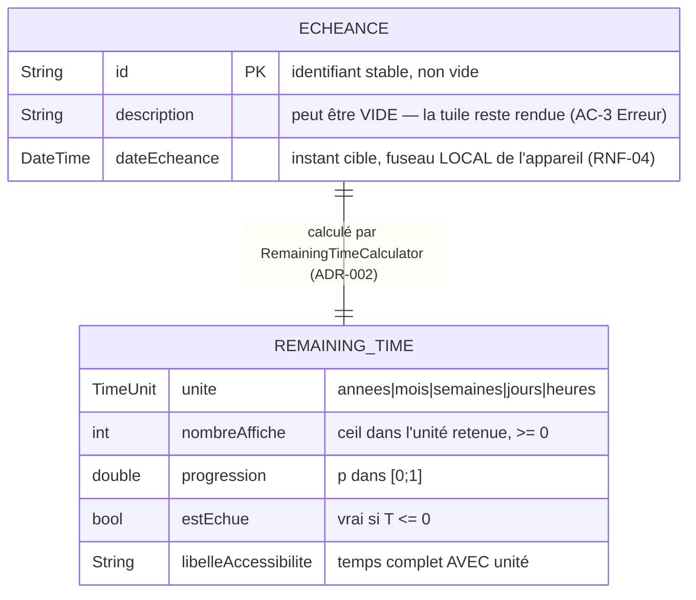

# Modèle de données — Échéance (US-01.1)

> Produit par **@DataEngineer** le **2026-08-01** — tâche **T0-data**, exigée par le track FULL qui
> interdit un `N/A` sur le Design Data *([ADR-008](../adr/ADR-008-arbitrages-track-full.md))*.

## ⛔ Ce document N'EST PAS un schéma de base de données, et c'est délibéré

US-01.1 est un périmètre **d'affichage seul**, alimenté par des **données injectées en mémoire**
*(`sample_echeances.dart`)*. **Il n'y a donc :**

- **aucune table**, aucun DDL, **aucune migration** — ⇒ ⛔ **`EVT_MIGRATION_SCRIPT_READY` n'est PAS émis** ;
- **aucun index** — aucun AC n'annonce de recherche ni de filtrage *(le tri se fait en mémoire sur au plus
  **9** éléments, RF-15)* ;
- **aucun choix de techno de persistance** — `STACK_PROFILE.md` §DataEngineer le **reporte explicitement**
  à **US-01.2**, avec son ADR.

**Ce que ce document livre**, et qui est le vrai objet de la phase Data ici : le **modèle en mémoire**, ses
**invariants**, et l'**ordre** — trois choses dont T2, T9 et US-01.2 dépendent.

⚠️ **Les conventions de nommage de mon rôle** *(snake_case, tables au pluriel, 3NF, index B-Tree)*
**sont sans objet à ce périmètre** : elles s'appliqueront **intégralement** à US-01.2. Je les nomme au lieu
de les cocher.

## Modèle

⚠️ **AJOUT DATÉ-2026-08-04 — la forme EN MÉMOIRE et la forme PERSISTÉE ne sont pas la même, et c'est
voulu** *(ADR-009 + ADR-010 §2)* : `Echeance.dateEcheance` **reste un `DateTime` local** — ⛔ **US-01.1
n'est pas modifiée** — tandis que la **valeur persistée** est une **chaîne de date-heure civile**
`AAAA-MM-JJThh:mm`, **sans `Z`, sans décalage**. ⇒ À chaque lecture, la date civile est **ré-ancrée dans
le fuseau courant** : c'est **exactement** la conséquence assumée d'AC-14 « Limite » *(« 23:59 **là où je
suis** »)*, et non un effet de bord.

⚠️ **`REMAINING_TIME` n'est PAS une entité persistable** : c'est un **résultat de calcul**, dérivé de
`(Echeance, Clock)`. Il figure au diagramme parce que **T2 le déclare dans le domaine**, mais ⛔ **il ne
doit JAMAIS être stocké** — le stocker le rendrait faux à la seconde suivante.

## Invariants — ce qui doit être vrai, et testable

| # | Invariant | Pourquoi il existe |
|---|---|---|
| **I-1** | **`Echeance` est IMMUABLE** *(champs `final`, égalité par valeur)* | La grille recalcule à chaque tick *(RF-05)* ; une entité mutable rendrait un ordre non déterministe et des tuiles incohérentes entre deux rendus |
| **I-2** | **`id` non vide et stable** | Identité d'une tuile entre deux rafraîchissements. Nécessaire dès qu'il faudra une `Key` de widget stable. ⚠️ **RENFORCÉ-2026-08-04** *(NB-1, [ADR-010](../adr/ADR-010-clauses-track-full-avec-persistance.md) §3)* : porté par un **`assert`**, il est **retiré en release** ⇒ dès qu'une donnée vient **du disque**, il doit être vérifié par du **code exécuté en release**, à la frontière `depuisDonnee` |
| **I-3** | ⛔ **`description` PEUT être vide** — jamais une erreur | AC-3 « Erreur » : *le nombre reste affiché*. Un invariant « description non vide » **casserait un AC** |
| **I-4** | **`dateEcheance` peut être dans le PASSÉ** — c'est un état **normal** | AC-7 : l'échue reste affichée en « à zéro ». ⛔ Rejeter une date passée casserait AC-6 *(les échues remontent en tête)* |
| ~~**I-5**~~ ⛔ **DÉPASSÉ-2026-08-04** | **Aucun fuseau stocké** : instants en heure **locale** de l'appareil | RNF-04. ⚠️ **Dette assumée, à rouvrir en US-01.2** : dès qu'il y aura persistance, un instant devra être stocké en **UTC** avec son fuseau, sinon un changement de fuseau **déplacera** les échéances — ⛔ **CETTE PRESCRIPTION EST DÉPASSÉE, voir `I-5 (2026-08-04)` sous la table.** Texte **conservé et daté**, jamais repeint |
| **I-5 (2026-08-04)** | **Une échéance est une DATE CIVILE**, pas un instant absolu : la valeur **persistée** exprime une **date et une heure civiles** et **ne porte ni fuseau, ni décalage, ni marque de temps universel**. Le temps restant se calcule contre l'**instant local courant** | **Arbitrage humain du 2026-08-03** *(clarify nº 7 ; AC-14 promu `Should` → `Must`)*, statué par [ADR-010](../adr/ADR-010-clauses-track-full-avec-persistance.md) §2. **Une date civile n'a pas de fuseau**, donc un déplacement de fuseau **ne PEUT PAS** déplacer l'échéance : la décision **DISSOUT** le problème qu'I-5 voulait **gérer** |
| **I-6** | **Une donnée illisible est IGNORÉE, jamais fatale** | AC-1/AC-3 « Erreur » : le hub reste debout. La validation vit **à la frontière** *(construction depuis les données d'exemple)*, pas dans le widget |
| **I-7** | ⛔ **Aucun champ de persistance** *(pas de `createdAt`, `dirty`, `version`, `deletedAt`)* | Ils n'ont **aucun sens sans stockage** ; les ajouter « pour plus tard » serait de la **modélisation spéculative**, et US-01.2 les introduira **avec** son ADR. ✅ **CONFIRMÉ-2026-08-04** *(ADR-009)* : la persistance arrive **sans en ajouter aucun** — `schemaVersion` est porté par le **DOCUMENT**, pas par l'entité. **I-7 reste vrai** |

## Ordre de tri — la règle exacte, et son piège

**Tri strict par `dateEcheance` CROISSANTE.** *(RF-07, AC-6.)*

🔴 **Conséquence qui surprend et qui est VOULUE** : une échéance **dépassée** est la plus **ancienne**,
donc elle **remonte EN TÊTE** de la grille *(résolution `clarify` nº 2)*. ⛔ **`estEchue` ne relègue PAS** —
tout tri qui pousserait les échues en fin de liste **violerait AC-6**.

**Départage des ex æquo** *(AC-6 « Erreur » : ordre relatif **déterministe**, aucune disparition)* :
à `dateEcheance` égale, **trier par `id` croissant**. **Motif** : un tri à comparateur non total est
**instable selon l'implémentation** ; deux tuiles pourraient alors **échanger leur place** entre deux
rafraîchissements, ce qu'un œil perçoit comme un scintillement. ⇒ ⛔ **le comparateur doit être TOTAL**.

## Jeu de données d'exemple — ce qu'il doit couvrir

Il ne s'agit pas d'un décor : `sample_echeances.dart` est le **seul** jeu qui exerce le moteur à
l'exécution. Il doit contenir **au moins une échéance par unité** *(années, mois, semaines, jours,
heures)*, **une échue** *(`T ≤ 0`, pour AC-7 et la tête de grille)*, **une à description vide** *(I-3)*, et
**deux de même `dateEcheance`** *(le départage ci-dessus)*.
⚠️ **Le cas « 9 tuiles »** *(AC-3 « Limite »)* et l'**état vide** *(AC-9)* relèvent des **tests**, pas du
jeu d'exemple : l'app démarre avec un jeu **lisible**, pas avec un cas limite.

## Ce que ce document ne dit pas

- ⛔ **Rien** sur la techno de persistance, le chiffrement au repos, ni les migrations — **US-01.2**, qui
  **hérite** de ce modèle et **instancie** la convention d'[ADR-005](../adr/ADR-005-convention-migrations-reversibles.md).
  📌 C'est le **critère d'entrée transféré par EPIC_00** *(critère de clôture nº 112)*, et le **risque nº 4
  d'EPIC_00 reste OUVERT** jusque-là.
  ➡️ **TRANCHÉ-2026-08-04** : la techno est **un document JSON local unique, versionné, écrit
  atomiquement** — [ADR-009](../adr/ADR-009-stockage-local-document-json-versionne.md). Le **chiffrement
  au repos** y est **explicitement écarté et nommé** *(aucun AC ne le demande)*.
- ⛔ **Aucune migration n'a jamais été exécutée sur ce projet** : la convention d'ADR-005 est **documentée
  et jamais instanciée**. Ce document **ne change pas cela**.
  ⚠️ **TOUJOURS VRAI AU 2026-08-04** : ADR-009 **décide** le mécanisme, il **n'exécute** aucune
  migration. **Le risque nº 4 d'EPIC_00 reste OUVERT** jusqu'à ce que les tests d'US-01.2 exécutent
  réellement le patron aller-retour. ⛔ **Un ADR n'est pas une exécution.**
