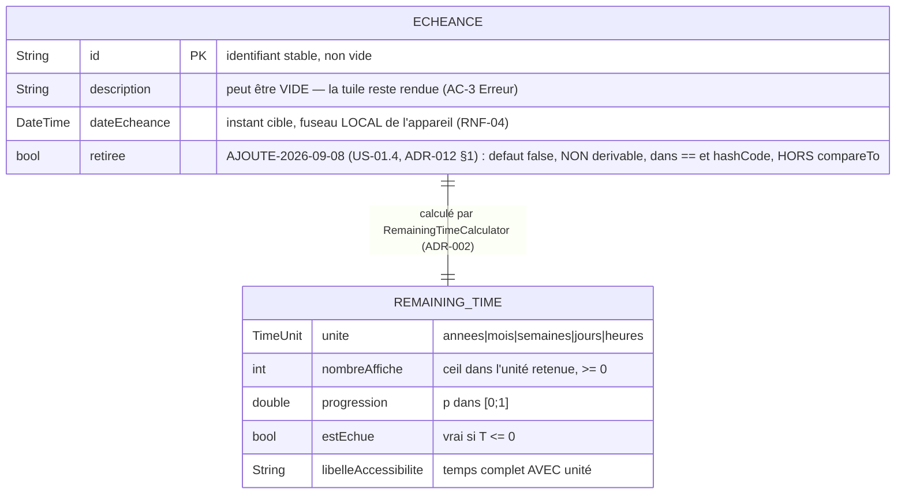

# Modèle de données — Échéance (US-01.1)

> Produit par **@DataEngineer** le **2026-08-01** — tâche **T0-data**, exigée par le track FULL qui
> interdit un `N/A` sur le Design Data *([ADR-008](../adr/ADR-008-arbitrages-track-full.md))*.

> ⚖️ **AMENDÉ le 2026-09-08 — @DataEngineer, tâche T16 d'US-01.4** *(branche `feat/US-01.4-gestes-tuile`)*,
> en instanciant [ADR-012](../adr/ADR-012-etat-echue-retiree-persistance-migration-v3.md) *(**accepté,
> donc IMMUABLE** — il est **cité**, ⛔ jamais touché)*.
>
> **Ce que cet amendement apporte, et il est ENTIÈREMENT MESURÉ SUR LE CODE LIVRÉ** *(⛔ plus une
> prescription : les tâches T1 → T15 sont commitées)* : **`I-7` amendé et daté** *(il nommait
> `deletedAt` parmi les champs interdits)* · l'attribut **`retiree` AJOUTÉ au diagramme de la forme EN
> MÉMOIRE** *(un ajout n'est pas une réécriture)* · **pourquoi `retiree` n'est PAS un `deletedAt`**,
> vérifié dans `lib/` et non plaidé · et la **règle `containsKey`** *(arbitrage **D-4**)*, qui vit à la
> frontière de cette entité.
>
> ⛔ **On DATE, on ne repeint pas** *(patron d'`I-5`)* : le texte dépassé **reste visible**, marqué
> **`PÉRIMÉ-2026-09-08` en LITTÉRAL** — ⛔ **jamais barré** *(`~~texte~~` ne se voit pas dans un balayage
> de corpus ; leçon d'US-00.7)*. Le nouvel énoncé est ajouté **au-dessous**.

## ⛔ Ce document N'EST PAS un schéma de base de données, et c'est délibéré

US-01.1 est un périmètre **d'affichage seul**, alimenté par des **données injectées en mémoire**
*(`sample_echeances.dart`)*. **Il n'y a donc :**

- **aucune table**, aucun DDL, **aucune migration** — ⇒ ⛔ **`EVT_MIGRATION_SCRIPT_READY` n'est PAS émis** ;
- **aucun index** — aucun AC n'annonce de recherche ni de filtrage *(le tri se fait en mémoire sur au plus
  **9** éléments, RF-15)* ;
- **aucun choix de techno de persistance** — `STACK_PROFILE.md` §DataEngineer le **reporte explicitement**
  à **US-01.2**, avec son ADR.

**Ce que ce document livre**, et qui est le vrai objet de la phase Data ici : le **modèle en mémoire**, ses
**invariants**, et l'**ordre** — trois choses dont T2, T9 et US-01.2 dépendent.

⚠️ **Les conventions de nommage de mon rôle** *(snake_case, tables au pluriel, 3NF, index B-Tree)*
**sont sans objet à ce périmètre** : elles s'appliqueront **intégralement** à US-01.2. Je les nomme au lieu
de les cocher.

## Modèle



⚠️ **AJOUT DATÉ-2026-08-04 — la forme EN MÉMOIRE et la forme PERSISTÉE ne sont pas la même, et c'est
voulu** *(ADR-009 + ADR-010 §2)* : `Echeance.dateEcheance` **reste un `DateTime` local** — ⛔ **US-01.1
n'est pas modifiée** — tandis que la **valeur persistée** est une **chaîne de date-heure civile**
`AAAA-MM-JJThh:mm`, **sans `Z`, sans décalage**. ⇒ À chaque lecture, la date civile est **ré-ancrée dans
le fuseau courant** : c'est **exactement** la conséquence assumée d'AC-14 « Limite » *(« 23:59 **là où je
suis** »)*, et non un effet de bord.
➡️ **AJOUT DATÉ-2026-08-06 (@DataEngineer, US-01.2)** : le **diagramme ER de la forme PERSISTÉE**, la
**grammaire exacte** de chaque valeur, le **contrat des migrations** et les **cas de corruption** vivent
désormais dans [`SCHEMA_STOCKAGE_ECHEANCES.md`](SCHEMA_STOCKAGE_ECHEANCES.md). ⛔ **Le diagramme
ci-dessus n'est PAS modifié** : il décrit la forme **en mémoire**, qu'US-01.2 **ne change pas**.
⛔ **PÉRIMÉ-2026-09-08 pour la SEULE dernière phrase, et le motif est dans sa propre lettre** : elle est
**vraie d'US-01.2** *(qui ne touche pas l'entité)* et **FAUSSE d'US-01.4**, qui **ajoute un champ à
l'entité** *(ADR-012 §Décision 1)*. ⇒ **le diagramme ci-dessus PORTE désormais `retiree`**, et c'est un
**AJOUT**, ⛔ pas une réécriture *(même nature que la modification ① du §2 de
[`SCHEMA_STOCKAGE_ECHEANCES.md`](SCHEMA_STOCKAGE_ECHEANCES.md))*.
**LU dans le code, ⛔ pas de mémoire** :

```
$ grep -n "^  final bool retiree;" lib/features/echeances/domain/echeance.dart
47:  final bool retiree;
```

⚠️ **UNE COMMANDE A ÉTÉ CORRIGÉE ICI AVANT PUBLICATION, ET L'ÉCART MÉRITE D'ÊTRE NOMMÉ** : j'avais écrit
`grep -n "final bool retiree" …` *(sans ancrage)*, qui rend **DEUX** lignes — le **champ** de l'entité
**et** une **variable locale de même déclaration** dans `depuisDonnee`. ⛔ **Une commande qui rend deux
lignes ne peut pas établir « le champ existe et il est unique ».** **Trouvé en la rejouant**, ⛔ pas en la
relisant — *« un résultat se LIT dans la sortie, il ne s'écrit pas à côté de la commande »* **(classe de
défaut nº 1 du projet)**.

⚠️ **La forme EN MÉMOIRE et la forme PERSISTÉE restent différentes, et pour `retiree` la différence est
NEUVE** : en mémoire le champ est **toujours présent** *(un `bool` non nullable, défaut `false`)* ; sur le
disque la clé est **OPTIONNELLE et écrite seulement si `true`** ⇒ **absence ⇒ présente**. **C'est cette
asymétrie qui rend AC-5 « Erreur » d'US-01.4 vrai PAR CONSTRUCTION** *(aucun document déjà écrit ne porte
la clé)*, ⛔ pas un test de garde.

⚠️ **`REMAINING_TIME` n'est PAS une entité persistable** : c'est un **résultat de calcul**, dérivé de
`(Echeance, Clock)`. Il figure au diagramme parce que **T2 le déclare dans le domaine**, mais ⛔ **il ne
doit JAMAIS être stocké** — le stocker le rendrait faux à la seconde suivante.

## Invariants — ce qui doit être vrai, et testable

| # | Invariant | Pourquoi il existe |
|---|---|---|
| **I-1** | **`Echeance` est IMMUABLE** *(champs `final`, égalité par valeur)* | La grille recalcule à chaque tick *(RF-05)* ; une entité mutable rendrait un ordre non déterministe et des tuiles incohérentes entre deux rendus |
| **I-2** | **`id` non vide et stable** | Identité d'une tuile entre deux rafraîchissements. Nécessaire dès qu'il faudra une `Key` de widget stable. ⚠️ **RENFORCÉ-2026-08-04** *(NB-1, [ADR-010](../adr/ADR-010-clauses-track-full-avec-persistance.md) §3)* : porté par un **`assert`**, il est **retiré en release** ⇒ dès qu'une donnée vient **du disque**, il doit être vérifié par du **code exécuté en release**, à la frontière `depuisDonnee` |
| **I-3** | ⛔ **`description` PEUT être vide** — jamais une erreur | AC-3 « Erreur » : *le nombre reste affiché*. Un invariant « description non vide » **casserait un AC** |
| **I-4** | **`dateEcheance` peut être dans le PASSÉ** — c'est un état **normal** | AC-7 : l'échue reste affichée en « à zéro ». ⛔ Rejeter une date passée casserait AC-6 *(les échues remontent en tête)* |
| ~~**I-5**~~ ⛔ **DÉPASSÉ-2026-08-04** | **Aucun fuseau stocké** : instants en heure **locale** de l'appareil | RNF-04. ⚠️ **Dette assumée, à rouvrir en US-01.2** : dès qu'il y aura persistance, un instant devra être stocké en **UTC** avec son fuseau, sinon un changement de fuseau **déplacera** les échéances — ⛔ **CETTE PRESCRIPTION EST DÉPASSÉE, voir `I-5 (2026-08-04)` sous la table.** Texte **conservé et daté**, jamais repeint |
| **I-5 (2026-08-04)** | **Une échéance est une DATE CIVILE**, pas un instant absolu : la valeur **persistée** exprime une **date et une heure civiles** et **ne porte ni fuseau, ni décalage, ni marque de temps universel**. Le temps restant se calcule contre l'**instant local courant** | **Arbitrage humain du 2026-08-03** *(clarify nº 7 ; AC-14 promu `Should` → `Must`)*, statué par [ADR-010](../adr/ADR-010-clauses-track-full-avec-persistance.md) §2. **Une date civile n'a pas de fuseau**, donc un déplacement de fuseau **ne PEUT PAS** déplacer l'échéance : la décision **DISSOUT** le problème qu'I-5 voulait **gérer** |
| **I-6** | **Une donnée illisible est IGNORÉE, jamais fatale** | AC-1/AC-3 « Erreur » : le hub reste debout. La validation vit **à la frontière** *(construction depuis les données d'exemple)*, pas dans le widget |
| **I-7** | ⛔ **Aucun champ de persistance** *(pas de `createdAt`, `dirty`, `version`, `deletedAt`)* | Ils n'ont **aucun sens sans stockage** ; les ajouter « pour plus tard » serait de la **modélisation spéculative**, et US-01.2 les introduira **avec** son ADR. ✅ **CONFIRMÉ-2026-08-04** *(ADR-009)* : la persistance arrive **sans en ajouter aucun** — `schemaVersion` est porté par le **DOCUMENT**, pas par l'entité. **I-7 reste vrai** — ⛔ **PÉRIMÉ-2026-09-08 pour le SEUL terme `deletedAt`, voir `I-7 (2026-09-08)` sous la table.** Texte **conservé et daté**, ⛔ jamais repeint ni barré |
| **I-7 (2026-09-08)** | **`retiree` est AUTORISÉ dans l'entité ; `createdAt`, `dirty`, `version` et `retireeLe` restent INTERDITS.** ⛔ **`I-7` n'est pas LEVÉ — il est RÉDUIT D'UN CHAMP, nommément** | **Décidé par [ADR-012](../adr/ADR-012-etat-echue-retiree-persistance-migration-v3.md) §Décision 1**, qui **remplace** la puce d'ADR-010 §2 reconduisant `I-7` — ⛔ **et uniquement pour ce champ** *(ADR-010 n'est PAS édité : un ADR accepté est immuable)*. **Le motif d'`I-7` n'était pas faux, il était BORNÉ, et sa borne est dans son propre texte** : *« aucun sens sans stockage »* + *« modélisation spéculative »* ⇒ il interdit le **SPÉCULATIF**, ⛔ **pas le NÉCESSAIRE**. Il y a désormais **un stockage** *(ADR-009)* **et deux AC qui exigent le champ** *(AC-4, AC-5 d'US-01.4)* ⇒ **la prémisse du motif est FAUSSE pour ce seul champ**. Et `I-7` **avait prévu ce moment** : *« US-01.2 les introduira **avec son ADR** »* — l'US a changé, **la forme prescrite est tenue**. ⛔ **`retireeLe` n'a AUCUN AC** ⇒ l'ajouter **serait** la spéculation qu'`I-7` refuse |

### 🔴 AMENDEMENT DATÉ-2026-09-08 — pourquoi `retiree` **n'est PAS** un `deletedAt`

**Le terme visé, cité verbatim** *(il reste dans la table ci-dessus, marqué)* : *« ⛔ Aucun champ de
persistance *(pas de `createdAt`, `dirty`, `version`, **`deletedAt`**)* »*.

⛔ **Le point n'est PAS que `retiree` échapperait à la LETTRE de l'énumération.** Ce serait un
raisonnement d'avocat, et **ADR-012 §Contexte 2 le refuse explicitement avant d'argumenter** : `deletedAt`
est le **nom canonique du marqueur de suppression logique**, tout relecteur lirait la prohibition comme
couvrant un champ de retrait, ⇒ **on remplace, on ne contourne pas.** Le point est que **le comportement
livré n'est pas une suppression logique** — et cela **se vérifie dans `lib/`**, ⛔ pas dans un raisonnement.

| Ce qu'un `deletedAt` fait, par définition | Ce que `retiree` fait, **LU dans le code livré** |
|---|---|
| L'objet est **réputé supprimé** ; toute lecture ordinaire le **filtre** | ⛔ **UN SEUL** filtre existe, et il porte sur **la grille seule** : `presentesSurLaGrille` *(`lib/features/echeances/domain/echeance_etat.dart`)*. La page de **gestion** consomme `notifier.echeances`, **la liste COMPLÈTE**, retirées comprises |
| L'objet **disparaît de l'interface** | ⛔ **L'échéance reste LISTÉE, MODIFIABLE dans la limite de ses propres règles, et SUPPRIMABLE** en gestion — et elle y porte **un mot**, pas un silence *(`ligne_echeance.dart` : `marqueRetiree` / `marqueSurLaGrille`)* |
| C'est **l'acte destructif**, rendu réversible par convention | ⛔ **Ce n'est PAS l'acte destructif.** Le port compte **cinq** opérations et **`ActeEcriture` en porte TROIS** : `enregistrement`, **`suppression`**, **`retrait`**. `retirer(String id)` écrit `e.avec(retiree: true)` — **l'entrée reste dans le document** ; `supprimer(String id)` fait `liste.where((e) => e.id != id)` — **l'entrée sort du document.** ⇒ **la SUPPRESSION reste le SEUL acte destructif du produit** |
| Souvent **silencieux** | ⛔ **La suppression exige une CONFIRMATION EXPLICITE** : `ConfirmationSuppression` dit *« sera définitivement supprimée »* et *« Cette action est irréversible »*, et **« Annuler » porte le focus initial**. **Le retrait, lui, n'en demande aucune — et c'est cohérent : il ne détruit rien** |

**Les commandes qui établissent le tableau ci-dessus** — ⛔ **transcription, pas affirmation** :

```
grep -rn "retiree" lib/ --include=*.dart | grep -v "^lib/features/echeances/data/echeance_schema_migrations.dart"
grep -n "where((e) => e.id != id)\|avec(retiree: true)" lib/features/echeances/data/echeance_document_repository.dart
grep -n "enregistrement(\|suppression(\|retrait(" lib/features/echeances/domain/echeance_repository.dart
grep -n "définitivement\|irréversible\|Annuler" lib/features/echeances/presentation/widgets/confirmation_suppression.dart
```

⇒ 🔬 **Le vocabulaire d'état du produit compte TROIS termes distincts et non deux** : `ÉCHUE` *(dérivée de
l'horloge)*, **`ÉCHUE RETIRÉE`** *(absente de la grille, **conservée**)*, `SUPPRIMÉE` *(l'entrée n'existe
plus)*. **Un `deletedAt` confond les deux derniers.** ⛔ **C'est pour cela que le champ n'est pas de la
même famille**, et non parce qu'il porte un autre nom.

⛔ **CE QUE CET AMENDEMENT NE FAIT PAS** : il **ne lève pas `I-7`**. **Restent interdits dans l'entité,
sans un mot de changement** : `createdAt`, `dirty`, `version` — **et `retireeLe`**, parce qu'⛔ **aucun AC
ne demande la DATE du retrait**. **Un booléen est le plus petit domaine qui satisfait AC-4 et AC-5.**
**Le contrôle porte son négatif** *(mesuré : `test/features/echeances/domain/echeance_retiree_test.dart`,
groupe « I-7 RÉDUIT D'UN CHAMP » — une assertion refuse les champs spéculatifs, **et son contrôle négatif
vérifie que le champ AUTORISÉ est bien déclaré**)*.

### ⚖️ D-4 (arbitrage humain du 2026-08-24) — la présence se teste par `containsKey`, ⛔ **jamais par la nullité**

🔴 **`retiree: null` est une valeur PRÉSENTE et NON booléenne, donc un RÉSIDU** — l'**entrée entière** est
conservée verbatim et **non affichée** *(ADR-012 §Décision 3)*. ⛔ **La forme la plus naturelle à écrire est
la fausse** : `donnee['retiree'] ?? false` **confond `null` avec l'absence de clé** et **afficherait comme
présente une tuile dont l'application n'a pas su lire l'état** — l'application **contredirait une action de
l'utilisateur sur la base d'une valeur qu'elle n'a pas comprise**.

**Où la règle vit — en UN SEUL exemplaire** *(règle **F-1**)* : à la **frontière de cette entité**,
`Echeance.depuisDonnee`, en **code exécuté en release** *(ADR-010 §3 — ⛔ **jamais un `assert`**)*. Le codec
ne fait que **transporter** la valeur brute.

**Statut : contrat interne, ⛔ AUCUN AC, ⛔ aucun scénario Gherkin** — **voie (b)**, même voie que les trois
règles arbitrées le 2026-08-06. **Motif, et il est décisif** : `null` n'est **pas une règle nouvelle**,
c'est une **LECTURE** de la règle qu'ADR-012 §3 pose déjà *(« valeur présente et non booléenne ⇒ résidu »)*.
Lui donner son propre AC en créerait un **second exemplaire**, et *« une règle n'existe qu'en un seul
exemplaire — deux copies dérivent »*, vérifié trois fois sur ce corpus.
⛔ **Le défaut n'était pas la règle : c'était son ABSENCE du corpus.**

**Couverture LUE, ⛔ pas déclarée** — `grep -rn "D-4" test/ | head` rend deux tests, **un de chaque côté de
la frontière** : `test/features/echeances/domain/echeance_retiree_test.dart` *(« 🔴 D-4 — `retiree: null`
est PRÉSENT et non booléen ⇒ RÉSIDU »)* et `test/features/echeances/data/echeance_codec_retiree_test.dart`
*(« 🔴 D-4 — `retiree: null` : `containsKey`, ⛔ JAMAIS la nullité »)*.

## Ordre de tri — la règle exacte, et son piège

**Tri strict par `dateEcheance` CROISSANTE.** *(RF-07, AC-6.)*

🔴 **Conséquence qui surprend et qui est VOULUE** : une échéance **dépassée** est la plus **ancienne**,
donc elle **remonte EN TÊTE** de la grille *(résolution `clarify` nº 2)*. ⛔ **`estEchue` ne relègue PAS** —
tout tri qui pousserait les échues en fin de liste **violerait AC-6**.

**Départage des ex æquo** *(AC-6 « Erreur » : ordre relatif **déterministe**, aucune disparition)* :
à `dateEcheance` égale, **trier par `id` croissant**. **Motif** : un tri à comparateur non total est
**instable selon l'implémentation** ; deux tuiles pourraient alors **échanger leur place** entre deux
rafraîchissements, ce qu'un œil perçoit comme un scintillement. ⇒ ⛔ **le comparateur doit être TOTAL**.

## Jeu de données d'exemple — ce qu'il doit couvrir

Il ne s'agit pas d'un décor : `sample_echeances.dart` est le **seul** jeu qui exerce le moteur à
l'exécution. Il doit contenir **au moins une échéance par unité** *(années, mois, semaines, jours,
heures)*, **une échue** *(`T ≤ 0`, pour AC-7 et la tête de grille)*, **une à description vide** *(I-3)*, et
**deux de même `dateEcheance`** *(le départage ci-dessus)*.
⚠️ **Le cas « 9 tuiles »** *(AC-3 « Limite »)* et l'**état vide** *(AC-9)* relèvent des **tests**, pas du
jeu d'exemple : l'app démarre avec un jeu **lisible**, pas avec un cas limite.

## 🔴 Ce que ce document N'ATTESTE PAS — ⚖️ **ajouté le 2026-09-08 (T16)**

1. ⛔ **Aucune ligne de ce document n'a été écrite en regardant un écran.** Tous ses énoncés neufs sont
   **lus dans `lib/`, dans `test/` ou dans la sortie d'un script**. **Ce qui a été vu par un œil** relève
   de la QA, ⛔ pas de moi.
2. 🔴 **UN PIÈGE DE REVUE, MESURÉ, qui rend un réflexe INUTILE** : le module de migrations **ne contient
   AUCUNE occurrence du mot `retiree` dans son code exécutable** — l'étape est **l'identité**, donc elle
   **ne nomme pas ce qu'elle transporte**. ⇒ ⛔ **cette migration NE PEUT PAS être revue en cherchant le
   nom du champ.** ⚠️ **Et la commande naïve MENT dans les deux sens** : elle rend **5 lignes**, toutes
   dans des **commentaires de documentation**, **zéro** dans le code. **Mesuré le 2026-09-08** :

   ```
   grep -c "retiree" lib/features/echeances/data/echeance_schema_migrations.dart        -> 5
   grep -n  "retiree" lib/.../echeance_schema_migrations.dart | grep -v "^[0-9]*: *//"  -> (vide)
   ```

   ⇒ **la seule chose qui établit la correction de cette étape est la campagne de mutation**
   *(`reports/US-01.4/migration_v3_guard_criterion.py --selftest` et `--croise`)*, avec **sa graine**.
   **Corollaire mesuré** : `dart analyze` rend **`No issues found!`** sur les **sept** sources dérivées,
   **mutants destructeurs compris** ⇒ ⛔ **aucun lint ne voit une perte de donnée.**
3. ⚠️ **`retiree` ne dit RIEN de l'horloge, et l'inverse est vrai aussi** : `ÉCHUE` et `ÉCHUE RETIRÉE` sont
   **toutes deux échues**. **Aucun filtre de ce projet ne combine les deux**, et `presentesSurLaGrille`
   **ne prend AUCUN instant en paramètre** — ⛔ *lui en passer un serait suggérer que le temps peut retirer
   une tuile*, ce qu'**AC-5 d'US-01.4 interdit** *(« aucune tuile ne disparaît sans geste »)*.

## Ce que ce document ne dit pas

- ⛔ **Rien** sur la techno de persistance, le chiffrement au repos, ni les migrations — **US-01.2**, qui
  **hérite** de ce modèle et **instancie** la convention d'[ADR-005](../adr/ADR-005-convention-migrations-reversibles.md).
  📌 C'est le **critère d'entrée transféré par EPIC_00** *(critère de clôture nº 112)*, et le **risque nº 4
  d'EPIC_00 reste OUVERT** jusque-là.
  ➡️ **TRANCHÉ-2026-08-04** : la techno est **un document JSON local unique, versionné, écrit
  atomiquement** — [ADR-009](../adr/ADR-009-stockage-local-document-json-versionne.md). Le **chiffrement
  au repos** y est **explicitement écarté et nommé** *(aucun AC ne le demande)*.
- ⛔ **Aucune migration n'a jamais été exécutée sur ce projet** : la convention d'ADR-005 est **documentée
  et jamais instanciée**. Ce document **ne change pas cela**.
  ⚠️ **TOUJOURS VRAI AU 2026-08-04** : ADR-009 **décide** le mécanisme, il **n'exécute** aucune
  migration. **Le risque nº 4 d'EPIC_00 reste OUVERT** jusqu'à ce que les tests d'US-01.2 exécutent
  réellement le patron aller-retour. ⛔ **Un ADR n'est pas une exécution.**
  ⚠️ **ENCORE VRAI AU 2026-08-06** *(@DataEngineer)* : le schéma persisté est **spécifié** et le patron
  est **exécutable** — [`SCHEMA_STOCKAGE_ECHEANCES.md`](SCHEMA_STOCKAGE_ECHEANCES.md) +
  [`reports/US-01.2/migration_roundtrip_criterion.py`](../../reports/US-01.2/migration_roundtrip_criterion.py)
  *(8 assertions, **7 mutants comportementaux**, autotest **vert** le 2026-08-06)*. ⛔ **Mais il a été
  joué contre une source de FIXTURE, pas contre `lib/`, qui n'existe pas encore** ⇒ **le risque nº 4
  reste OUVERT** jusqu'à l'`exit 0` du critère contre le module réel *(tâche **T5**)*.
  ⛔ **Un critère de sortie n'est pas davantage une exécution du produit.**
  ⛔ **PÉRIMÉ-2026-09-08 SUR SA PREMIÈRE PHRASE, ET SUR ELLE SEULE** *(@DataEngineer, T16 d'US-01.4)* :
  *« Aucune migration n'a jamais été exécutée sur ce projet »* était vrai jusqu'au 2026-08-06 et est
  **FAUX depuis**. **DEUX migrations sont désormais exécutées contre le module RÉEL** — ⛔ **transcription
  de sortie, pas affirmation** *(rejoué le 2026-09-08, Dart 3.12.2)* :

  ```
  python reports/US-01.2/migration_roundtrip_criterion.py   -> exit 0, A1..A8 toutes OK  (couple v1 ⇄ v2)
  python reports/US-01.4/migration_v3_guard_criterion.py    -> exit 0, B1..B8 toutes OK  (couple v2 ⇄ v3)
  ```

  ⚠️ **Ce que ces deux `exit 0` N'ATTESTENT PAS, et il ne faut pas sur-lire** : ils portent sur les
  **fonctions PURES** de migration *(`Map → Map`)*, ⛔ **ni le codec, ni le magasin, ni l'écriture
  atomique, ni l'application**. Et ⛔ **aucun des deux n'est un gate CI** *(ils exigent le SDK Dart, et
  chacun l'imprime lui-même)*. **Ce qui vit dans un gate requis**, c'est `flutter test` — voir
  `test/features/echeances/data/echeance_migration_v3_test.dart`.
