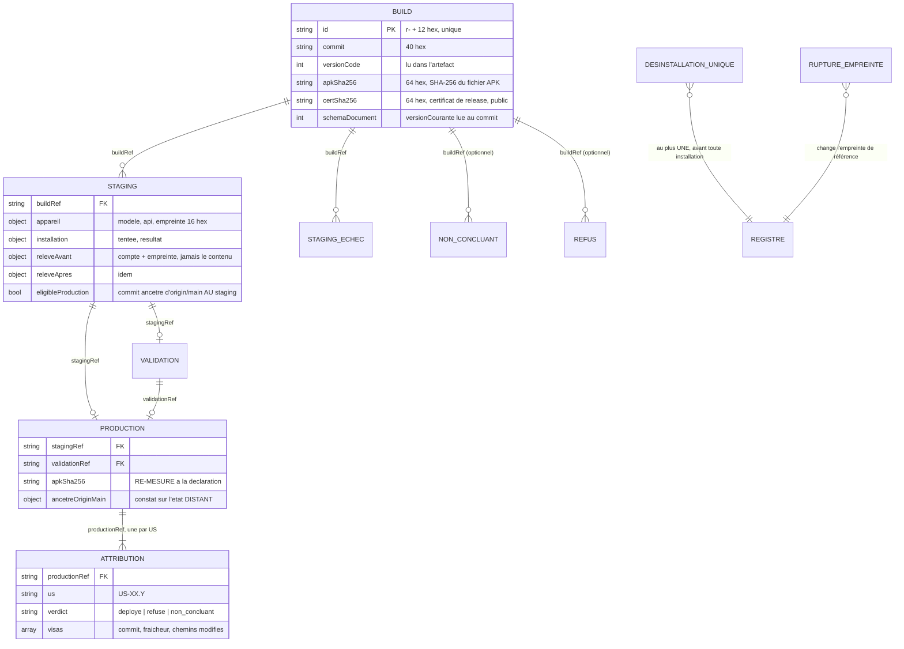

# Registre des déploiements, empreinte d'appareil et données préservées par une mise à jour (US-01.3)

> Produit par **@DataEngineer** le **2026-09-30**, branche de design `data_design` d'US-01.3 *(track
> FULL, phase `parallel_design`, branche `feat/US-01.3-chaine-deploiement-mobile`, HEAD `bfcb2a2`)*.
> Il **instancie** [ADR-015](../adr/ADR-015-deploiement-android-sans-serveur-signature-locale.md)
> *(**Accepté, donc immuable** : §5 décide qu'un registre append-only existe, où il vit et ce que la CI y
> contrôle ; §13 décide la formule de l'empreinte)*. ⛔ **Rien de ce qui y est décidé n'est rouvert ici.**
> Ce document apporte ce que l'ADR ne donne pas : **la grammaire des lignes**, **les invariants sous une
> forme qu'une machine peut vérifier**, **la liste des champs interdits**, **la forme exacte de l'entrée
> de l'empreinte**, **ce que la comparaison avant / après une mise à jour compare**, et **les règles des
> fixtures**.
>
> **Pourquoi un document neuf et pas un amendement** de [`SCHEMA_STOCKAGE_ECHEANCES.md`](SCHEMA_STOCKAGE_ECHEANCES.md)
> ou de [`MIGRATIONS.md`](MIGRATIONS.md) : ces deux documents décrivent **la donnée du produit**, lue et
> écrite par l'application. Le registre n'est **pas** lu par l'application, il n'a **pas** de migration,
> et il vit sous d'autres règles (ajout seul, dépôt public). Les mêler ferait croire que la convention
> d'ADR-005 s'applique au registre, et elle ne s'y applique pas (§1.7). En revanche, la **partie 3** de ce
> document (ce qu'une mise à jour préserve) **lit** ces deux documents sans les recopier : elle **y
> renvoie**.

> 🔐 **AVERTISSEMENT DE CLASSIFICATION.** Ce design porte sur des données **C3 — secrètes** *(clé de
> release, mots de passe, clé d'empreinte d'appareil)* et **C2 — confidentielles** *(numéro de série de
> l'appareil personnel de l'humain et, point établi ici au §3.4, **le contenu des échéances du
> pratiquant**)*. ⛔ **Aucune valeur réelle n'apparaît dans ce document.** Chaque valeur d'exemple est
> **FICTIVE** et construite pour **se voir fictive** : hexadécimal `f1c7…`, identifiants `FICTIF…`.
> ⛔ Je n'ai lu ni keystore, ni `android/key.properties`, ni numéro de série, et **aucun appareil n'a été
> observé** : `adb` est absent du `PATH` de la session *(fait déjà mesuré trois fois, ⛔ non ré-affirmé
> comme présent)*.

---

## 0 · Les conventions de mon rôle, nommées et non cochées

| Convention du rôle | Ce qu'elle devient ici | Motif |
|---|---|---|
| **snake_case, tables au pluriel** | ⚠️ **Écart assumé** : les **clés** du registre sont en **camelCase** (`schemaVersion`, `versionCode`, `apkSha256`). Les **valeurs énumérées** (natures, causes) sont en **snake_case**. | `versionCode` est le nom Android, et les sorties d'`aapt2` et `dumpsys` l'emploient. `schemaVersion` est déjà le nom du champ de tête d'ADR-009. Deux orthographes pour un même concept dériveraient. Les valeurs énumérées servent de **clé** aux messages de l'UX, et le snake_case est l'usage des codes. |
| **3NF, traquer la redondance** | Un attribut de l'**artefact** vit **une seule fois**, sur sa ligne `build`. Les autres lignes le **référencent** par `buildRef`. ⚠️ Quand une valeur semble répétée (empreinte d'APK au staging, `versionCode` lu sur l'appareil), ce n'est **pas une copie** : c'est une **seconde observation**, mesurée de nouveau, et l'invariant exige qu'elle **égale** la première. | Une copie ne prouve rien. Une seconde mesure qui doit égaler la première **est** le contrôle d'AC-9 « Erreur » et d'AC-1 ④. ⛔ Une valeur **recopiée** d'une ligne à l'autre au lieu d'être re-mesurée **passerait tous les invariants**, et aucune machine ne peut le voir (§7, borne B-4). |
| **Index sur les colonnes filtrées** | ⛔ **Aucun index.** Décision de silence **sous une borne NOMMÉE** : *tant que le registre ne porte que les constats d'**un seul appareil** (H-2)*. Il se relit alors **en entier** à chaque contrôle. | Quelques lignes par déploiement : un index serait une seconde structure à tenir cohérente. **Réfutable** si un second appareil ou une distribution à un tiers entre au périmètre. |
| **Migrations réversibles, `downgrade` jamais vide** | ⛔ **Sans objet pour le registre, et c'est une décision, pas une omission** : §1.7. Et ⛔ **aucune migration du schéma produit** n'est créée par cette US *(pas d'`EVT_MIGRATION_SCRIPT_READY`)*. | Une migration réécrit des lignes, ce que l'ajout seul interdit. |
| **Diagramme ER si le schéma change** | Le schéma **produit** (`echeances.json`) **ne change pas** : son diagramme n'est **pas** touché. Le registre, lui, reçoit **son** diagramme (§1.2). | — |

---

## 1 · Le registre : `docs/deploiement/registre.jsonl`

### 1.1 · Ce qu'est une ligne

Le fichier est **une suite de lignes JSON** (JSON Lines, UTF-8, une ligne = un objet, fin de ligne `LF`).
Chaque ligne est **un constat daté**, écrit par un outil de la chaîne (`release_build.py`,
`release_deploy.py`, tâches T6 et T7). ⛔ **Aucune ligne n'est jamais modifiée ni supprimée** une fois
sur `main` (§1.6).

L'**entité** est donc l'**observation**, et le registre est **l'historique complet** de ce qui a été
constaté sur l'artefact et l'appareil. Le « dernier `versionCode` déployé », « l'empreinte de référence
de l'appareil » et « les US déployées » ne sont **stockés nulle part** : ils se **calculent** en relisant
le fichier. ⛔ Un état stocké à côté de l'historique serait un second exemplaire, qui dériverait.

### 1.2 · Diagramme

⚠️ Comme pour `echeances.json`, ce diagramme décrit **des lignes d'un fichier**, pas des tables : les
« relations » sont des **références par `id`**, toujours **vers une ligne antérieure**.



### 1.3 · Champs communs à toutes les lignes

| Clé | Type et domaine exact | Réfutée par |
|---|---|---|
| `schemaVersion` | entier `≥ 1`. **Vaut `1`** à la création du registre | un entier absent, textuel, ou supérieur à la version que le contrôle connaît |
| `id` | chaîne `^r-[0-9a-f]{12}$`, tirée **au hasard** par l'outil, **unique dans le fichier** | deux lignes de même `id` · un `id` dérivé du **rang** de la ligne |
| `nature` | l'une des valeurs du §1.4 | une nature inconnue de la `schemaVersion` de la ligne |
| `ts` | horodatage `AAAA-MM-JJThh:mm:ss±hh:mm` **de la machine de l'humain** | un horodatage sans décalage, ou antérieur à celui de la ligne précédente |
| `preuve` | *(optionnel)* chemin **relatif** `^docs/deploiement/preuves/[A-Za-z0-9._/-]+$` vers le relevé détaillé caviardé | un chemin absolu · un chemin hors de `docs/deploiement/preuves/` |

**Pourquoi un `id` tiré au hasard et non un numéro de séquence.** La leçon du projet est de ne jamais
désigner une ligne par son numéro : il glisse en silence. Ici il glisserait **pour de vrai** : deux
branches qui ajoutent chacune des lignes (répétitions de T15 sur la branche de l'US, production sur une
branche ouverte après la fusion) entrent en conflit sur un numéro de séquence, et `strict: true`
imposerait de **renuméroter les lignes et toutes leurs références**. Avec un `id` aléatoire, une
résolution de conflit ne touche aucune référence. L'ordre, lui, est **l'ordre du fichier** (§1.5).

⛔ **Toute clé inconnue fait refuser la ligne.** C'est **l'inverse** de la règle d'`echeances.json`, qui
**préserve** les clés inconnues (ADR-009). Le motif est différent : le document des échéances doit ne
jamais perdre une donnée ; le registre, public, doit ne jamais **laisser passer** un champ interdit sous
un nom nouveau. Une grammaire **fermée** est la barrière principale contre la fuite (§1.8).

### 1.4 · Les natures, et ce que chacune porte

Les six natures d'ADR-015 §5 sont conservées. **Quatre natures sont ajoutées**, chacune parce qu'un AC
l'exige *(point P-1 pour @Architect : la liste d'ADR-015 §5 est-elle fermée ?)* :

| Nature | Issue (ADR-015 §6) | Consomme un `versionCode` ? | AC | Origine |
|---|---|---|---|---|
| `build` | `0` | non | AC-2, AC-3, AC-6, AC-12, AC-13 | ADR-015 §5 |
| `staging` | `0` | **oui** | AC-1 ④ ⑤ ⑥, AC-7, AC-8, AC-9 | ADR-015 §5 |
| `staging_echec` | `1` | **oui si `installation.tentee`** | AC-8 « Erreur », AC-9 « Erreur », AC-7 | ADR-015 §5 |
| `validation` | déclaratif | non | AC-9 | ADR-015 §5 |
| `production` | `0` | ⛔ **non** : aucune réinstallation | AC-1, AC-9 | ADR-015 §5 |
| `refus` | `1` | **oui si `installation.tentee`** | AC-5 « Limite », AC-6 « Erreur », AC-7 « Erreur », AC-9 « Erreur », AC-12 « Erreur », AC-13 « Erreur » | ADR-015 §5 |
| 🆕 `non_concluant` | `2` | **oui si `installation.tentee`** | AC-8 « Limite » (capture vide), AC-11 « Erreur » | **AC-11** : « ne conclut pas » doit être **distinct** d'un succès **et** d'un échec, donc il faut une nature qui ne soit ni `staging` ni `staging_echec` |
| 🆕 `attribution` | `0`, `1` ou `2` | non | **AC-9 « Limite »** : une preuve **par US** | Q5 (a) : un déploiement vaut pour plusieurs US, chacune avec **sa** preuve renvoyant au même artefact |
| 🆕 `desinstallation_unique` | déclaratif + constat | non | **AC-7 « Limite »** : étape nommée, confirmée, **consignée**, jamais répétée | Sans nature propre, « jamais répétée » serait **invérifiable** par machine |
| 🆕 `rupture_empreinte` | déclaratif | non | **AC-1 « Nominal »** (continuité) | ADR-015 §13 : la rupture est **consignée au registre** |

⛔ **Les refus au moment du BUILD ne sont PAS consignés** (arbre modifié, AC-2 « Erreur » ; clé absente
ou mot de passe faux, AC-3 « Erreur »). Décision de silence **sous une borne nommée** : *tant qu'aucun AC
n'exige de consigner un refus qui ne produit aucun artefact*. Leur preuve est **le code de sortie et le
message** de `release_build.py`, et un refus sans artefact n'a rien à référencer. **Réfutable par l'UX**
si l'opérateur a besoin de retrouver après coup un refus de build.

#### Champs par nature

Les valeurs énumérées de `causes` sont listées au **§6.2** (un seul exemplaire).

**`build`** — l'artefact, et **toutes ses propriétés intrinsèques**, lues **dans l'artefact** :

| Clé | Domaine | Source de la valeur |
|---|---|---|
| `commit` | 40 hex | `git rev-parse HEAD`, arbre propre, commit **poussé** |
| `arbrePropre`, `commitPousse` | `true` (une ligne `build` n'existe que si les deux sont vrais) | constats de l'outil |
| `applicationId` | **exactement** `com.concentration.concentration` | `aapt2 dump badging` |
| `versionName` | chaîne `x.y.z` | idem ; ⛔ **n'est pas ordonnée** : seul `versionCode` compte |
| `versionCode` | entier `≥ 1` | idem ; il **égale** la partie `+N` de `pubspec.yaml` au commit |
| `mode` | `signee` | ⛔ le mode `aucune` (CI) **ne produit jamais** de ligne `build` |
| `apkSha256` | 64 hex minuscules | SHA-256 **du fichier APK** (ADR-015 §3) |
| `certSha256` | 64 hex minuscules | `apksigner verify --print-certs` ; **public** (AC-4 « Limite ») |
| `certEstDebug` | booléen | comparaison au certificat de débogage (ADR-015 §2) ; ⛔ **le DN du certificat n'est jamais consigné** (§1.8) |
| `debuggable` | booléen | manifeste fusionné |
| `permissions` | liste de noms de permission, **triée** | `aapt2` ; ⛔ jamais filtrée avant consignation |
| `sauvegarde` | objet : `allowBackup` (booléen), `minSdk`, `targetSdk` (entiers), `brancheAc13` (`sans_distinction` \| `avec_distinction`), `inclus` (liste de chemins **relatifs au répertoire de données**, attendue **vide**) | manifeste fusionné, `aapt2 dump xmltree` (T6) |
| `schemaDocument` | entier `≥ 1` | 🆕 **`versionCourante` lue au commit construit** (`grep -n "^const int versionCourante" lib/features/echeances/data/echeance_schema_migrations.dart`), ⛔ jamais recopiée à la main |
| `chaineOutils` | objet de **versions seules** : `flutter`, `dart`, `jdk`, `buildTools`, `gradlePluginAndroid` | sorties `--version` ; ⛔ **jamais un chemin** |

**`staging`, `staging_echec`, `non_concluant`** — une demande de staging et son issue :

| Clé | Domaine | Remarque |
|---|---|---|
| `buildRef` | `id` d'une ligne `build` antérieure | *(optionnel pour `non_concluant` si l'outil n'a pas pu identifier l'artefact)* |
| `appareil` | objet : `modele` (ex. `SM-T580`), `api` (entier), `empreinte` (§2) | ⛔ absent si aucun appareil n'a été identifié (`non_concluant`, cause `aucun_appareil` ou `adb_introuvable`) |
| `versionCodeAvant` | entier, ou `null` si le paquet de release est **absent** de l'appareil | lu **avant** installation (`dumpsys package com.concentration.concentration`) ; sert l'invariant INV-14 |
| `installation` | objet : `tentee` (booléen), `commande` (constante `install -r`), `resultat` (`succes` ou le **code d'échec** rendu par l'appareil) | ⛔ jamais `-d`, jamais `uninstall` |
| `versionCodeLu` | entier | lu **après** installation |
| `empreinteRelue` | objet : `methode` (`base_apk_sha256` \| `repli_version_certificat`), `egale` (booléen) | ADR-015 §3, hypothèse **R-12, non mesurée** ; la méthode de repli **se dit** dans la ligne |
| `smoke` | objet : `issue` (0/1/2), `lignesCapturees` (entier), `lignesFatal` (entier), `ligneFatalCitee` (chaîne **caviardée**, §5), `hub` : `constat` (booléen) et `methode` (`arbre_accessibilite` \| `constat_humain`) | ⚠️ `methode: constat_humain` est le **repli R-8** : il est **déclaratif** et la ligne le dit |
| `releveAvant`, `releveApres` | objet du §3.4 | ⛔ **jamais le contenu des échéances** |
| `comparaisonReleve` | `identique` \| `different` \| `non_observable_releve_vide` \| `non_conclu` | §3.4 |
| `eligibleProduction` | booléen | **vrai si et seulement si** le `commit` de l'artefact est ancêtre d'`origin/main` **au moment du staging**, après un `fetch` |
| `motifsIneligibilite` | liste de causes (ex. `commit_absent_branche_principale`) | **non vide si et seulement si** `eligibleProduction` est faux ; c'est **le texte de l'avertissement** d'AC-9 « Nominal » |
| `originMainSha` | 40 hex | le SHA d'`origin/main` **observé** pour ce constat |
| `causes` | liste non vide pour `staging_echec` et `non_concluant`, **vide** pour `staging` | §6.2 |

**`validation`** — `stagingRef` (une ligne `staging` réussie), `decision` (`valide` \| `rejete`),
`attestation` (constante `declarative`). ⚠️ Même famille que l'attestation de fusion : **aucune machine
ne prouve qu'un humain a regardé**. Un `rejete` peut porter un `motif` (chaîne de **200 caractères au
plus**, balayée par le contrôle de secrets — c'est l'**un des deux seuls champs de texte libre** du
registre, et donc une surface de fuite).

**`production`** — `stagingRef`, `validationRef`, et **trois observations refaites à la déclaration** :
`apkSha256` (le fichier présenté est **re-haché**), `appareil` + `versionCodeLu` (l'appareil est
**présent** et fait tourner **cette** version, AC-11), `ancetreOriginMain` : objet `originMainSha`
(40 hex, **lu après `git fetch`**, ⛔ jamais une copie locale périmée) et `resultat` (`true`).

**`attribution`** — `productionRef`, `us` (`^US-[0-9]+\.[0-9]+$`), `verdict` (`deploye` \| `refuse` \|
`non_concluant`), `causes`, `perimetreDiff` (la liste des chemins comparés, §1.5 INV-11), et `visas` :
liste d'objets `role` (`code-reviewer` \| `cyber-security` \| `qa-tester`), `commit` (40 hex, ou `null`
si le visa n'en porte pas), `fraicheur` (`fraiche` \| `perimee` \| `indeterminee`), `cheminsModifies`
(liste de chemins relatifs, vide si `fraiche`).

**`refus`** — `etape` (`avant_installation` \| `installation` \| `production`), `origine` (`chaine` \|
`appareil`), `causes` (non vide), `buildRef` *(optionnel : un artefact de CI ou un artefact signé par une
autre clé n'a pas de ligne `build`)*, `artefact` (objet d'observations : `apkSha256`, `versionCode`,
`applicationId`, `certSha256` ou `null` si non signé), `installation` (si `etape = installation`),
`exercice` (booléen, **vrai seulement** pour l'essai délibéré de T15, point P-6).

**`desinstallation_unique`** — `paquet` (constante `com.concentration.concentration`), `appareil`,
`installationRemplacee` (objet : `certEstDebug` **vrai**, `versionCodeLu`), `constatContenu` (Q8 :
`aucune_echeance_a_conserver` \| `echeances_relevees_hors_depot`), `confirmation` (constante
`saisie_humaine`).

**`rupture_empreinte`** — §2.4.

### 1.5 · Les invariants, sous une forme qu'une machine vérifie

Colonne **Où** : `CI` = `check_registre.py` dans le job requis `governance` (T7) ; `outil` = vérifié par
`release_deploy.py` **avant** d'écrire la ligne, parce que la CI ne voit pas l'appareil.

| # | Invariant | Où | Réfuté par *(un mutant que le test doit tuer)* |
|---|---|---|---|
| **INV-1** | Chaque ligne respecte la grammaire de **sa** `schemaVersion` ; ⛔ toute clé inconnue est un refus | CI | une clé ajoutée acceptée · un `versionCode` textuel accepté |
| **INV-2** | `id` unique ; chaque `…Ref` désigne une ligne **antérieure** dans le fichier, de la **nature attendue** | CI | une référence vers une ligne postérieure · un `stagingRef` pointant vers un `staging_echec` |
| **INV-3** | **Ordre** : l'ordre du fichier fait foi ; `ts` **non décroissant** ; `schemaVersion` **non décroissant** | CI | deux lignes interverties acceptées |
| **INV-4** | **Ajout seul** : le registre de la base (`origin/main`) est un **préfixe, ligne pour ligne et octet pour octet**, du registre de la tête | CI | une ligne modifiée, supprimée ou insérée **avant** la fin acceptée |
| **INV-5** | **`versionCode` strictement croissant sur TOUTES les installations tentées** : sur la suite, dans l'ordre du fichier, des lignes portant `installation.tentee = true` (**répétitions, échecs et essais compris**), chaque `versionCode` est **strictement supérieur** au précédent | CI | comparaison `≥` au lieu de `>` · les `staging_echec` exclus du calcul · un refus `avant_installation` compté *(il est `≤` par définition)* |
| **INV-6** | 🆕 **Schéma de document non régressif** : le `schemaDocument` d'un artefact installé est **≥** celui de la dernière installation réussie. Sinon : `refus`, `etape: avant_installation`, cause `schema_regressif` | outil + CI | un artefact de `versionCode` supérieur mais de schéma inférieur installé *(point P-2 : **aucune clause d'AC ne porte cette règle**)* |
| **INV-7** | **Continuité du certificat de release** : toutes les lignes `build` portent **le même** `certSha256`, et `certEstDebug = false` | CI | une seconde clé de release acceptée · le certificat de débogage accepté |
| **INV-8** | **Reproductibilité même machine** (AC-2 « Limite ») : deux `build` du **même `commit`** portent le même `versionCode` et le même `certSha256` *(⛔ `apkSha256` peut différer : Q6)* | CI | deux builds du même commit de versions différentes acceptés |
| **INV-9** | **Refus au plus tôt des causes intrinsèques** : un artefact dont la ligne `build` porte une permission réseau, une donnée incluse dans la sauvegarde, `debuggable`, `certEstDebug`, ou un `applicationId` différent **n'est jamais installé** : sa demande de staging produit un `refus` `avant_installation` | outil + CI | une ligne `staging` dont le `build` porte `INTERNET` *(point P-3 : c'est **plus strict** que la lettre d'AC-12 et AC-13, qui disent « refusé en production »)* |
| **INV-10** | **Production** : ① `stagingRef` → un `staging` avec `eligibleProduction = true` · ② `validationRef` → une `validation` `valide` **du même staging** · ③ ordre du fichier `staging < validation < production` **et** `ts` dans le même ordre · ④ `apkSha256` re-mesuré = `apkSha256` du `build` du staging · ⑤ ⛔ **aucune ligne portant `installation.tentee = true` entre le staging et la production** (l'artefact déclaré est **celui qui tourne**) · ⑥ `ancetreOriginMain.resultat = true`, et la CI **re-vérifie** `git merge-base --is-ancestor <commit> origin/main` · ⑦ au plus **une** `production` par staging | outil + CI | empreinte comparée à la **dernière** ligne au lieu du staging · validation hors de l'intervalle · un second staging glissé entre staging et production · ascendance lue sur une branche locale |
| **INV-11** | **Attribution** : `verdict = deploye` **si et seulement si** chaque visa requis est `fraiche`. **Fraîcheur par diff de contenu** : `git diff --name-only <commit du visa> <commit de production> -- <perimetreDiff>` est **vide**. ⛔ **Jamais par ascendance** : squash et rebase sont autorisés sur ce dépôt, et un commit de visa réécrit n'est **pas** ancêtre de `main` alors que son contenu peut être identique. Commit du visa absent (`null`) ou objet introuvable ⇒ `fraicheur: indeterminee` ⇒ `verdict: non_concluant` *(côté sûr : ni déployé, ni un refus du produit)* | outil + CI | un visa périmé accepté · une fraîcheur calculée par `merge-base` · un visa sans commit accepté |
| **INV-12** | **Continuité de l'empreinte d'appareil** : §2.3 | CI | deux empreintes différentes sans `rupture_empreinte` entre elles |
| **INV-13** | **Désinstallation unique** : **au plus une** ligne `desinstallation_unique` dans **tout** le registre, et elle **précède** toute ligne portant `installation.tentee = true` | CI | une seconde désinstallation acceptée · une désinstallation après la première release |
| **INV-14** | 🆕 **Appareil synchrone avec le registre** : avant installation, `versionCodeAvant` lu sur l'appareil **égale** le `versionCode` de la dernière installation **réussie** du registre (ou le paquet est absent / porte le certificat de débogage, **seulement** avant la `desinstallation_unique`). Sinon : `non_concluant`, cause `registre_desynchronise` | outil | une installation faite hors de la chaîne (un `flutter run`, un `adb install` à la main, un défaut de l'outil après installation) **non détectée** |
| **INV-15** | **Champs interdits** : §1.8 | CI | §1.8 |
| **INV-16** | **Relevés** : `comparaisonReleve = identique` **si et seulement si** les deux empreintes de relevé sont égales **et** les comptes `total` et `retirees` sont égaux ; `non_observable_releve_vide` **si et seulement si** `releveAvant.total = 0` | CI | un `identique` sur deux empreintes différentes · un `identique` sur un relevé avant vide *(le vert par absence que Q10 refuse)* |

**Deux conséquences qui découlent des invariants, et qu'il ne faut pas coder une seconde fois** :

- ⓵ **Un artefact passé par un `staging_echec` ne peut JAMAIS devenir la production**, et ce n'est pas une
  règle de plus : pour le réinstaller il faudrait le **même** `versionCode` (INV-5 l'interdit), et la
  production exige un `staging` **réussi** de ce même artefact (INV-10 ①). ⛔ Un test qui l'asserterait
  séparément serait un doublon ; un mutant qui retire INV-5 doit donc être tué **par ce chemin**.
- ⓶ **INV-14 est le seul invariant qui voie une installation hors de la chaîne.** Il est **vérifié par
  l'outil**, pas par la CI. Il ne voit pas une installation faite **puis** annulée, et il ne voit rien
  entre deux passages de l'outil.

### 1.6 · Ajout seul : comment il se vérifie, et ce qu'il ne protège pas

**Vérifié** (INV-4) : en CI, le fichier de la base est un **préfixe exact** du fichier de la tête. ⚠️ Le
job doit disposer de l'**historique complet** : un clone superficiel ne permet ni de lire la base, ni de
calculer une ascendance (INV-10 ⑥, point P-9).

**Ce que l'ajout seul ne protège PAS** :

| Non protégé | Pourquoi |
|---|---|
| Une réécriture **locale** avant le premier push | la CI ne voit que ce qui est poussé |
| Une réécriture, sur **une branche**, des lignes que **cette branche** a ajoutées avant sa fusion | elles ne sont pas encore dans la base ; ⚠️ c'est exactement le cas des **répétitions de T15** |
| La **provenance** d'une ligne | rien ne prouve qu'une ligne a été écrite par un outil et non tapée à la main. **Le registre prouve la COHÉRENCE, pas la PROVENANCE** (même famille que `is_bot`) |
| La **justesse de l'horloge** | `ts` vient de la machine de l'humain |
| La **vérité des observations** | une valeur recopiée au lieu d'être mesurée passe tous les invariants (§0, B-4) |
| L'historique de `main` | ✅ protégé **par la protection de branche** (force-push refusé), ⛔ pas par ce contrôle |

**Ordre des entrées** : l'ordre du fichier. Une résolution de conflit (deux branches qui ajoutent des
lignes) **ajoute les lignes de la branche après celles de `main`**, sans en changer le contenu. Les
références par `id` restent valides (§1.3). ⚠️ Une ligne ainsi déplacée peut porter un `ts` **antérieur**
à la dernière ligne de `main`, et INV-3 la refuserait. Décision : **INV-3 s'applique** ; deux branches
ne déploient pas en parallèle (**un seul appareil**, `strict: true`), donc le cas ne doit pas arriver, et
s'il arrive, ⛔ il est refusé plutôt que toléré.

### 1.7 · Versionnage du schéma du registre

**Décision** : un champ `schemaVersion` **sur chaque ligne** (et non en tête de fichier). Il vaut `1` à
la création.

**Quand le schéma change** (nouvelle nature, nouvelle clé, nouvelle valeur énumérée, changement de
sens d'un champ) :

1. la version **monte de 1** ;
2. les outils d'écriture n'écrivent **que** la version courante ;
3. ⛔ **les lignes anciennes ne sont JAMAIS réécrites** ;
4. le contrôle `check_registre.py` **valide chaque version qui a déjà été écrite**, pour toujours :
   retirer la grammaire d'une version rendrait le registre invalide ;
5. son autotest porte **au moins une ligne de chaque version** parmi ses fixtures ;
6. un invariant qui porte sur plusieurs lignes (INV-5, INV-10, INV-12) doit rester vrai **à travers**
   les versions. S'il ne peut pas l'être, le changement exige un **ADR**.

**Pourquoi la convention d'ADR-005 ne s'applique pas telle quelle.** ADR-005 existe parce qu'un
**stockage lu par l'application** doit être **transformé** d'une forme à l'autre, sans perte, dans les
deux sens (`up`/`down`), au moment où une nouvelle version du code le relit. Le registre n'est lu par
**aucune application**, il est une **preuve**, et une preuve ne se transforme pas : **réécrire une ligne
ancienne pour la mettre au format nouveau serait détruire le constat d'origine**, et l'ajout seul (INV-4)
le refuserait de toute façon. Ce qui remplace l'aller-retour d'ADR-005 est la **lecture multi-version** :
un lecteur qui comprend toutes les versions écrites, et ⛔ aucun écrivain qui réécrit le passé. Il n'y a
donc **pas de `down`**, et ce n'est pas un `down` « vide » interdit par mon rôle : il n'y a **pas de
`up`** non plus.

Pourquoi **par ligne** et non en tête : une ligne d'en-tête modifiée à chaque changement de schéma
violerait l'ajout seul, et une ligne dont la version n'est pas portée par elle-même se lirait sous une
grammaire qui n'était pas la sienne.

### 1.8 · Champs et valeurs INTERDITS

⛔ **Aucune de ces valeurs n'apparaît dans le registre, les preuves, les fixtures, la trace, le
PROJECT_LOG ni les rapports**, quelle que soit la clé sous laquelle elle serait placée :

| Interdit | Classe | Où elle apparaîtrait sans règle | Barrière |
|---|---|---|---|
| **Numéro de série** de l'appareil, en clair | C2 | première colonne d'`adb devices`, `getprop ro.serialno`, en-têtes de certaines sorties | seule `appareil.empreinte` (§2) ; contrôle de **forme** en CI, de **valeur** en local (T2) |
| **Tout autre identifiant matériel ou de compte** : identifiant Android (`android_id`), adresses MAC, **nom d'appareil** choisi par l'utilisateur, **comptes** Google listés par `dumpsys`, noms de réseaux Wi-Fi | C2 | `dumpsys` non filtré, `getprop` complet, `adb devices -l` sur certaines versions | ⛔ **aucune sortie `dumpsys` ou `getprop` complète n'est capturée** : seules des requêtes **ciblées** sur le paquet de release |
| **Liste des applications installées** | C2 | `pm list packages` | ⛔ jamais capturée : l'outil interroge **un** paquet nommé |
| **Clé de release**, **mots de passe**, **alias**, contenu de `android/key.properties`, **contenu du keystore** | C3 | journal de Gradle en mode verbeux | ⛔ jamais capturé ; T2, T4 |
| **Clé d'empreinte d'appareil** | C3 | — | ⛔ jamais lue par un agent |
| **DN du certificat de release** (`CN=…, O=…`) | **C2 probable** : il porte souvent le **nom réel** de l'humain | `apksigner verify --print-certs` | ⛔ seul `certSha256` et le booléen `certEstDebug` sont consignés. ✅ Le DN **de débogage** (`CN=Android Debug`) est public et **peut** figurer dans une fixture |
| **Chemin absolu** de la machine | C2 (il révèle le nom de session) **et** C3 (il désigne l'emplacement du keystore) | `local.properties` (`sdk.dir`), messages d'erreur, `flutter doctor -v` | chemins **relatifs au dépôt** seulement ; valeur de `preuve` contrainte (§1.3) |
| **Contenu des échéances du pratiquant** (descriptions, dates) | 🆕 **C2** | relevé avant / après (§3.4), arbre d'accessibilité, **capture d'écran du hub** | §3.4 : seuls un **compte** et une **empreinte à clé** sont publiés ; point P-4 pour le repli R-8 |
| **Journal non filtré** | C2 possible | `logcat` sans filtre de PID | capture **filtrée sur le PID** de l'application (ADR-015 §7) ; lignes citées **caviardées** |

**Pourquoi une grammaire fermée est la barrière principale** : presque toutes les valeurs du registre
sont **typées** (hexadécimal de longueur fixe, entiers, énumérations). Une valeur interdite ne peut s'y
glisser **que dans un champ de texte libre**. Il n'y en a que **deux** : `validation.motif` et
`smoke.ligneFatalCitee`. Ce sont eux que le contrôle de secrets balaie en priorité, et ⛔ **aucun champ de
texte libre ne doit être ajouté** sans passer par une nouvelle `schemaVersion` et une revue.

---

## 2 · L'empreinte d'appareil comme donnée *(ADR-015 §13)*

### 2.1 · Format exact

- **Valeur** : les **16 premiers caractères**, en **hexadécimal minuscule**, de
  `HMAC-SHA-256(clé d'empreinte, numéro de série)`. Motif : `^[0-9a-f]{16}$`.
- **Entrée du HMAC** — ADR-015 §13 fixe la formule ; il ne fixe pas **l'encodage**, et c'est lui qui
  décide de la continuité. Je le fixe ainsi, **une fois pour toutes** (le changer plus tard produirait une
  rupture **non consignée**) :
  - **message** = les octets **UTF-8** du numéro de série tel que le rend `adb`, **débarrassé de tout
    blanc en tête et en fin**, retour chariot compris. ⚠️ Sous Windows, les sorties d'`adb` peuvent finir
    par `CRLF` : un `\r` laissé dans le message donnerait **une autre empreinte pour le même appareil**,
    et rien ne le signalerait ;
  - **clé** = les **octets** de la clé d'empreinte **décodés** depuis leur représentation dans le fichier
    local, et non le texte de cette représentation. Recommandation pour T1 : **32 octets aléatoires**,
    stockés en 64 caractères hexadécimaux. ⚠️ La représentation retenue à T1 doit être **écrite dans le
    runbook** (sans la valeur).
- 64 bits de troncature : les collisions sont sans objet pour un appareil. ⚠️ La longueur est à
  **auditer** par @CyberSecurity (ADR-015 §13), ⛔ pas à re-choisir ici.

### 2.2 · Où elle apparaît

Sous la seule clé **`appareil.empreinte`**, dans les lignes `staging`, `staging_echec`, `non_concluant`
(quand un appareil a été identifié), `refus` d'origine `appareil`, `production` et
`desinstallation_unique` ; et sous `ancienne` / `nouvelle` dans `rupture_empreinte`. **Nulle part
ailleurs** : ni dans un nom de fichier de preuve, ni dans un message de commit, ni dans la trace.
⛔ Dans les fixtures, **seules** des empreintes fictives de la liste autorisée (§5.3) apparaissent.

Le **modèle** (`SM-T580`) et le **niveau d'API** (`27`) restent **en clair** (arbitrage A-2).

### 2.3 · Invariant de continuité (INV-12)

- La **première** ligne qui porte une `appareil.empreinte` **établit l'empreinte de référence**.
- Toute ligne suivante qui porte une empreinte **égale** l'empreinte de référence **courante**.
- Seule une ligne `rupture_empreinte` change la référence : son `ancienne` **égale** la référence
  courante, et après elle la référence est son `nouvelle`.
- Une empreinte différente **sans** rupture ⇒ `refus`, cause `appareil_non_reference`. ⛔ Ce n'est pas
  « un autre appareil accepté » : **H-2 nomme un seul appareil**, et un changement d'appareil de
  référence est **hors périmètre** de cette US (il demanderait un arbitrage humain).
- Le `modele` est **constant** à travers une rupture : une rupture qui changerait le modèle serait un
  changement d'appareil déguisé, et elle est refusée.

### 2.4 · Rupture consignée, et sa représentation exacte

Si la clé d'empreinte est **perdue** (ou renouvelée, par exemple après une exposition), l'empreinte du
même appareil change. ⛔ **Ce n'est pas une perte de données** : les échéances ne dépendent pas de cette
clé. C'est une **perte de continuité** entre les preuves, qui doit être **dite** :

```json
{"schemaVersion":1,"id":"r-f1c7000000e1","nature":"rupture_empreinte","ts":"2026-11-02T10:15:00+01:00",
 "modele":"SM-T580","ancienne":"f1c7f1c7f1c7f1c7","nouvelle":"f1c70000f1c70000",
 "cause":"cle_perdue","attestation":"declarative"}
```
*(⛔ **Toutes les valeurs sont FICTIVES.**)*

- `cause` ∈ `cle_perdue` \| `cle_renouvelee`.
- `attestation: declarative` : **seul l'humain** peut affirmer que la nouvelle empreinte désigne **le
  même** appareil. ⛔ Aucune machine ne le peut sans la valeur en clair du numéro de série, qu'il est
  interdit de publier.
- La ligne doit **précéder** la première ligne qui porte la nouvelle empreinte.

### 2.5 · C'est une pseudonymisation, pas une anonymisation

Écrit tel quel : **l'empreinte est un pseudonyme**. Quiconque détient **la clé d'empreinte et l'appareil**
(ou son numéro de série) relie l'empreinte à l'appareil. Sans clé, un SHA-256 serait **renversable par
énumération** (un numéro de série est court et structuré), ce qui est pourquoi la clé est exigée.

⚠️ **Ce que la pseudonymisation ne cache pas, et qui est publié** : l'empreinte est un identifiant
**stable** ; le registre dit donc publiquement qu'**un** SM-T580 en API 27 est l'appareil du pratiquant,
et **à quelles dates et heures** il a reçu des versions (les `ts`, avec leur fuseau). C'est une donnée
**faible**, mais c'est une donnée **personnelle** de comportement. Décision : publiée, parce qu'AC-1
exige que la preuve soit **datée**. **Réfutable** par @CyberSecurity à `/audit-us`.

---

## 3 · Ce qu'une mise à jour doit préserver *(AC-7)*

### 3.1 · Le paquet et son répertoire de données

- **Paquet de release** : `com.concentration.concentration`, **définitif** (Q15). Identifiant + clé de
  release = **identité** de l'application sur l'appareil.
- **Répertoire des données** : le document d'ADR-009 est écrit sous `getApplicationDocumentsDirectory()`
  (lu : `lib/features/echeances/data/document_store_io.dart`). **Lu dans le cache pub du poste**
  (`path_provider_android` **2.3.1**, version verrouillée par `pubspec.lock`) : sur Android, cet appel
  rend `Context.getDir("flutter", MODE_PRIVATE)`. ⚠️ **Documentation Android, ⛔ non mesuré sur
  l'appareil** : ce répertoire est le sous-dossier `app_flutter` du répertoire **privé du paquet**, et il
  **disparaît avec le paquet**.
- **Fichiers de données de l'utilisateur** dans ce répertoire (lus dans le code) : `echeances.json` · son
  provisoire `echeances.json.tmp` (inerte, jamais lu) · ses mises de côté
  `echeances.json.illisible-<horodatage>[-<rang>]` (ADR-009 §4, **conservées verbatim**).
- ⚠️ **Ce que la mise à jour préserve, ce n'est pas un fichier, c'est un paquet** : `adb install -r` met
  à jour le code et **laisse le répertoire privé en place** ; toute voie qui **désinstalle** le paquet
  (`uninstall`, l'outil Flutter en cas d'échec — F-2) le **détruit**. ⛔ **`pm clear`** et l'action
  « Effacer les données » des paramètres Android le **détruisent aussi** : ils doivent figurer dans la
  **liste des commandes interdites** de l'outil de smoke test (ADR-015 §7, liste blanche).

### 3.2 · Le document d'ADR-009 et la migration au premier lancement

La « migration en environnement » de `deployment_staging` (point C-10) est, pour ce produit, la migration
que **l'application exécute elle-même au premier lancement** d'une version plus récente
(`echeance_document_repository.dart`, branche `version != versionCourante` de `charger` ; sémantique au
§4 et §5 de [`SCHEMA_STOCKAGE_ECHEANCES.md`](SCHEMA_STOCKAGE_ECHEANCES.md), ⛔ non recopiée ici).

**Ce que cela implique pour cette US, et il faut le dire parce que c'est un vert par absence possible** :

- 🔴 **Sur l'appareil de référence, cette migration sera VIDE pour chaque installation de cette US.** La
  première release s'installe sur un paquet **vierge** (après la `desinstallation_unique`) : `v0`, aucun
  fichier. Les releases suivantes (répétitions n et n+1, puis la production) sont construites depuis des
  commits qui portent **la même** `versionCourante` tant que `lib/` n'est pas modifié (et cette US ne
  touche pas `lib/`). ⇒ `version == versionCourante` ⇒ **aucune migration ne s'exécute**.
- ⇒ **AC-7 observera la survie des échéances à une mise à jour SANS changement de schéma.** C'est
  exactement ce que Q10 (c) a refusé d'étendre, et c'est **conforme** : ⛔ **aucune migration n'est
  rejouée sur l'appareil**. Mais la preuve doit le **dire** : c'est pourquoi chaque `build` porte
  `schemaDocument` (§1.4), et une mise à jour dont les deux `schemaDocument` sont égaux se lit « **mise à
  jour sans migration** ». ⛔ Jamais « migration vérifiée sur l'appareil ».
- Le chemin de migration reste couvert **par les tests des migrations** (critères d'US-01.2 et d'US-01.4,
  en CI), ⛔ **pas par l'appareil**.
- 🆕 **Le cas qui détruirait l'affichage sans détruire les données** : un artefact de `versionCode`
  **supérieur** mais construit depuis un code de `versionCourante` **inférieure** (un vieux commit auquel
  on aurait monté la version). Il lirait le document comme une **version future** : **hub vide, aucune
  écriture** (§5 de `SCHEMA_STOCKAGE_ECHEANCES.md`). `versionCode` croissant **ne l'empêche pas**. D'où
  **INV-6** (schéma non régressif), et le point **P-2** : aucune clause d'AC ne le porte.

### 3.3 · Ce qui NE peut PAS servir à comparer

- ⛔ **« Le même fichier »** : le premier lancement d'une version d'un schéma plus récent **réécrit** le
  document (écriture de **format**, pas de **contenu**, ADR-015 §7), et une écriture ordinaire peut
  changer l'**ordre** des clés sans changer une échéance. Comparer des octets serait **faux dans les deux
  sens**.
- ⛔ **`run-as`** : une release **n'est pas débogable**.
- ⛔ **`adb backup`** : `allowBackup="false"` le **ferme aussi** (ADR-015 §12, A-1bis).
- ⛔ **Rendre la release débogable** pour la lire (R-9).

⇒ **La comparaison passe par l'INTERFACE**, et cela fixe ce qu'elle peut et ne peut pas voir.

### 3.4 · La comparaison avant / après : quels champs, quelle égalité

**Source du relevé** : la **page de gestion** des échéances, ⛔ pas le hub. Le hub ne montre **ni** les
échéances retirées, **ni** les descriptions entières, et sa grille est bornée. La page de gestion
(`gestion_echeances_page.dart`, carte `ligne_echeance.dart`, lues) présente **chaque échéance
reconnue** : sa description (ou, si elle est vide, la date en titre), sa date `15 mars 2027 · 23:59` à la
minute, et, **pour les échues seulement**, le mot `sur la grille` ou `retirée de la grille`.

**Forme canonique d'une entrée** : le triplet **`(description, date, retiree)`** où :

- `description` = le texte **entier** de la description (⚠️ le titre visible est **tronqué par une
  ellipse** ; la valeur entière est à lire dans l'arbre d'accessibilité, **non mesuré** sur une release
  Flutter, R-8) ; chaîne vide si l'échéance n'en a pas ;
- `date` = `AAAA-MM-JJThh:mm`, **reconstruite** depuis `dateLisible` + `heureLisible` (l'inverse exact de
  ces deux fonctions) ;
- `retiree` = `true` si et seulement si la ligne porte `retirée de la grille`.

**Égalité exigée** : **le multiensemble** des triplets avant **égale** le multiensemble après
(multiensemble et non ensemble : deux échéances de même description et de même date sont deux
échéances).

**Pourquoi ce triplet répond à « état actif, échu ou retiré »** : l'état **stocké** d'une échéance est
`(date, retiree)` ; « active » ou « échue » en est **dérivé** par l'horloge (`estEchue`). Entre deux
relevés, **le temps passe** : une échéance peut franchir son instant et devenir échue **légitimement**.
Comparer « active / échue » ferait voir une **perte là où il n'y a qu'une horloge**. Comparer le triplet
compare l'état **à tout instant** : deux entrées égales sur `(date, retiree)` sont dans le même état à
n'importe quel instant de référence. ⚠️ Une échéance passée d'active à échue entre les deux relevés
apparaît `retiree = false` des deux côtés : **l'égalité tient**, sans tolérance à coder.

**Ce que le relevé par l'interface NE VOIT PAS — bornes nommées** :

| Invisible | Conséquence |
|---|---|
| `id` d'une échéance | un `id` changé passe inaperçu ; ⚠️ acceptable : l'`id` n'est pas une donnée du pratiquant |
| **`retiree` d'une échéance ACTIVE** — le mot n'est affiché que sur les échues, or la modification passe par `original.avec(description: …, dateEcheance: …)`, qui **conserve** `retiree` (lu dans `validation_echeance.dart` et `echeance.dart`) : modifier la date d'une échue retirée vers le futur donne une active `retiree = true`, affichée comme toute active | une mise à jour qui changerait ce seul bit sur une active **passe** l'égalité |
| **Résidus** (entrées non conformes conservées verbatim, non affichées) et **clés inconnues** | leur perte **ne se voit pas** ; ⛔ elle ne doit pas être écrite comme observée. Couverture : tests des migrations en CI |
| **Mises de côté** `.illisible-*` | idem |
| Une description vide et une description **littéralement égale** à une date lisible | le titre est identique ; la désignation des boutons (`Modifier l’échéance du …` contre `Modifier <description>`) les distingue, **sauf** description malicieusement égale à `l’échéance du …` |
| **Complétude** : toutes les cartes ont-elles été vues ? | ⚠️ **non mesuré** : si la liste dépasse l'écran, l'arbre d'accessibilité peut ne pas porter les cartes hors écran. Un relevé incomplet serait un **faux « identique »** si les deux relevés manquent les mêmes cartes. Point **P-8** |

**Ce qui est publié** (dans `releveAvant` / `releveApres`) — et ⛔ **jamais le contenu** :

```json
{"instantAppareil":"2026-10-05T18:02:00+02:00",
 "total":7,"retirees":1,
 "empreinte":"f1c7f1c7f1c7f1c7"}
```
*(⛔ **Valeurs FICTIVES.**)*

- `total`, `retirees` : deux comptes.
- `empreinte` : les 16 premiers caractères hexadécimaux de `HMAC-SHA-256(clé d'empreinte,
  "concentration/releve/v1\n" ‖ forme canonique)`, où la forme canonique est la **liste triée** des
  triplets sérialisée en JSON compact UTF-8. Le **préfixe de domaine** empêche qu'une empreinte de relevé
  soit confondue avec une empreinte d'appareil (un numéro de série ne contient ni `/` ni retour à la
  ligne).
- 🔴 **Pourquoi une clé, et pas un SHA-256 simple** : **même motif qu'ADR-015 §13**. Des descriptions
  d'échéances sont courtes et devinables (« Examen », « Rendu ») : un hachage sans clé se renverserait par
  essais. ⚠️ **C'est un usage NOUVEAU de la clé d'empreinte, qu'ADR-015 ne décide pas** : point **P-4**
  pour @Architect et @CyberSecurity. L'alternative (une seconde clé locale) ajoute un secret à
  sauvegarder ; l'autre alternative (ne publier que les comptes) rend INV-16 invérifiable par la CI.
- `instantAppareil` : l'heure **de l'appareil** au relevé ; c'est elle que l'application utilise pour
  dériver « échue ».

**Le relevé en clair** n'est **jamais écrit dans le dépôt**. Recommandation pour T7 : ne pas l'écrire du
tout (calcul en mémoire) ; s'il faut le garder pour diagnostiquer, **hors du dépôt**, au même statut que
le keystore. ⛔ Et **la sortie console de l'outil ne l'imprime pas** : une sortie console finit
régulièrement recopiée dans un rapport versionné.

**Où chaque paire de relevés est prise** : **dans chaque `staging`**, `releveAvant` **avant**
l'installation, `releveApres` **après** l'installation, le lancement et le smoke test. Une seule paire
couvre donc **AC-7 « Nominal »** (la mise à jour ne perd rien) **et AC-8 « Limite »** (le smoke test
n'écrit rien). ⚠️ Elle **ne distingue pas** les deux causes d'un écart ; les deux sont des échecs de
staging, donc cela ne change pas le verdict, mais la cause nommée sera `releve_different`, ⛔ pas « la
mise à jour » ni « le smoke test ».

⚠️ **Le relevé demande une navigation** jusqu'à la page de gestion, donc **une entrée** dans
l'application. Le smoke test, lui, n'injecte **aucune** entrée (ADR-015 §7). ⇒ **le relevé est une étape
distincte du smoke test**, faite par l'humain qui navigue, l'outil ne faisant que **lire** l'arbre
d'accessibilité. Point **P-8**.

---

## 4 · Conséquences d'`allowBackup="false"` sur les données *(ADR-015 §12)*

- **Il n'existe plus aucune copie système** des échéances : ni sauvegarde vers le nuage, ni transfert
  d'appareil à appareil, ni `adb backup` (API 27, branche « sans distinction » d'AC-13 « Limite »).
  ⚠️ **Documentation, ⛔ non mesuré.**
- ⇒ **L'appareil détient la SEULE copie**, et chacun de ces événements est une **perte totale et
  définitive** : **perte de la clé de release** (aucune mise à jour possible, donc la seule issue est de
  désinstaller) · **désinstallation** · **effacement des données** de l'application · **réinitialisation**
  de l'appareil · **perte ou panne** de l'appareil. ⛔ **Aucune n'est réparable** par la factory. La clé
  de release est devenue **la seule chose** qui protège les échéances d'une désinstallation (ADR-015
  §Conséquences).
- **INV-7** (continuité du certificat) rend visible dans le registre qu'**un changement de clé n'a pas de
  représentation** : ⛔ il n'existe **aucune** nature « changement de clé de release », et c'est voulu.
  Une clé nouvelle signifie désinstaller, ce qu'AC-7 interdit ; en faire une ligne ordinaire aurait
  banalisé la perte.
- **Les paquets `.debug` et `.profile`** (ADR-015 §1) sont **d'autres paquets**, avec **leur propre**
  répertoire privé : leurs données ne touchent **jamais** celles du paquet de release, dans **aucun** des
  deux sens. Le manifeste principal s'applique à tous les types de build : ⚠️ **ils héritent donc aussi
  d'`allowBackup="false"`** (à vérifier sur leur manifeste fusionné, ⛔ non lu). ⛔ **Ils n'entrent jamais
  dans le registre** : INV-1 impose `applicationId` exact, et INV-5 ne compte que les installations du
  paquet de release.
- **La mesure RNF-02** place **9 échéances dans `.profile`** (T16, ADR-015 §11), ⛔ **jamais** dans le
  paquet de release. Ce sont des données de **mesure** ; elles ne sont pas celles du pratiquant et ⛔ elles
  ne sont **pas** préservées par quoi que ce soit.
- **L'installation debug du 2026-08-21** occupe aujourd'hui **le paquet de release** (elle est antérieure
  aux suffixes de T3) avec la clé de débogage. Elle est **débogable** et a été construite **avant**
  `allowBackup="false"` ⇒ ⚠️ **documentation, ⛔ non mesuré** : c'est **le seul moment** où le contenu du
  stockage peut être lu par une machine (`run-as`), avant l'unique désinstallation. Cela sert **Q8** : si
  elle porte des échéances à conserver, elles peuvent être **relevées** avant la désinstallation, puis
  **ressaisies à la main** dans la release (il n'existe **aucun import**). Le relevé en clair est **C2** et
  reste **hors du dépôt** ; la ligne `desinstallation_unique` n'en porte que `constatContenu`.
- ⛔ `pm uninstall -k` (désinstaller en gardant les données) **n'est pas une issue** : son comportement face
  à un paquet réinstallé sous **une autre signature** n'est pas établi, et ⛔ il ne sera pas découvert sur
  les données du pratiquant. Il rejoint la liste des commandes interdites.

---

## 5 · Les fixtures : sorties d'outils enregistrées puis caviardées

### 5.1 · Format d'une fixture

Une fixture = **deux fichiers** sous `scripts/deploiement/fixtures/<outil>/` :

- `<cas>.txt` : la sortie de l'outil **octet pour octet** après caviardage, fins de ligne **comprises**
  (⚠️ une sortie `adb` capturée sous Windows peut porter des `CRLF`, et c'est précisément un cas que le
  parseur doit tenir, §2.1). Recommandation pour @Developer : marquer ce répertoire comme **non-texte**
  pour Git, faute de quoi la conversion des fins de ligne **réécrirait les fixtures** ;
- `<cas>.meta.json` : `outil` (`adb` \| `apksigner` \| `aapt2` \| `dumpsys` \| `logcat` \|
  `uiautomator` \| `git`), `versionOutil`, `commande` (arguments **sans** cible réelle : `-s <SERIE>`),
  `dateCapture`, `origine` (`capture_reelle_caviardee` \| `synthetique`), `caviardage` (liste des
  **classes** remplacées, jamais des valeurs d'origine).

⚠️ **`origine: synthetique` doit être dit**, et c'est important : une fixture **fabriquée** (deux
appareils connectés, un émulateur, une ligne `FATAL` d'un autre processus) reflète **ce que son auteur
croit** de la sortie de l'outil, ⛔ pas ce que l'outil rend. Un test vert sur fixture synthétique prouve la
logique, ⛔ pas le format. Chaque cas synthétique **devrait** avoir un cas réel du même outil à côté.

### 5.2 · Règle de caviardage

**Remplacer par une valeur fictive de MÊME FORME** (même jeu de caractères, même longueur quand le
parseur en dépend) **tirée de la liste autorisée**, ⛔ jamais supprimer la valeur (le parseur ne serait
plus exercé) et ⛔ jamais la remplacer par `XXX` (un parseur trop permissif passerait).

| Outil | Ce qui se caviarde | Ce qui reste verbatim |
|---|---|---|
| `adb devices [-l]` | numéro de série → `FICTIF0SERIE01`, `FICTIF0SERIE02` | états (`device`, `unauthorized`, `offline`), `model:`, `device:`, `product:`, `transport_id:`, **`emulator-5554`** (non personnel, et nécessaire au refus d'émulateur) |
| `apksigner verify --print-certs` | DN de release → `CN=FICTIF` ; empreintes SHA-256 / SHA-1 / MD5 → fictives | **DN de débogage** `CN=Android Debug` (public, nécessaire à AC-3 « Limite ») ; libellés |
| `aapt2 dump badging` / `xmltree` | chemins absolus → `<DEPOT>/…`, `<SDK>/…` | nom de paquet, `versionCode`, `versionName`, permissions, `allowBackup`, `debuggable`, `minSdk`, `targetSdk` |
| `dumpsys package com.concentration.concentration` | chemin d'installation `…-<suffixe aléatoire>==` → `…-FICTIF==` ; toute empreinte de signature → fictive | `versionCode`, `versionName`, `dataDir`, dates d'installation, drapeaux |
| `logcat` filtré sur PID | chemins de la machine ; ⛔ toute ligne d'un **autre** processus dans une fixture est **synthétique** (les journaux système réels peuvent porter des comptes ou des réseaux) | niveau, étiquette, `FATAL EXCEPTION`, pile d'appels de l'application |
| `uiautomator dump` | 🆕 **toute description et toute date d'échéance** → descriptions de la liste autorisée (`Fictif A`, `Fictif B`, …) et dates fictives **de même format** | structure des nœuds, classes, bornes, mots `sur la grille` / `retirée de la grille` |
| `git` | rien : les SHA de commit sont **publics** ; ⚠️ mais une fixture de fraîcheur de visa emploie des SHA **fictifs** pour ne pas dépendre de l'historique | — |

### 5.3 · Liste autorisée des valeurs fictives

Une **seule** liste, dans le code du contrôle de T2 (⛔ pas recopiée dans les tests : ils l'importent) :
séries `FICTIF0SERIE01`, `FICTIF0SERIE02`, `emulator-5554` · empreintes d'appareil et de relevé
`f1c7f1c7f1c7f1c7`, `f1c70000f1c70000` · empreintes d'APK et de certificat : motifs de 64 caractères
commençant par `f1c7` · `CN=FICTIF` · descriptions `Fictif A` à `Fictif I` (neuf, le maximum de RF-15).

**Pourquoi une liste autorisée plutôt qu'une détection de valeur réelle** : la CI **ne connaît pas** la
valeur réelle (ADR-015 §13) ; elle ne peut donc rien « détecter ». Mais elle peut **refuser tout ce qui
n'est pas dans la liste** là où la forme d'un identifiant est attendue (colonne série d'une sortie
`adb devices`, champ `empreinte`). C'est un refus **par défaut**, donc du côté sûr.

⛔ **Borne** : la liste autorisée ne voit une valeur réelle **que là où la forme l'attend**. Un numéro de
série collé dans un champ de texte libre, ou dans une fixture d'un outil non listé, ne sera vu que par le
**contrôle local par valeur** (T2 (b)), qui tourne sur la machine de l'humain et ⛔ **pas en CI**.

---

## 6 · Interface avec l'UX

> **Pour @UXDesigner, à RÉFUTER.** Cette section liste ce que le registre **sait dire**, pour que
> l'expérience de l'opérateur (runbook, messages, présentation des issues) le présente. ⛔ **Les textes
> des messages ne sont PAS ici** : ils sont à toi, et ils vivent en un seul exemplaire dans ton design ou
> le runbook. Ce que je fournis, ce sont les **états** et les **codes de cause** stables qui servent de
> **clé** aux messages. Si un état dont l'opérateur a besoin **manque**, ou si un code est inutile, c'est
> ici qu'il faut le dire.

### 6.1 · Les quatre issues et ce que le registre en garde

| Issue | Nature(s) écrite(s) | L'opérateur doit voir |
|---|---|---|
| `0` conforme | `build`, `staging`, `production`, `attribution` (`deploye`) | ce qui est **établi** ; ⚠️ pour un `staging`, **toujours** son éligibilité (§6.3) |
| `1` refus | `refus`, `staging_echec`, `attribution` (`refuse`) | **la ou les causes** (§6.2), l'**étape**, et si l'artefact **a été installé** (`installation.tentee`) : c'est ce qui dit si le numéro de version est **consommé** et si l'appareil fait maintenant tourner le candidat (**aucun retour arrière**, ADR-015 §8) |
| `2` ne conclut pas | `non_concluant`, `attribution` (`non_concluant`) | ⛔ **jamais présenté comme un succès ni comme un échec du produit** ; la cause ; et, là aussi, si une installation a eu lieu |
| `3` défaut de l'instrument | ⛔ **rien n'est écrit** (l'outil n'est pas en état d'écrire une ligne fiable) | que **rien n'a été consigné**, et que le prochain passage vérifiera l'appareil contre le registre (INV-14) |

### 6.2 · Les codes de cause *(un seul exemplaire ; valeurs de `causes`)*

| Étape | Code | Issue | Ce dont l'UX a besoin pour l'expliquer (valeurs portées par la ligne) |
|---|---|---|---|
| appareil | `adb_introuvable` | 2 | ⛔ jamais « aucun appareil » (AC-11) |
| appareil | `aucun_appareil` | 2 | — |
| appareil | `cible_absente` | 2 | la cible nommée n'est pas dans la liste |
| appareil | `appareil_non_autorise`, `appareil_hors_ligne` | 2 | 🆕 l'appareil est **vu** mais inutilisable (états `unauthorized`, `offline` d'`adb`). ⚠️ AC-11 ne les nomme pas : je les range en « ne conclut pas », **réfutable** |
| appareil | `plusieurs_appareils_sans_cible` | 1 | — |
| appareil | `emulateur` | 1 | — |
| appareil | `appareil_non_reference` | 1 | empreinte vue ≠ empreinte de référence **sans** rupture consignée |
| appareil | `registre_desynchronise` | 2 | `versionCodeAvant` lu sur l'appareil et dernier `versionCode` installé du registre (INV-14) : une installation a eu lieu **hors de la chaîne** |
| avant installation | `version_non_superieure` | 1 | `versionCode` candidat **et** maximum consigné |
| avant installation | `schema_regressif` | 1 | les deux `schemaDocument` |
| avant installation | `signature_absente` | 1 | artefact de **CI** (AC-5 « Limite ») |
| avant installation | `certificat_debug` | 1 | — |
| avant installation | `certificat_non_release` | 1 | certificat ≠ celui des `build` du registre (INV-7) |
| avant installation | `permission_reseau` | 1 | **les permissions en cause**, nommées (AC-12 « Erreur ») |
| avant installation | `sauvegarde_non_exclue` | 1 | les fichiers inclus ou `allowBackup` (AC-13 « Erreur ») ; ⛔ une exclusion **partielle** est ce refus |
| avant installation | `artefact_debuggable` | 1 | — |
| avant installation | `paquet_non_release` | 1 | l'`applicationId` lu (ex. suffixe `.profile`, AC-12 « Limite ») |
| avant installation | `desinstallation_deja_faite` | 1 | toute demande d'une seconde désinstallation (INV-13) |
| installation | `signature_incompatible` | 1 | origine `appareil` ; ⛔ **l'application n'est pas désinstallée** (AC-7 « Erreur ») |
| installation | `installation_refusee_autre` | 1 | le **code d'échec brut** rendu par l'appareil |
| smoke test | `fatal` | 1 | la ligne `FATAL` **citée, caviardée** |
| smoke test | `capture_vide` | 2 | ⛔ jamais « 0 `FATAL` » (AC-8 « Limite ») |
| smoke test | `hub_non_constate` | 1 | la méthode de constat |
| relevé | `releve_different` | 1 | les deux comptes ; ⛔ **jamais** le contenu |
| relevé | `releve_incomplet` | 2 | 🆕 si l'outil sait établir que des cartes n'ont pas été vues (P-8) |
| production | `staging_absent`, `staging_echoue` | 1 | — |
| production | `staging_non_eligible` | 1 | le staging référencé portait déjà l'avertissement (§6.3) |
| production | `validation_absente`, `validation_hors_intervalle`, `validation_rejetee` | 1 | les trois horodatages |
| production | `empreinte_differente_du_staging` | 1 | les deux empreintes d'APK (publiques) |
| production | `artefact_plus_installe` | 1 | une installation a eu lieu **depuis** le staging (INV-10 ⑤) |
| production | `version_lue_differente` | 1 | lu contre consigné |
| production | `commit_absent_branche_principale` | 1 | le commit **et** le SHA d'`origin/main` observé (AC-9 « Erreur ») |
| production | `origin_main_non_constate` | 2 | le `fetch` a échoué : ⛔ jamais une ascendance lue sur une copie locale |
| attribution | `visa_perime` | 1 | le rôle, le commit du visa, **les chemins modifiés** |
| attribution | `visa_sans_commit`, `visa_introuvable` | 2 | ⚠️ NB-6 : le commit d'un visa n'est porté que par un **champ libre** de la trace |

### 6.3 · Les états que l'UX doit présenter, et comment les retrouver

| État | Où le lire | Ce qui doit être dit |
|---|---|---|
| **Avertissement de staging** « ne pourra pas être déclaré en production » | `staging.eligibleProduction = false` + `motifsIneligibilite` | **au moment du staging**, ⛔ pas découvert à la production. ⚠️ Les répétitions n et n+1 de T15 le porteront **toutes** |
| **Mise à jour sans migration** | les deux `schemaDocument` égaux | ⛔ jamais « migration vérifiée » (§3.2) |
| **AC-7 non observable** | `comparaisonReleve = non_observable_releve_vide` | la **première** release sur un paquet vierge ne prouve **pas** AC-7 ; ⛔ pas un succès |
| **Hub constaté par un humain** (repli R-8) | `smoke.hub.methode = constat_humain` | le constat est **déclaratif** |
| **Empreinte relue par repli** (R-12) | `empreinteRelue.methode = repli_version_certificat` | ADR-015 §3 exige que ce repli **se dise** |
| **Branche d'AC-13** | `build.sauvegarde.brancheAc13 = sans_distinction` | « **aucune sauvegarde locale disponible** » (AC-13 « Limite »), ⛔ jamais « sauvegarde locale disponible » |
| **Rupture d'empreinte consignée** | ligne `rupture_empreinte` | ancienne → nouvelle, cause, **attestation déclarative** ; les preuves de part et d'autre **ne se comparent plus** par l'empreinte |
| **Unique désinstallation** | ligne `desinstallation_unique` ; son **absence** avant la première release | avant : c'est une étape **à confirmer**, précédée du constat Q8 ; après : ⛔ **plus jamais proposée** |
| **Essai délibéré de refus** (T15, clé jetable) | `refus.exercice = true` | un refus **attendu** n'est pas un incident ; il consomme quand même un numéro de version |
| **Numéro de version consommé** | `installation.tentee = true` | le prochain artefact doit porter un numéro **supérieur**, même si ce staging a échoué |
| **Déployé pour quelles US** | lignes `attribution` d'une même `productionRef` | une ligne **par US**, avec ses visas ; ⛔ une US sans ligne n'est **pas** déployée |

**Ce dont l'opérateur a besoin pour retrouver l'information** : le registre se lit **en entier** et ses
états utiles se **calculent** (dernier numéro installé, empreinte de référence courante, dernier staging
éligible sans validation, US déployées). ⚠️ **Lire un fichier JSON Lines à l'œil n'est pas une
expérience d'opérateur.** Je ne conçois pas l'outil qui le résume (c'est du code, et une décision de
@Architect) : je signale le **besoin**, point **P-10**.

**Ce qui ne doit JAMAIS être affiché, ni en console ni dans une preuve** : §1.8. En particulier ⛔ le
relevé des échéances en clair, ⛔ le DN du certificat, ⛔ un chemin absolu, ⛔ une capture d'écran de
l'appareil du pratiquant versionnée (point P-5).

---

## 7 · ⛔ Ce que ce design N'ATTESTE PAS

- **Aucune ligne du registre n'existe.** Ni le fichier, ni `docs/deploiement/`, ni le contrôle : c'est
  T7. Chaque invariant est **une spécification**, ⛔ pas une règle en vigueur.
- **Aucun appareil n'a été observé.** Aucune sortie d'`adb`, `dumpsys`, `apksigner`, `aapt2` ou
  `uiautomator` n'a été lue sur le SM T580. Les formes de sortie supposées au §5 sont **à capturer**.
- **R-12** (le `base.apk` relu est identique au fichier installé) : **non mesuré**.
- **R-8** (constat « hub affiché » et **lecture du texte entier** des cartes par l'arbre d'accessibilité
  d'une release Flutter) : **non mesuré**. Toute la comparaison du §3.4 en dépend.
- **Complétude du relevé** (toutes les cartes vues) : **non mesurée** (P-8).
- **Emplacement du répertoire de données** : lu dans la **source** de `path_provider_android` 2.3.1 ;
  le préfixe `app_` et la destruction du répertoire à la désinstallation sont de la **documentation
  Android**, ⛔ non mesurés.
- **`allowBackup="false"` et ses effets** : **documentation**, ⛔ non mesurée (A-1bis) ; et une **absence**
  de sauvegarde ne se mesure pas (NM-16).
- **La migration au premier lancement ne sera jamais exercée sur l'appareil** par cette US (§3.2).
- **Ce que l'interface ne montre pas n'est pas comparé** : `retiree` d'une active, résidus, clés
  inconnues, mises de côté (§3.4).
- **B-4 — l'observation contre la copie** : une valeur recopiée d'une ligne à l'autre au lieu d'être
  re-mesurée **passe tous les invariants**. Aucune machine ne le voit ; seule la revue du code de T6 / T7
  le peut.
- **Ajout seul** : vérifié contre `main` seulement ; ⛔ rien contre une réécriture locale ou de branche
  avant fusion, ⛔ rien sur la **provenance** (§1.6).
- **L'empreinte est une pseudonymisation** et le registre publie des **horodatages** d'usage (§2.5).
- **La validation humaine, la confirmation de désinstallation et l'attestation de rupture sont
  DÉCLARATIVES.**
- **La fraîcheur d'un visa** repose sur un commit porté par un **champ libre** de la trace (NB-6, non
  enforcé).
- **NM-14, NM-15, NM-16 restent vraies** : ⛔ rien ici n'est un taux de crash, ni une reproductibilité
  inter-machines, ni une observation d'absence d'envoi.
- ⛔ **Rien ne vaut pour iOS** (H-1, BT-1).

---

## 8 · Points datés du 2026-09-30 adressés à @Architect *(⛔ ADR-015 n'est pas édité)*

| # | Point | Nature | Ce que je recommande |
|---|---|---|---|
| **P-1** | ADR-015 §5 liste **six** natures ; ce design en ajoute **quatre** (`non_concluant`, `attribution`, `desinstallation_unique`, `rupture_empreinte`), chacune exigée par un AC (§1.4) | lecture d'un ADR accepté | Si la liste du §5 est **exemplative**, rien à faire. Si elle est **fermée**, un ADR nouveau est requis. ⛔ Je ne tranche pas la lecture d'un ADR |
| **P-2** | 🔴 **Schéma de document régressif** (INV-6) : un artefact de `versionCode` supérieur construit depuis une `versionCourante` inférieure viderait le hub sans écrire. **Aucune clause d'AC ne le porte** — le motif d'AC-6 « Erreur » en parle, sa clause non | **clause manquante** (défaut ⑥) | @ProductOwner l'ajoute (AC-6 « Erreur » ou AC-7 « Erreur ») avec son scénario ; en attendant, INV-6 est **spécifié** ici |
| **P-3** | INV-9 refuse **avant installation** ce qu'AC-12 et AC-13 disent refuser **en production** | écart de sévérité, du côté sûr | Motif : staging = appareil du pratiquant, **sans retour arrière** (ADR-015 §8) : installer un artefact qui ne pourra jamais être la production laisserait chez le pratiquant une version non conforme. À confirmer |
| **P-4** | Empreinte des relevés sous la **clé d'empreinte d'appareil**, avec préfixe de domaine | usage nouveau d'un secret C3 | À auditer par @CyberSecurity. Alternatives au §3.4 |
| **P-5** | 🔴 Le repli **R-8** d'ADR-015 §7 prévoit « **capture d'écran jointe** ». Sur l'appareil du pratiquant, une capture du hub **publie ses échéances** (C2) dans un dépôt public | conflit avec la classification | La capture reste **hors du dépôt**, ou est **caviardée** avant d'être versionnée ; la preuve dit seulement « constat humain ». ⛔ Aucune capture brute sous `docs/deploiement/preuves/`. À écrire dans T7 et le runbook |
| **P-6** | T15 veut un APK signé par une **clé jetable** « refusé, sans désinstallation ». Pour que le refus observé soit **celui de l'appareil** (lettre d'AC-7 « Erreur »), la chaîne doit **ne pas** le refuser elle-même (INV-7 le ferait), et l'artefact doit porter un `versionCode` **supérieur** (sinon l'appareil ou la chaîne refuse **pour la version**, et l'essai prouve autre chose) | décision d'outillage | Un mode d'**exercice nommé** dans `release_deploy.py`, consigné `refus.exercice = true`, `origine: appareil` |
| **P-7** | `EVT_STAGING_DEPLOYED` exige `EVT_READY_FOR_DEPLOY` ⇒ les **répétitions** de T15, faites en développement, **ne peuvent pas** être tracées par cet événement | correspondance registre ↔ trace | Une ligne `staging` du registre **n'est pas** un `EVT_STAGING_DEPLOYED`. Seul le staging du candidat de production s'y relie, par l'`id` de sa ligne cité dans la preuve de l'événement |
| **P-8** | Le relevé du §3.4 exige une **navigation** (donc distinct du smoke test) et sa **complétude** n'est pas établie | à mesurer à T7 | Le relevé lit l'arbre d'accessibilité **après** une navigation **par l'humain**. Si la complétude ne peut pas être établie, la preuve le dit (`releve_incomplet`, issue 2) |
| **P-9** | INV-4 et INV-10 ⑥ exigent l'**historique complet** en CI | contrainte sur T7 / `ci.yml` | un clone **non superficiel** dans le job `governance` |
| **P-10** | L'opérateur a besoin d'un **résumé** calculé du registre | besoin UX | un mode de lecture seule du contrôle de T7 ; forme à @Architect |
| **P-11** | **Conséquence de la fraîcheur par diff de contenu** : un changement de `lib/`, `android/` ou `pubspec.*` **après** le visa d'une US rend ce visa **périmé**, même s'il ne touche pas le code de cette US. ⇒ **en pratique, seuls les visas pris sur l'arbre déployé sont frais** | conséquence à assumer | La règle est stricte **par choix** : une portée par US demanderait de savoir quels fichiers « appartiennent » à une US, ce qui dériverait. À confirmer ; c'est ce qui imposera le rafraîchissement des visas d'US-01.1, US-01.2 et US-01.4 |
| **P-12** | **Éligibilité à la production** : ce design exige l'ascendance **au staging** (`eligibleProduction`) **et** à la déclaration. La lettre d'AC-9 « Nominal » ne demande que la déclaration. Cas où cela diffère : un staging de branche puis une fusion **par merge** qui rendrait ce commit ancêtre, **sans** reconstruction | écart, du côté sûr | Motif : AC-9 « Nominal » veut que la preuve de ce staging **dise** qu'il ne pourra pas être déclaré ; une production ultérieure rendrait fausse une ligne qu'on ne peut plus corriger (ajout seul). Et T15 écrit déjà que les répétitions ne deviennent **jamais** la production |
| **P-13** | L'artefact candidat doit être **conservé localement** entre son staging et sa production (il n'est pas versionné) ; un nettoyage du répertoire de build entre les deux oblige à reconstruire, donc à **repasser le staging** | à écrire dans le runbook | le runbook le dit ; INV-10 ④ le refusera de toute façon |
| **P-14** | Le parseur du relevé doit inverser `dateLisible` : il lui faut **la liste des mois en français**, qui vit dans `ligne_echeance.dart`. La recopier en Python en ferait un **second exemplaire** | règle d'unicité | le parseur **lit** la liste dans la source Dart (patron de l'instrument RNF-02, qui lit son seuil), ou un test d'égalité les lie |

---

## 9 · Réponses aux besoins publiés par la branche UX *(lecture du §10 et du §11 de [`US-01.3-DESIGN-UX.md`](../design/US-01.3-DESIGN-UX.md), 2026-09-30, fichier en cours d'écriture)*

> Écrit **après** les sections ci-dessus, qui ont été conçues sans lire le design UX. ⛔ Je n'édite pas
> son fichier. La jointure appartient à l'Integration Lock de @Architect ; ceci en prépare les entrées.

| Besoin UX | Réponse du registre |
|---|---|
| **B-1 / B-2** constat de l'installation existante et **remplacement unique**, « avec N » | ✅ `desinstallation_unique` (§1.4). ⚠️ Elle porte `constatContenu` (énumération), **pas** un nombre : ⇒ **à ajouter à la jointure** : `nombreEcheancesConstatees` (entier, **déclaré**, ⛔ jamais le contenu) |
| **B-3** rupture d'empreinte | ✅ `rupture_empreinte` (§2.4) — S-5 de l'UX est donc **vrai** |
| **B-4** validation refusée **distincte** d'un `staging_echec` | ✅ `validation.decision = rejete` + `motif` borné ; la production la refuse par `validation_rejetee` |
| **B-5** attestation de sauvegarde de la clé dans le registre ? | ⛔ **Non.** Décision **sous une borne nommée** : *tant que l'attestation ne conditionne aucun build* (le point P-11 de l'UX le constate). Ce n'est pas une observation d'artefact ni d'appareil, et la placer dans un fichier public rapprocherait la description du support d'une donnée **C3**. Elle vit dans un rapport d'US (T1). **Réfutable** si @ProductOwner fait d'elle une condition de build |
| **M-24** « le staging n'accepte qu'un APK ayant une ligne `build` conforme » | ✅ `staging.buildRef` est **obligatoire**, l'empreinte re-mesurée doit égaler celle du `build` (§1.5, INV-10 ④ par analogie au staging) et **INV-9** refuse avant installation tout `build` non conforme. ⚠️ Un APK **sans** ligne `build` produit un `refus`, cause à ajouter à la jointure : `artefact_non_consigne` (le code `ARTEFACT-NON-CONSIGNE` de l'UX) |
| « Qu'est-ce qui **fixe** le certificat de référence ? » | le **premier** `build` du registre (INV-7) |
| « L'appareil de référence : désigné par qui, et quand ? » | par la **première** ligne qui porte une empreinte (§2.3) — ⚠️ c'est donc **la première installation** qui le fixe, et l'humain doit s'assurer que c'est bien le SM T580 : la ligne porte le modèle |
| **P-2 de l'UX** : une répétition peut-elle devenir la production après une fusion **par merge** ? | ⛔ **Non, dans ce design** : `eligibleProduction` est **fixé au staging** et exigé à la production (point **P-12**). ⇒ la phrase de l'UX *« ne pourra pas être déclaré en production »* est **vraie** sans la réserve « en l'état » — **sous réserve** de la confirmation de @Architect |
| **P-4 de l'UX** : C2 dans les preuves (capture, ligne FATAL, relevé) | ✅ **même constat, trouvé des deux côtés** : capture → point **P-5** ; ligne FATAL → `smoke.ligneFatalCitee` est **caviardée** avant consignation (le terminal peut l'afficher entière, la preuve non) ; relevé → comptes + empreinte à clé (§3.4). S-4 de l'UX est donc **vrai** |
| **P-6 de l'UX** : l'installation debug du 2026-08-21 avait `allowBackup` au défaut | ✅ **Retenu, et il corrige ma phrase du §4** : *« il n'existe plus aucune copie système »* vaut **pour le paquet de release à partir de la première release**, ⛔ **pas** pour ce que l'installation debug a pu copier **avant**. Non mesurable (NM-16) |
| **P-9 de l'UX** : production où **aucune** US n'est déclarée | le registre sait le représenter (une `production` suivie d'attributions toutes `refuse` ou `non_concluant`). ⚠️ **À trancher à la jointure** : la ligne `production` doit-elle alors être **refusée** (proposition de l'UX), ou écrite avec une issue globale `1` ? Je penche pour **refuser** : une production qui ne vaut pour aucune US ne prouve rien d'AC-1 |
| Codes de l'UX (`VERSION-NON-CROISSANTE`, …) et codes du registre (`version_non_superieure`, …) | ⚠️ **deux orthographes du même code dériveront** : à la jointure, **un seul** jeu de codes, et l'autre côté le **lit** |

**Ce qui manquerait au Story File** *(⛔ je ne l'écris pas)* :

- **P-2** : une clause pour le schéma régressif (voir ci-dessus).
- **Scénario d'AC-7 « Nominal »** : il dit *« les mêmes échéances sont présentes avec leur **description**
  et leur **date** »*, alors que la clause exige aussi **l'état** *(actives, échues, retirées)*. ⇒ un test
  qui ne compare pas `retiree` **passerait le scénario** en violant la clause. Point pour @ProductOwner.
- **AC-11** ne nomme pas les états `unauthorized` et `offline` d'un appareil **vu mais inutilisable** ; je
  les range en « ne conclut pas » (§6.2).
- La **classification C2 des échéances du pratiquant** n'est écrite nulle part dans le Story File ; elle
  gouverne les relevés, les captures et les fixtures `uiautomator`.
