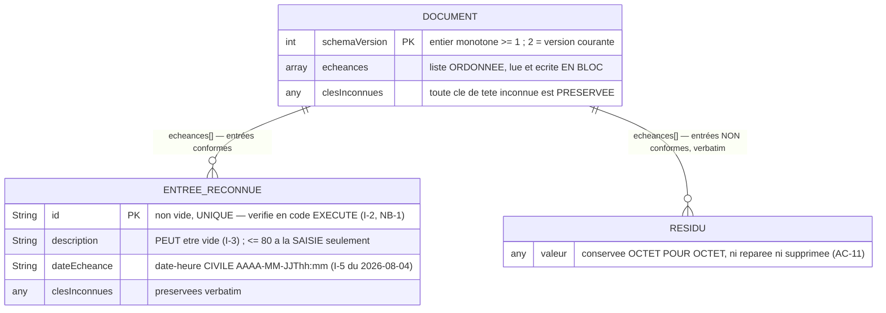

# Schéma du stockage local — document `echeances.json` (US-01.2)

> Produit par **@DataEngineer** le **2026-08-06** — branche de design `data_design` d'US-01.2
> *(track FULL, `parallel_design`)*. Il **instancie** [ADR-009](../adr/ADR-009-stockage-local-document-json-versionne.md)
> *(le mécanisme est **déjà décidé** : document JSON unique, versionné, écrit atomiquement — ⛔ il n'est
> pas rouvert ici)* et [ADR-005](../adr/ADR-005-convention-migrations-reversibles.md) *(la convention de
> migrations réversibles — **c'est elle que ce document rend exécutable**)*.
>
> **Complément de** [`MODELE_ECHEANCE.md`](MODELE_ECHEANCE.md), qui décrit la forme **EN MÉMOIRE**
> *(entité `Echeance`, invariants I-1 → I-7)*. ⛔ **Les deux formes ne sont pas la même, et c'est
> voulu** *(ADR-010 §2)* : ici c'est la forme **SUR LE DISQUE**.

## 🔴 Ce que ce document apporte, et pourquoi ce n'est pas une redite d'ADR-009

ADR-009 **décide** le mécanisme et **mesure** son coût. Il ne décrit **ni la grammaire exacte de chaque
valeur persistée**, ni le **contrat d'appel** des migrations, ni les **cas de corruption**. Surtout, il
porte une affirmation que **la mesure du 2026-08-06 contredit** :

> ADR-009 §Conséquences : « *l'aller-retour est **exact dans un fuseau donné** (ce que le patron
> asserte) et ne l'est pas d'un fuseau à l'autre.* »

⛔ **C'est FAUX, et c'est mesuré** *(commande rejouable ci-dessous)* : **dans un seul et même fuseau**,
l'aller-retour `v1 → v2 → v1` est **inexact** pour tout instant portant des **secondes ou millisecondes
non nulles**, et pour l'**heure répétée** de la bascule d'heure d'hiver. ⛔ **ADR-009 n'est PAS édité**
*(un ADR accepté est immuable — c'est le corpus qui date le constat)*, et sa **décision** n'est pas
touchée : c'est un **constat de son §Conséquences** qui a vieilli avant d'avoir servi.
➡️ **Conséquence directe** : la **garde d'inversibilité** décrite au §4 n'est pas une élégance, elle est
**la condition sans laquelle le couple `v1 ⇄ v2` NE SATISFAIT PAS ADR-005 §2**.

## 1 · Les conventions de mon rôle : nommées, pas cochées

*(Même discipline que `MODELE_ECHEANCE.md` : je les **nomme** au lieu de les **cocher**.)*

| Convention @DataEngineer | Statut ici | Motif — mesuré, pas supposé |
|---|---|---|
| **snake_case** | ⛔ **Écartée, sciemment** | Les clés persistées **miroitent les champs de l'entité Dart** *(`dateEcheance`)*. Deux graphies exigeraient une **table de correspondance** — soit **deux exemplaires d'une même règle**, et ce corpus a mesuré **trois fois** que deux copies dérivent. Les clés sont **figées par ADR-009 §1**, qui est **immuable** |
| **Tables au pluriel** | ✅ **Appliquée** | La collection est `echeances` *(pluriel)*, l'entrée est au singulier |
| **3NF — traquer la redondance** | ✅ **Appliquée, et c'est la contrainte la plus structurante** | **Aucun fait dérivable n'est stocké** : ni `estEchue`, ni `RemainingTime`, ni `createdAt`, ni `dirty`, ni `deletedAt` *(I-7, confirmé par ADR-009)*. L'état `ÉCHUE` est **dérivé de `(dateEcheance, Clock)`** ⇒ **redondance nulle par construction**. ⛔ Stocker `estEchue` le rendrait **faux à la seconde suivante** |
| **Index (B-Tree, plein texte)** | ⛔ **Sans objet, et interdit** | **Aucun AC n'annonce recherche ni filtrage** ; **AC-10 « Limite » interdit explicitement** index, pagination, recherche et chargement différé. Volume : **≤ 9 présentes** + historique. Lecture et écriture **du document entier** |
| **Migrations nommées descriptivement** | ✅ **Appliquée** | L'étape porte son numéro **et** son intention : `v1 → v2 : date_utc_vers_date_civile` |
| **DDL et migration de données séparés** | ⚠️ **Sans objet ici, et il faut le dire** | Un document JSON **n'a pas de DDL** : il n'existe **que** la migration de données. La séparation prescrite par mon rôle **n'a rien à séparer** — ⛔ ne pas la cocher pour autant |

## 2 · La forme persistée — diagramme et grammaire

⚠️ **Ce diagramme décrit un DOCUMENT, pas des tables** : les « entités » sont des **objets JSON**, la
« cardinalité » est celle d'un **tableau**, et il n'y a **aucune clé étrangère** *(il n'y a qu'une seule
collection)*.



**Exemple d'un document `v2` complet** *(forme exacte, ADR-009 §1)* :

```json
{"schemaVersion":2,
 "echeances":[{"id":"a1","description":"Convent","dateEcheance":"2026-11-15T23:59"}]}
```

### Grammaire de chaque valeur — et **ce qui la réfute**

| Clé | Domaine **exact** | Hors domaine ⇒ | Réfutée par |
|---|---|---|---|
| `schemaVersion` | entier, `1 ≤ v ≤ versionCourante` | **document non interprétable** *(§5)* | Une version **devinée** au lieu d'être lue · un `"2"` textuel accepté |
| `echeances` | tableau JSON, **ordre préservé** | document non interprétable | Une lecture qui réordonne, ou qui accepte un objet à la place d'un tableau |
| `id` | chaîne **non vide**, **unique** dans le tableau | **résidu** *(entrée conservée, non affichée)* | Un `id` vide accepté **en release** *(NB-1)* · deux entrées de même `id` affichées toutes deux |
| `description` | chaîne, **peut être vide** *(I-3)* | résidu | Une entrée à description vide **masquée** *(casserait AC-3 « Erreur » d'US-01.1)* · une longueur refusée **à la lecture** *(la borne de 80 vit à la **saisie**, AC-2)* |
| `dateEcheance` *(v2)* | chaîne **canonique civile** : `formatCivil(DateTime.parse(s)) == s` **et** `!DateTime.parse(s).isUtc` | résidu | Une valeur portant `Z`, un décalage, des **secondes**, une date **hors calendrier**, ou une **heure civile inexistante localement** — toutes acceptées silencieusement par `DateTime.parse` *(mesuré §3)* |
| `dateEcheance` *(v1)* | chaîne **canonique UTC** : `DateTime.parse(s).toIso8601String() == s` **et** `isUtc` | entrée **non migrée**, laissée verbatim | Une valeur v1 **tronquée** par la montée |
| toute autre clé | quelconque | **préservée verbatim** | Une clé inconnue **perdue** par une lecture, une écriture ou une migration |

🔴 **Le prédicat de forme canonique n'est pas une coquetterie : sans lui, `DateTime.parse` MUTE la donnée
en silence.** Mesuré : `2026-02-31T23:59` **ne lève pas** et rend **`2026-03-03T23:59`** ⇒ sans le
prédicat, l'échéance du pratiquant **change de date toute seule**, et **AC-14 « Nominal »** *(« restituées
exactement »)* tombe **sans qu'aucun test générique ne rougisse**.

## 3 · Les mesures qui gouvernent ce schéma — **rejouables, jamais recopiées de mémoire**

```
python reports/US-01.2/migration_roundtrip_criterion.py --sonde
```

Sortie **réelle du 2026-08-06** *(Dart 3.12.2, hôte en Europe/Paris)* :

```
fuseau=Paris, Madrid (heure d??t?)  offset_janvier=1:00:00.000000  offset_juillet=2:00:00.000000
nominal hiver                      v1=2026-11-15T22:59:00.000Z  up=2026-11-15T23:59  down=2026-11-15T22:59:00.000Z  ALLER_RETOUR_EXACT=true  GARDE=true
nominal ete                        v1=2026-07-15T21:59:00.000Z  up=2026-07-15T23:59  down=2026-07-15T21:59:00.000Z  ALLER_RETOUR_EXACT=true  GARDE=true
secondes non nulles                v1=2026-11-15T22:59:30.000Z  up=2026-11-15T23:59  down=2026-11-15T22:59:00.000Z  ALLER_RETOUR_EXACT=false  GARDE=false
millisecondes non nulles           v1=2026-11-15T22:59:00.500Z  up=2026-11-15T23:59  down=2026-11-15T22:59:00.000Z  ALLER_RETOUR_EXACT=false  GARDE=false
bascule automne 1re occurrence     v1=2026-10-25T00:30:00.000Z  up=2026-10-25T02:30  down=2026-10-25T00:30:00.000Z  ALLER_RETOUR_EXACT=true  GARDE=true
bascule automne 2e occurrence      v1=2026-10-25T01:30:00.000Z  up=2026-10-25T02:30  down=2026-10-25T00:30:00.000Z  ALLER_RETOUR_EXACT=false  GARDE=false
bascule printemps                  v1=2026-03-29T01:30:00.000Z  up=2026-03-29T03:30  down=2026-03-29T01:30:00.000Z  ALLER_RETOUR_EXACT=true  GARDE=true
heure civile inexistante          v2=2026-03-29T02:30  down=2026-03-29T01:30:00.000Z  up=2026-03-29T03:30  ALLER_RETOUR_EXACT=false
date hors calendrier 2026-02-31T23:59 -> parse rend 2026-03-03T23:59 SANS exception ; forme canonique preservee=false
parse("2026-11-15") -> 2026-11-15T00:00:00.000 isUtc=false forme canonique preservee=false
parse("2026-11-15T23:59:00Z") -> 2026-11-15T23:59:00.000Z isUtc=true forme canonique preservee=false
```

**Ce que ces 11 lignes établissent, et qui n'était écrit nulle part** :

1. ⛔ **L'aller-retour n'est PAS exact dans un fuseau donné** — **deux classes de contre-exemples**
   *(secondes non nulles ; **heure répétée** de la bascule d'automne)*. ⇒ un couple `up`/`down` naïf
   **violerait ADR-005 §2**, et le patron de `MIGRATIONS.md` §4 **doit** le refuser.
2. ✅ **La colonne `GARDE` vaut exactement `ALLER_RETOUR_EXACT`, sur 7 cas sur 7** — dans les **deux
   sens**. Le prédicat `DateTime.parse(civil).toUtc() == instant` est donc **la caractérisation exacte**
   de l'inversibilité, et non une approximation prudente. **C'est ce qui rend l'invariant tenable par
   CONSTRUCTION**, au lieu d'être surveillé.
3. ⛔ **`DateTime.parse` accepte silencieusement** une date hors calendrier, une date sans heure, et un
   instant marqué `Z` ⇒ ⛔ **une exception n'est PAS une barrière suffisante** : la barrière est la
   **comparaison à la forme canonique**.
4. ⚠️ **Une heure civile peut ne pas exister localement** *(bascule de printemps)* ⇒ elle **n'a pas
   d'aller-retour** et doit être **refusée à la SAISIE** — voir la règle **V-1** au §6.

## 4 · Les migrations — table, contrat, et la garde qui les rend réversibles

### Table des versions

| Version | Forme de `dateEcheance` | Statut | Qui l'a produite |
|---|---|---|---|
| **v0** | *(aucun fichier)* | Installation neuve — **état vide réellement atteignable** *(AC-13 « Erreur »)* | — |
| **v1** | **instant ISO-8601 canonique marqué UTC** `AAAA-MM-JJThh:mm:00.000Z` | **Format lisible, jamais distribué** | Ce que prescrivait la note **I-5**, en vigueur jusqu'au 2026-08-02 |
| **v2** | **date-heure CIVILE** `AAAA-MM-JJThh:mm` | ✅ **`versionCourante`** | Arbitrage humain du 2026-08-03 *(AC-14, promu **Must**)* |

⚠️ **`v1` n'est l'héritage de personne** *(ADR-009 §Conséquences)* : **aucun utilisateur n'a jamais détenu
de document `v1`**. Sa valeur est de faire **transformer de la donnée** à la première migration du projet,
comme le `.feature` **normatif** l'exige *(« une version antérieure … contient 3 échéances »)*.
⛔ **Le dire autrement serait une fiction.**

🔴 **DÉVIATION ASSUMÉE D'ADR-005 §1, à contester si l'on n'en veut pas** : **il n'existe AUCUNE étape
`v0 → v1`**. Pour un magasin document, `v0` est **l'absence de fichier** ; « créer le schéma » n'est pas
une **transformation de données** mais **la première écriture**, qui relève du dépôt. Une étape
fictive `v0 → v1` n'aurait **aucun effet**, et son `down` — *supprimer le fichier* — serait **le seul
`down` destructif du projet** *(ADR-005 §3)* pour un chemin que **rien n'emprunte**. ⇒ la table d'étapes
**commence à `v2`**, la première migration **réelle**. ⚠️ **C'est un écart à la lettre du §1 « Cas de
base », il est ici NOMMÉ et daté** — ⛔ pas glissé sous le tapis.

### Contrat d'appel — **c'est à lui que se lie le critère de sortie**

```dart
// lib/features/echeances/data/echeance_schema_migrations.dart
typedef EtapeFn = Map<String, Object?> Function(Map<String, Object?>);

class EtapeMigration {
  const EtapeMigration(this.version, this.up, this.down);
  final int version;   // version ATTEINTE par up ; down en repart
  final EtapeFn up;    // (version - 1) -> version
  final EtapeFn down;  // version -> (version - 1)
}

const int versionCourante = 2;
const List<EtapeMigration> etapesMigration = <EtapeMigration>[
  EtapeMigration(2, /* v1 -> v2 */ ..., /* v2 -> v1 */ ...),
];

/// null si le document ne porte pas d'entier >= 1. ⛔ Jamais une version devinée.
int? lireVersion(Map<String, Object?> document);

/// Applique les étapes montantes OU descendantes jusqu'à [cible], puis réécrit
/// `schemaVersion`. Rend **null** si la version de départ n'est pas prise en charge
/// (absente, non entière, < 1, ou **supérieure à versionCourante**).
/// ⛔ Fonction PURE : elle ne touche ni disque ni horloge, et ne mute pas son entrée.
Map<String, Object?>? migrer(Map<String, Object?> document, {int cible = versionCourante});
```

⚠️ **Ces noms sont contraignants** : le critère de sortie s'y **lie**. Un nom différent laisse le critère
**rouge** — c'est le principe même d'un critère, ⛔ pas un effet de bord.

### Sémantique de l'étape `v1 ⇄ v2` — *`date_utc_vers_date_civile`*

- **`up`** : pour chaque entrée dont `dateEcheance` est une chaîne **v1 canonique**, écrire la
  date-heure **civile locale** correspondante. **Toute autre entrée est laissée VERBATIM.**
- **`down`** : pour chaque entrée dont `dateEcheance` est une chaîne **v2 canonique**, écrire l'**instant
  UTC** correspondant. **Toute autre entrée est laissée VERBATIM.**
- 🔴 **Garde d'inversibilité, non négociable** : une conversion n'est effectuée **que si elle est
  réversible sur place** — `DateTime.parse(civil).toUtc() == instant`. Sinon l'entrée est **laissée
  verbatim**. **Motif mesuré au §3** : sans cette garde, `22:59:30Z` devient `23:59` puis `22:59:00Z`
  ⇒ **30 secondes détruites**, et **AC-12 « Erreur »** *(« aucune migration ne tronque une donnée »)*
  **tombe**.
- ⛔ **Aucune clé n'est retirée, aucune entrée n'est supprimée, aucun document n'est recomposé** : le
  `up` et le `down` **transportent** ce qu'ils ne comprennent pas *(clés de tête inconnues, clés
  d'entrée inconnues, lignes non-objet)*.
- ✅ **Cette étape n'est donc PAS destructive** au sens d'ADR-005 §3 ⇒ **aucune stratégie de préservation
  n'est requise, et aucune `EVT_WAIVER_GRANTED` n'est demandée.**

⚠️ **Contrepartie, à ne pas sur-lire** : une entrée **non inversible** est **conservée** mais **cesse
d'être affichée** *(elle devient un résidu au sens d'ADR-009 §4)*. **Aucune donnée n'est perdue** ; une
échéance peut **disparaître de la grille**. Sur `v1`, la portée réelle est **nulle** *(personne n'a jamais
détenu de document `v1`)* — ⛔ mais la règle **doit être relue** si une version future devait migrer de
la donnée **réellement détenue par des utilisateurs**.

### Idempotence et unicité d'exécution *(AC-12 « Nominal », R-6)*

Après un `up` réussi, le document réécrit **porte `schemaVersion = 2`** ⇒ la relecture suivante ne trouve
**plus rien à migrer**. ⛔ **Vérifié par une assertion, pas par relecture du code** : le critère refuse un
`migrer` qui **ne réécrit pas la version** *(mutant `M3`)*.

## 5 · Corruption, absence, version inconnue, version future

| Cas sur le disque | Comportement **exigé** | ⛔ Interdit | Couverture |
|---|---|---|---|
| **Aucun fichier** *(v0)* | État vide sobre ; le premier enregistrement crée le document en `v2` | — | AC-13 « Erreur » — scénario |
| **Fichier vide / JSON invalide / racine non-objet** | `rename` vers `echeances.json.illisible-<horodatage>` **avant** toute écriture neuve, puis **état vide** | ⛔ **Jamais un `delete`**, jamais une réparation | AC-11 « Limite » — scénario |
| **Entrée non conforme** *(non-objet, `id` absent/vide/non-`String`, date non canonique)* | **Résidu** : ignorée à l'affichage, **ré-émise verbatim à sa place** à chaque écriture | ⛔ Ni réécrite, ni normalisée, ni supprimée | AC-11 « Erreur » — scénario · **R-2** |
| **`id` en double** | ⚠️ **La première occurrence est reconnue ; les suivantes sont des résidus** *(conservées, non affichées)* | ⛔ Ne pas afficher deux entrées de même `id` *(les `Key` de widgets entreraient en collision)* · ⛔ ne pas supprimer le doublon | 🔴 **Aucun AC, aucun scénario** — voir §7 |
| **`schemaVersion` absent, non entier, ou `< 1`** | Document **non interprétable** ⇒ traité comme *fichier illisible* *(mise de côté, état vide)* | ⛔ **Jamais deviner « c'est sûrement du v1 »** : deviner une version, c'est risquer d'appliquer un `up` sur une forme qu'il ne comprend pas | 🔴 **Aucun scénario** — unitaire |
| **`schemaVersion` > `versionCourante`** *(document ÉCRIT PAR UNE VERSION PLUS RÉCENTE de l'app)* | **État vide** **ET** ⛔ **aucune écriture** : le document est **laissé strictement intact, sans `rename`** | ⛔ **Ne pas le mettre de côté** *(cela orphelinerait une donnée valide du point de vue de la version récente)* · ⛔ **ne pas l'écraser** | 🔴 **Aucun AC, aucun scénario** — voir §7 |

🔴 **La distinction entre les deux dernières lignes est la plus facile à rater et la plus coûteuse** :
un document **illisible** se met de côté *(sinon l'application ne pourrait plus jamais écrire)* ; un
document **de version future** est **parfaitement lisible par une autre version** ⇒ **le déplacer est
destructeur en effet**, même si aucun octet n'est effacé.

## 6 · Ce que ce schéma impose à la SAISIE — la chaîne de défaut à couper

**V-1 — la validation de saisie doit refuser une date-heure civile NON CANONIQUE.**
*(Règle pour **T3** `validation_echeance.dart` et **T4** le codec.)*

**Pourquoi, et c'est une chaîne mesurée, pas une hypothèse** : le pratiquant peut saisir `02:30` le
**29 mars 2026** — une heure civile qui **n'existe pas** dans le fuseau local *(mesuré §3)*. Écrite telle
quelle, elle serait **relue comme non canonique**, donc traitée en **résidu**, donc **invisible** :
l'échéance disparaîtrait **sans message**, alors même que l'utilisateur l'a saisie et validée.
⇒ **La forme canonique se vérifie AU MOMENT DE LA SAISIE**, avec un refus explicite, ⛔ **jamais en
laissant l'écriture aboutir**.
**Réfutée par** : une saisie acceptée dont la relecture ne restitue pas exactement la valeur saisie.
⚠️ **Fenêtre réelle : une heure par an**, et l'heure par défaut *(23:59)* n'est **jamais** concernée —
⛔ **ce n'est pas une raison pour ne pas la coder** : c'est exactement le profil d'un défaut qui n'est
jamais reproduit et jamais compris.

**V-2 — un même prédicat, un seul exemplaire.** Le prédicat de forme canonique sert **la saisie**, **le
codec** et **les migrations**. ⛔ **Il vit en UN seul endroit** *(deux copies dérivent — vérifié trois
fois sur ce corpus)*.

## 7 · ⛔ Ce que ce design N'ATTESTE PAS

1. 🔴 **Le patron aller-retour n'a PAS été joué sur `lib/` — parce que `lib/` n'existe pas.** T2 → T7
   sont à @Developer et **aucune ligne du module de migration n'est écrite à ce jour**. Ce qui a été
   **réellement exécuté** aujourd'hui, c'est le patron **contre une source Dart de FIXTURE**.
   ⛔ **Le risque nº 4 d'EPIC_00 reste donc OUVERT**, et le **critère d'entrée transféré par EPIC_00
   n'est PAS satisfait** : il le sera quand `migration_roundtrip_criterion.py` rendra **exit 0** contre
   le module réel. **Un ADR n'est pas une exécution ; un critère de sortie non plus.**
2. ⚠️ **Trois règles de ce document ne sont couvertes par AUCUN AC et AUCUN scénario** : la **version
   future**, l'**`id` en double**, et le `schemaVersion` **absent ou non entier**. Elles sont
   **atteignables sur le disque**, donc réelles. ⛔ **Ne pas leur écrire de scénario Gherkin** : le
   `.feature` en porte **45**, et `check_gherkin_mapping.py` exige **45 ↔ 45** *(un 46ᵉ scénario rend le
   job requis `📋 Governance` **rouge** — R-7)*. ⇒ **tests unitaires de la couche `data`**, et
   **entrée à porter à @ProductOwner / @Architect** s'ils doivent devenir des AC.

   > 🔴 **PÉRIMÉ-2026-08-06 (@Architect) — LE MOTIF CI-DESSUS EST FAUX, LA CONCLUSION EST JUSTE. Les deux
   > sont conservés parce que l'écart entre eux est instructif.**
   > **Mesuré en LANÇANT la commande** : `COUPLES` est une tuple **codée en dur ne contenant qu'US-01.1** ;
   > `python scripts/check_gherkin_mapping.py` imprime *« 13 scénarios ↔ 13 tests »* et rend `exit 0`.
   > ⇒ ⛔ **US-01.2 n'est sous aucun contrôle de correspondance aujourd'hui**, et un 46ᵉ scénario **ne
   > rend rien rouge**. La contrainte ne s'active qu'à **T14**, qui enregistre le couple **en dernier** —
   > ce que **R-7 énonçait déjà correctement**.
   > **La conclusion « pas de Gherkin pour ces trois règles » DEMEURE**, mais pour son **vrai** motif :
   > **arbitrage humain du 2026-08-06, voie (b)** — ce sont des règles de **contrat interne invisibles à
   > l'utilisateur**, couvertes par des **tests unitaires déclarés**. ⛔ **Pas parce qu'un gate l'aurait
   > interdit.**
   > 📌 **Le `.feature` porte désormais 50 scénarios** *(AC-16 et AC-17 créés le 2026-08-06 ; compté par
   > commande : **50**, **0 titre en double**)*. ⛔ **Ce nombre n'est PAS recopié ailleurs dans ce
   > document** : il se **lit** dans le `.feature`.
3. ⚠️ **Le comportement de l'IHM face à un document de version future n'est pas défini** : la couche de
   données sait **refuser d'écrire**, l'application n'a **aucun mode « lecture seule »**. ⛔ **Je ne le
   décide pas** *(c'est du produit)*.
4. ⚠️ **NM-8 est INCHANGÉE** : rien ici ne vérifie que le document est écrit dans le **vrai répertoire de
   documents de l'appareil** *(`path_provider`)* — cela n'existe **ni en test hôte, ni en CI, ni sur le
   web**, et se lèvera avec **US-01.3**.
5. ⚠️ **NM-5 est INCHANGÉE** : la mesure du §3 **calcule** le comportement des bascules d'heure ;
   ⛔ **personne n'a observé** un voyage ni une transition réelle.
6. ⚠️ **Divergence dev / prod, déjà portée par ADR-009 §Conséquences — je la précise, je n'ouvre pas un
   ADR de plus** : les tests écrivent dans un **répertoire temporaire réel** *(même code de production)*,
   l'appareil dans le **répertoire de documents**, et **le web ne persiste RIEN** *(branche stub)*.
   ⇒ **`flutter build web --release` restera VERT en produisant une application sans stockage**, et
   **aucune barrière machine ne signale cet écart**. ✅ **Aucun ADR nouveau n'est requis** : la décision
   est prise et documentée ; en ouvrir un second **dupliquerait le motif**.
7. ⚠️ **Le critère de sortie n'est pas un gate CI** : il exige le SDK Dart et un fichier qui n'existe pas
   encore. ⛔ **Ne pas l'ajouter à `ci.yml`** en l'état.
8. ⚠️ **L'assertion `A1` du critère ne vérifie pas qu'un `down` est CORRECT**, seulement qu'il **existe et
   diffère du `up`**. La correction du `down` est établie par `A3`, et **par lui seul**.

## 8 · Le critère de sortie — **exécutable, rejouable, et il porte ses mutants**

📄 [`reports/US-01.2/migration_roundtrip_criterion.py`](../../reports/US-01.2/migration_roundtrip_criterion.py)

```
python reports/US-01.2/migration_roundtrip_criterion.py            # contre lib/ (T5)
python reports/US-01.2/migration_roundtrip_criterion.py --selftest # pouvoir du critère
python reports/US-01.2/migration_roundtrip_criterion.py --sonde    # mesures du §3
```

Les **8 assertions** instancient `MIGRATIONS.md` §4 sur le document : contrat du couple `up`/`down`
*(A1)*, montée effective sans déplacer l'instant *(A2)*, **aller-retour sur les octets** *(A3 — le patron
lui-même)*, réécriture de la version *(A4)*, survie des clés inconnues *(A5)*, **jamais de conversion
avec perte** *(A6)*, refus des versions non prises en charge *(A7)*, **forme civile du texte persisté**
*(A8 — AC-14)*.

**Les mutants sont COMPORTEMENTAUX** — ils changent ce que le code **fait**, ⛔ pas comment il est
**écrit** : *« un contrôle portant son mutant a été juste 7 fois sur 7 ; un contrôle purement lexical,
faux 7 fois sur 7 »*. Les verdicts sont comparés **en ENSEMBLES**, ⛔ jamais en cardinaux, et un mutant
dont la source serait **identique** à la source conforme est **refusé** *(contrôle négatif)*.

---

**Références** : [ADR-005](../adr/ADR-005-convention-migrations-reversibles.md) ·
[`MIGRATIONS.md`](MIGRATIONS.md) §4 · [ADR-009](../adr/ADR-009-stockage-local-document-json-versionne.md) ·
[ADR-010](../adr/ADR-010-clauses-track-full-avec-persistance.md) §2 ·
[`MODELE_ECHEANCE.md`](MODELE_ECHEANCE.md) *(forme en mémoire, I-1 → I-7)* ·
[Story File US-01.2](../stories/US-01.2-gestion-echeances.md) *(AC-11, AC-12, AC-14 · T3 → T7)* ·
[`tests/features/US-01.2-gestion-echeances.feature`](../../tests/features/US-01.2-gestion-echeances.feature)
*(**normatif**)*.
