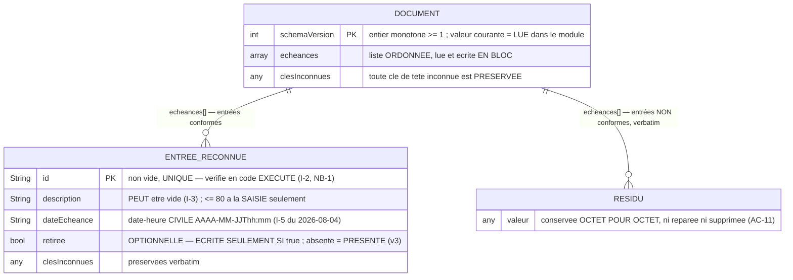

# Schéma du stockage local — document `echeances.json` (US-01.2)

> ⚖️ **AMENDÉ le 2026-08-24 — @DataEngineer, branche `data_design` d'US-01.4** *(track FULL,
> `parallel_design`)*, en instanciant
> [ADR-012](../adr/ADR-012-etat-echue-retiree-persistance-migration-v3.md) *(**accepté, donc immuable** :
> la **forme** de `retiree` sur le disque et la **sémantique** du couple `v2 ⇄ v3` y sont **décidées** —
> ⛔ **rien de tout cela n'est rouvert ici**)*.
>
> **Ce que cet amendement APPORTE, et qui n'existe nulle part ailleurs** : l'**échelle de migration**
> *(§4 — table des versions, sémantique de l'étape, garde)*, la **frontière exacte** où la valeur hors
> domaine est refusée *(§2 bis — **en UN seul exemplaire**, et le cas `null` que personne n'avait nommé)*,
> la **position de la clé à la ré-émission** *(mesurée : deux formes satisfont ADR-012, **une seule**
> préserve la garantie écrite du codec)*, et la **campagne de mutants** *(§8 — **quatre** formes
> destructrices que le critère d'US-01.2 laisse passer, **mesuré par exécution**)*.
>
> ⛔ **On date, on ne repeint pas** *(patron d'`I-5`)* : le texte antérieur du **§1** *(ligne 3NF)*, du
> **§2** *(diagramme)* et du **§4** *(table des versions)* **reste visible et marqué** ; le nouvel énoncé
> est ajouté **au-dessous**. ⛔ **Aucune valeur dérivée n'est « mise à jour »** : quand elle a vieilli,
> elle est **retirée** et remplacée par **la commande qui la produit** *(défaut ⑤ du `CLAUDE.md` :
> « une valeur fausse se retire, jamais ne se met à jour »)*.

> Produit par **@DataEngineer** le **2026-08-06** — branche de design `data_design` d'US-01.2
> *(track FULL, `parallel_design`)*. Il **instancie** [ADR-009](../adr/ADR-009-stockage-local-document-json-versionne.md)
> *(le mécanisme est **déjà décidé** : document JSON unique, versionné, écrit atomiquement — ⛔ il n'est
> pas rouvert ici)* et [ADR-005](../adr/ADR-005-convention-migrations-reversibles.md) *(la convention de
> migrations réversibles — **c'est elle que ce document rend exécutable**)*.
>
> **Complément de** [`MODELE_ECHEANCE.md`](MODELE_ECHEANCE.md), qui décrit la forme **EN MÉMOIRE**
> *(entité `Echeance`, invariants I-1 → I-7)*. ⛔ **Les deux formes ne sont pas la même, et c'est
> voulu** *(ADR-010 §2)* : ici c'est la forme **SUR LE DISQUE**.

## 🔴 Ce que ce document apporte, et pourquoi ce n'est pas une redite d'ADR-009

ADR-009 **décide** le mécanisme et **mesure** son coût. Il ne décrit **ni la grammaire exacte de chaque
valeur persistée**, ni le **contrat d'appel** des migrations, ni les **cas de corruption**. Surtout, il
porte une affirmation que **la mesure du 2026-08-06 contredit** :

> ADR-009 §Conséquences : « *l'aller-retour est **exact dans un fuseau donné** (ce que le patron
> asserte) et ne l'est pas d'un fuseau à l'autre.* »

⛔ **C'est FAUX, et c'est mesuré** *(commande rejouable ci-dessous)* : **dans un seul et même fuseau**,
l'aller-retour `v1 → v2 → v1` est **inexact** pour tout instant portant des **secondes ou millisecondes
non nulles**, et pour l'**heure répétée** de la bascule d'heure d'hiver. ⛔ **ADR-009 n'est PAS édité**
*(un ADR accepté est immuable — c'est le corpus qui date le constat)*, et sa **décision** n'est pas
touchée : c'est un **constat de son §Conséquences** qui a vieilli avant d'avoir servi.
➡️ **Conséquence directe** : la **garde d'inversibilité** décrite au §4 n'est pas une élégance, elle est
**la condition sans laquelle le couple `v1 ⇄ v2` NE SATISFAIT PAS ADR-005 §2**.

## 1 · Les conventions de mon rôle : nommées, pas cochées

*(Même discipline que `MODELE_ECHEANCE.md` : je les **nomme** au lieu de les **cocher**.)*

| Convention @DataEngineer | Statut ici | Motif — mesuré, pas supposé |
|---|---|---|
| **snake_case** | ⛔ **Écartée, sciemment** | Les clés persistées **miroitent les champs de l'entité Dart** *(`dateEcheance`)*. Deux graphies exigeraient une **table de correspondance** — soit **deux exemplaires d'une même règle**, et ce corpus a mesuré **trois fois** que deux copies dérivent. Les clés sont **figées par ADR-009 §1**, qui est **immuable** |
| **Tables au pluriel** | ✅ **Appliquée** | La collection est `echeances` *(pluriel)*, l'entrée est au singulier |
| **3NF — traquer la redondance** | ✅ **Appliquée, et c'est la contrainte la plus structurante** | **Aucun fait dérivable n'est stocké** : ni `estEchue`, ni `RemainingTime`, ni `createdAt`, ni `dirty`, ~~ni `deletedAt`~~ ⛔ **PÉRIMÉ-2026-08-24 pour ce seul dernier terme, voir sous la table** *(I-7, confirmé par ADR-009)*. L'état `ÉCHUE` est **dérivé de `(dateEcheance, Clock)`** ⇒ **redondance nulle par construction**. ⛔ Stocker `estEchue` le rendrait **faux à la seconde suivante** |
| **Index (B-Tree, plein texte)** | ⛔ **Sans objet, et interdit** | **Aucun AC n'annonce recherche ni filtrage** ; **AC-10 « Limite » interdit explicitement** index, pagination, recherche et chargement différé. Volume : **≤ 9 présentes** + historique. Lecture et écriture **du document entier**. ⚖️ **RECONDUIT-2026-08-24 malgré une apparence contraire** : **AC-7 d'US-01.4** *(signaler en gestion les échues **encore présentes**)* **ressemble** à un cas de filtrage, mais son propre volet « Limite » écrit ⛔ *« aucun filtre, aucune recherche, aucun troisième groupe »* ⇒ c'est une **partition d'une liste déjà entièrement en mémoire**, ⛔ pas une requête. **Aucun index n'est créé, et il serait interdit** |
| **Migrations nommées descriptivement** | ✅ **Appliquée** | L'étape porte son numéro **et** son intention : `v1 → v2 : date_utc_vers_date_civile` |
| **DDL et migration de données séparés** | ⚠️ **Sans objet ici, et il faut le dire** | Un document JSON **n'a pas de DDL** : il n'existe **que** la migration de données. La séparation prescrite par mon rôle **n'a rien à séparer** — ⛔ ne pas la cocher pour autant |

### 🔴 AMENDEMENT DATÉ-2026-08-24 — la ligne 3NF portait un motif **TROP LARGE**, et c'est un défaut

**Le texte visé, cité verbatim** *(il reste dans la table ci-dessus, marqué)* : *« Aucun fait **dérivable**
n'est stocké : … ni `deletedAt` »*.

⛔ **Ce n'est pas une nuance : le motif ne couvre pas ce qu'il exclut.**

| Fait | Se dérive de | Verdict 3NF |
|---|---|---|
| `estEchue` | `(dateEcheance, Clock)` | ⛔ **Non stockable** — il serait **faux à la seconde suivante**. **La ligne a raison** |
| `RemainingTime` | `(Echeance, Clock)` | ⛔ **Non stockable** — même motif |
| `createdAt`, `dirty`, `version` | *(rien — mais **aucun AC ne les demande**)* | ⛔ **Non stockables** : **modélisation spéculative**, interdiction **reconduite sans réserve** |
| *« le pratiquant a retiré cette tuile »* | 🔴 **RIEN** | ✅ **Stockable** : aucune redondance, **aucune dérivation possible** |

➡️ **La 3NF n'a JAMAIS interdit ce champ** : `retiree` la **respecte**. Ce qui l'excluait était un motif
*« dérivable »* **annoncé plus large que sa portée réelle** — la classe de défaut même qu'ADR-010 relève
chez ADR-008. **La décision, elle, appartient à
[ADR-012](../adr/ADR-012-etat-echue-retiree-persistance-migration-v3.md)** *(§Contexte 4 et §Décision 1)*,
qui **remplace** la puce d'ADR-010 reconduisant `I-7` — ⛔ **et uniquement pour ce champ**.

⛔ **Ce que cet amendement NE fait pas** : il **ne lève pas `I-7`**, il le **réduit d'un champ,
nommément**. **Restent interdits dans l'entité, sans un mot de changement** : `createdAt`, `dirty`,
`version` — **et `retireeLe`**, parce qu'**aucun AC ne demande la date du retrait** ⇒ l'ajouter **serait**
la modélisation spéculative qu'`I-7` refuse. **Un booléen est le plus petit domaine qui satisfait AC-4 et
AC-5 d'US-01.4.**

## 2 · La forme persistée — diagramme et grammaire

⚠️ **Ce diagramme décrit un DOCUMENT, pas des tables** : les « entités » sont des **objets JSON**, la
« cardinalité » est celle d'un **tableau**, et il n'y a **aucune clé étrangère** *(il n'y a qu'une seule
collection)*.



> ⚖️ **DEUX MODIFICATIONS DATÉES-2026-08-24 dans ce diagramme, et il faut dire laquelle est de quelle
> nature.**
> **① AJOUT** : l'attribut **`retiree`** sur `ENTREE_RECONNUE` *(un ajout n'est pas une réécriture)*.
> **② RETRAIT d'une valeur dérivée** : la cellule `schemaVersion` portait ⛔ **« 2 = version courante »**.
> Cette valeur **a vieilli** ⇒ elle est **RETIRÉE, pas mise à jour** — *« une valeur mise à jour périme au
> cycle suivant »*, et c'est le **défaut ⑤** du `CLAUDE.md` *(un nombre dérivé écrit N fois)*. **La valeur
> se LIT**, et la commande qui la produit est :
> `grep -n "^const int versionCourante" lib/features/echeances/data/echeance_schema_migrations.dart`.
> ⛔ **Ce document ne réécrit ce nombre nulle part** — pas même dans l'exemple ci-dessous, qui est
> **daté** au lieu d'être présenté comme « courant ».

**Exemple d'un document complet, tel qu'il était en `v2`** *(forme exacte, ADR-009 §1 — ⛔ conservé comme
**témoin de la v2**, pas comme forme courante)* :

```json
{"schemaVersion":2,
 "echeances":[{"id":"a1","description":"Convent","dateEcheance":"2026-11-15T23:59"}]}
```

**Le même document après la montée, avec une échéance retirée** *(⚖️ ajouté le 2026-08-24)* — noter que
`a1` **n'a pas changé d'un octet** et que **seule** `a2` porte la clé :

```json
{"schemaVersion":3,
 "echeances":[{"id":"a1","description":"Convent","dateEcheance":"2026-11-15T23:59"},
              {"id":"a2","description":"Revue","dateEcheance":"2026-01-09T23:59","retiree":true}]}
```

### Grammaire de chaque valeur — et **ce qui la réfute**

| Clé | Domaine **exact** | Hors domaine ⇒ | Réfutée par |
|---|---|---|---|
| `schemaVersion` | entier, `1 ≤ v ≤ versionCourante` | **document non interprétable** *(§5)* | Une version **devinée** au lieu d'être lue · un `"2"` textuel accepté |
| `echeances` | tableau JSON, **ordre préservé** | document non interprétable | Une lecture qui réordonne, ou qui accepte un objet à la place d'un tableau |
| `id` | chaîne **non vide**, **unique** dans le tableau | **résidu** *(entrée conservée, non affichée)* | Un `id` vide accepté **en release** *(NB-1)* · deux entrées de même `id` affichées toutes deux |
| `description` | chaîne, **peut être vide** *(I-3)* | résidu | Une entrée à description vide **masquée** *(casserait AC-3 « Erreur » d'US-01.1)* · une longueur refusée **à la lecture** *(la borne de 80 vit à la **saisie**, AC-2)* |
| `dateEcheance` *(v2)* | chaîne **canonique civile** : `formatCivil(DateTime.parse(s)) == s` **et** `!DateTime.parse(s).isUtc` | résidu | Une valeur portant `Z`, un décalage, des **secondes**, une date **hors calendrier**, ou une **heure civile inexistante localement** — toutes acceptées silencieusement par `DateTime.parse` *(mesuré §3)* |
| `dateEcheance` *(v1)* | chaîne **canonique UTC** : `DateTime.parse(s).toIso8601String() == s` **et** `isUtc` | entrée **non migrée**, laissée verbatim | Une valeur v1 **tronquée** par la montée |
| `retiree` *(v3 — ⚖️ **ajoutée le 2026-08-24**)* | **`true`** ⇒ `ÉCHUE RETIRÉE` · **clé absente** ⇒ **présente** · **`false`** ⇒ présente *(forme **licite**, ⛔ **jamais écrite** par le produit)* | 🔴 **résidu** — l'**ENTRÉE ENTIÈRE** est conservée verbatim et **non affichée** *(ADR-012 §3)* | Une clé absente lue comme un retrait · un `"true"` **textuel**, un `1`, un `null` acceptés · une valeur hors domaine **réparée**, **normalisée**, **supprimée**, ou traitée par une **exception levée** · un repli sur `false` *(il **afficherait** une tuile que le pratiquant a retirée)* |
| toute autre clé | quelconque | **préservée verbatim** | Une clé inconnue **perdue** par une lecture, une écriture ou une migration |

🔴 **Le prédicat de forme canonique n'est pas une coquetterie : sans lui, `DateTime.parse` MUTE la donnée
en silence.** Mesuré : `2026-02-31T23:59` **ne lève pas** et rend **`2026-03-03T23:59`** ⇒ sans le
prédicat, l'échéance du pratiquant **change de date toute seule**, et **AC-14 « Nominal »** *(« restituées
exactement »)* tombe **sans qu'aucun test générique ne rougisse**.

### 2 bis · ⚖️ **AJOUTÉ le 2026-08-24** — OÙ la valeur hors domaine est refusée, et OÙ la clé est écrite

> **Pourquoi ce paragraphe existe** : ADR-012 décide **quoi** *(la grammaire, le résidu, l'émission
> conditionnelle)*. Il ne dit **ni où** la règle vit, **ni** ce qu'un `null` doit devenir, **ni** à quelle
> **place** la clé est ré-émise. **Les trois sont des décisions de forme sur le disque, donc les miennes**,
> et les trois ont un mutant qui passe inaperçu sans elles.

**F-1 · La refus de la valeur hors domaine vit à la FRONTIÈRE DE L'ENTITÉ, en UN SEUL exemplaire.**
`_reconnaitre` *(codec)* **transporte** la valeur brute ; **`Echeance.depuisDonnee` REFUSE** — c'est-à-dire
rend `null`, donc l'entrée devient un **résidu**. **Motif, et il est double** : ⓵ c'est déjà la frontière
qui porte `I-2` en **code exécuté en release** *(`NB-1`, ADR-010 §3 — ⛔ **jamais un `assert`**)* ; ⓶ mettre
le test **aussi** dans `_reconnaitre` créerait un **deuxième exemplaire** de la même règle, et *« deux
copies dérivent »* — vérifié trois fois sur ce corpus.
🔴 **Mutant à tuer** : `if (ligne['retiree'] is! bool) return null;` **ajouté dans `_reconnaitre`** — le
comportement est **identique aujourd'hui**, donc ⛔ **aucun test ne rougit** ; c'est un **contrôle de
revue**, ⛔ pas une assertion. **Réfutation greppable** : `grep -n "retiree" lib/**/echeance*.dart` doit
montrer **un seul** test de type, et il doit être **dans `echeance.dart`**.

**F-2 · 🔴 `null` est une valeur PRÉSENTE et NON booléenne ⇒ RÉSIDU.** ⛔ **Ce n'est pas une subtilité
gratuite** : `"retiree":null` est du JSON parfaitement valide, et la forme la plus naturelle à écrire —
`donnee['retiree'] ?? false` — le confond avec **une clé absente**. ⇒ la présence se teste par
**`containsKey`**, ⛔ **jamais par la nullité de la valeur** :

```
retiree = donnee.containsKey('retiree') ? donnee['retiree'] : false
si retiree n'est pas un bool  ⇒  l'entrée est un RÉSIDU
```

🔴 **Mutant à tuer** : `donnee['retiree'] ?? false` ⇒ une entrée à `retiree: null` **s'affiche comme
présente**, c'est-à-dire l'application **contredit une action de l'utilisateur sur la base d'une valeur
qu'elle n'a pas su lire** — exactement ce que le §Décision 3 d'ADR-012 refuse pour le repli sur `false`.
**Assertion qui le tue** : une entrée `retiree: null` est **absente de l'affichage** *(grille **et**
gestion)* **et** ré-émise **verbatim** à l'écriture suivante.

**F-3 · La clé CONSERVE SA POSITION dans l'entrée ; elle n'est ajoutée en fin que si l'entrée ne la
portait pas.** **Mesuré** *(sonde jetable hors dépôt, Dart 3.12.2)* — deux formes de `_encoderEntree`
satisfont **toutes deux** la règle d'ADR-012 §2-3 *(« émise si et seulement si `true`, retirée sinon »)*,
et **une seule** préserve la garantie **écrite** du codec *(« une entrée inchangée se réécrit à
l'identique »)* :

| Entrée d'origine | Forme **A** *(sauter la clé, puis l'ajouter en fin)* | Forme **B** *(retenue)* |
|---|---|---|
| `{"id","retiree":true,"description","dateEcheance"}` | ⛔ **`retiree` migre EN FIN** ⇒ octets **différents** | ✅ **octets identiques** |
| `{"id","description","dateEcheance","retiree":true}` | ✅ identiques | ✅ identiques |
| la même, **entité NON retirée** | ✅ clé **retirée** *(voulu)* | ✅ clé **retirée** *(voulu)* |

⇒ **Règle** : dans la copie des clés d'origine, `retiree` est **conservée** quand l'entité est retirée
*(sa valeur est ensuite forcée à `true` par la clé explicite — le littéral Dart garde la **position de
première insertion** et la **dernière valeur**)*, et **omise** sinon.
⚠️ **Portée honnête** : le cas nominal est **indiscernable** *(le produit écrit toujours la clé en
dernier)*. Le défaut n'apparaît que sur un document dont l'ordre des clés diffère — **document édité à la
main, ou écrit par une version future**. ⛔ **Ce n'est pas une raison de ne pas le coder** : c'est le profil
exact d'un défaut jamais reproduit et jamais compris *(même raisonnement que la fenêtre « une heure par an »
de **V-1**)*.

## 3 · Les mesures qui gouvernent ce schéma — **rejouables, jamais recopiées de mémoire**

```
python reports/US-01.2/migration_roundtrip_criterion.py --sonde
```

Sortie **réelle du 2026-08-06** *(Dart 3.12.2, hôte en Europe/Paris)* :

```
fuseau=Paris, Madrid (heure d??t?)  offset_janvier=1:00:00.000000  offset_juillet=2:00:00.000000
nominal hiver                      v1=2026-11-15T22:59:00.000Z  up=2026-11-15T23:59  down=2026-11-15T22:59:00.000Z  ALLER_RETOUR_EXACT=true  GARDE=true
nominal ete                        v1=2026-07-15T21:59:00.000Z  up=2026-07-15T23:59  down=2026-07-15T21:59:00.000Z  ALLER_RETOUR_EXACT=true  GARDE=true
secondes non nulles                v1=2026-11-15T22:59:30.000Z  up=2026-11-15T23:59  down=2026-11-15T22:59:00.000Z  ALLER_RETOUR_EXACT=false  GARDE=false
millisecondes non nulles           v1=2026-11-15T22:59:00.500Z  up=2026-11-15T23:59  down=2026-11-15T22:59:00.000Z  ALLER_RETOUR_EXACT=false  GARDE=false
bascule automne 1re occurrence     v1=2026-10-25T00:30:00.000Z  up=2026-10-25T02:30  down=2026-10-25T00:30:00.000Z  ALLER_RETOUR_EXACT=true  GARDE=true
bascule automne 2e occurrence      v1=2026-10-25T01:30:00.000Z  up=2026-10-25T02:30  down=2026-10-25T00:30:00.000Z  ALLER_RETOUR_EXACT=false  GARDE=false
bascule printemps                  v1=2026-03-29T01:30:00.000Z  up=2026-03-29T03:30  down=2026-03-29T01:30:00.000Z  ALLER_RETOUR_EXACT=true  GARDE=true
heure civile inexistante          v2=2026-03-29T02:30  down=2026-03-29T01:30:00.000Z  up=2026-03-29T03:30  ALLER_RETOUR_EXACT=false
date hors calendrier 2026-02-31T23:59 -> parse rend 2026-03-03T23:59 SANS exception ; forme canonique preservee=false
parse("2026-11-15") -> 2026-11-15T00:00:00.000 isUtc=false forme canonique preservee=false
parse("2026-11-15T23:59:00Z") -> 2026-11-15T23:59:00.000Z isUtc=true forme canonique preservee=false
```

**Ce que ces 11 lignes établissent, et qui n'était écrit nulle part** :

1. ⛔ **L'aller-retour n'est PAS exact dans un fuseau donné** — **deux classes de contre-exemples**
   *(secondes non nulles ; **heure répétée** de la bascule d'automne)*. ⇒ un couple `up`/`down` naïf
   **violerait ADR-005 §2**, et le patron de `MIGRATIONS.md` §4 **doit** le refuser.
2. ✅ **La colonne `GARDE` vaut exactement `ALLER_RETOUR_EXACT`, sur 7 cas sur 7** — dans les **deux
   sens**. Le prédicat `DateTime.parse(civil).toUtc() == instant` est donc **la caractérisation exacte**
   de l'inversibilité, et non une approximation prudente. **C'est ce qui rend l'invariant tenable par
   CONSTRUCTION**, au lieu d'être surveillé.
3. ⛔ **`DateTime.parse` accepte silencieusement** une date hors calendrier, une date sans heure, et un
   instant marqué `Z` ⇒ ⛔ **une exception n'est PAS une barrière suffisante** : la barrière est la
   **comparaison à la forme canonique**.
4. ⚠️ **Une heure civile peut ne pas exister localement** *(bascule de printemps)* ⇒ elle **n'a pas
   d'aller-retour** et doit être **refusée à la SAISIE** — voir la règle **V-1** au §6.

## 4 · Les migrations — table, contrat, et la garde qui les rend réversibles

### Table des versions

| Version | Grammaire *(ce qui change)* | Statut | Qui l'a produite |
|---|---|---|---|
| **v0** | *(aucun fichier)* | Installation neuve — **état vide réellement atteignable** *(AC-13 « Erreur »)* | — |
| **v1** | `dateEcheance` = **instant ISO-8601 canonique marqué UTC** `AAAA-MM-JJThh:mm:00.000Z` | **Format lisible, jamais distribué** | Ce que prescrivait la note **I-5**, en vigueur jusqu'au 2026-08-02 |
| **v2** | `dateEcheance` = **date-heure CIVILE** `AAAA-MM-JJThh:mm` | ⛔ **PÉRIMÉ-2026-08-24 : cette cellule portait « ✅ `versionCourante` »** — elle l'a été jusqu'au 2026-08-24. **La valeur est RETIRÉE, pas mise à jour** *(défaut ⑤)* ; elle se **LIT** dans le module *(commande au §2)* | Arbitrage humain du 2026-08-03 *(AC-14, promu **Must**)* |
| **v3** *(⚖️ **ajoutée le 2026-08-24**)* | **une clé d'entrée reconnue de plus** : `retiree`, **optionnelle**, **booléenne**, **écrite seulement si `true`**. ⛔ **`dateEcheance` est INCHANGÉE** | **Deuxième migration réelle du projet** ; la **première** dont la transformation de données est **VIDE** | [ADR-012](../adr/ADR-012-etat-echue-retiree-persistance-migration-v3.md), US-01.4 *(AC-4, AC-5)* |

⚠️ **`v1` n'est l'héritage de personne** *(ADR-009 §Conséquences)* : **aucun utilisateur n'a jamais détenu
de document `v1`**. Sa valeur est de faire **transformer de la donnée** à la première migration du projet,
comme le `.feature` **normatif** l'exige *(« une version antérieure … contient 3 échéances »)*.
⛔ **Le dire autrement serait une fiction.**

🔴 **DÉVIATION ASSUMÉE D'ADR-005 §1, à contester si l'on n'en veut pas** : **il n'existe AUCUNE étape
`v0 → v1`**. Pour un magasin document, `v0` est **l'absence de fichier** ; « créer le schéma » n'est pas
une **transformation de données** mais **la première écriture**, qui relève du dépôt. Une étape
fictive `v0 → v1` n'aurait **aucun effet**, et son `down` — *supprimer le fichier* — serait **le seul
`down` destructif du projet** *(ADR-005 §3)* pour un chemin que **rien n'emprunte**. ⇒ la table d'étapes
**commence à `v2`**, la première migration **réelle**. ⚠️ **C'est un écart à la lettre du §1 « Cas de
base », il est ici NOMMÉ et daté** — ⛔ pas glissé sous le tapis.

### Contrat d'appel — **c'est à lui que se lie le critère de sortie**

```dart
// lib/features/echeances/data/echeance_schema_migrations.dart
typedef EtapeFn = Map<String, Object?> Function(Map<String, Object?>);

class EtapeMigration {
  const EtapeMigration(this.version, this.up, this.down);
  final int version;   // version ATTEINTE par up ; down en repart
  final EtapeFn up;    // (version - 1) -> version
  final EtapeFn down;  // version -> (version - 1)
}

// ⛔ PÉRIMÉ-2026-08-24 : ces deux lignes portaient `= 2` et une liste d'UNE étape.
// La valeur et la liste se LISENT dans le module (commande au §2) ; ⛔ elles ne
// sont pas recopiées ici. Ce qui est CONTRAIGNANT, ce sont les NOMS et les TYPES.
const int versionCourante = /* lu dans le module */ ...;
const List<EtapeMigration> etapesMigration = <EtapeMigration>[
  EtapeMigration(2, /* v1 -> v2 */ ..., /* v2 -> v1 */ ...),
  EtapeMigration(3, /* v2 -> v3 */ ..., /* v3 -> v2 */ ...),  // ajoutée 2026-08-24
  // 🔴 DEUX fonctions DISTINCTES par étape, même quand l'effet est l'identité :
  // les tear-offs d'une fonction de premier niveau sont CANONICALISÉS dans une
  // liste `const` ⇒ une seule fonction partagée rend `identical(up, down)` vrai
  // et fait ROUGIR l'assertion A1 du critère de sortie (mesuré, Dart 3.12.2).
];

/// null si le document ne porte pas d'entier >= 1. ⛔ Jamais une version devinée.
int? lireVersion(Map<String, Object?> document);

/// Applique les étapes montantes OU descendantes jusqu'à [cible], puis réécrit
/// `schemaVersion`. Rend **null** si la version de départ n'est pas prise en charge
/// (absente, non entière, < 1, ou **supérieure à versionCourante**).
/// ⛔ Fonction PURE : elle ne touche ni disque ni horloge, et ne mute pas son entrée.
Map<String, Object?>? migrer(Map<String, Object?> document, {int cible = versionCourante});
```

⚠️ **Ces noms sont contraignants** : le critère de sortie s'y **lie**. Un nom différent laisse le critère
**rouge** — c'est le principe même d'un critère, ⛔ pas un effet de bord.

### Sémantique de l'étape `v1 ⇄ v2` — *`date_utc_vers_date_civile`*

- **`up`** : pour chaque entrée dont `dateEcheance` est une chaîne **v1 canonique**, écrire la
  date-heure **civile locale** correspondante. **Toute autre entrée est laissée VERBATIM.**
- **`down`** : pour chaque entrée dont `dateEcheance` est une chaîne **v2 canonique**, écrire l'**instant
  UTC** correspondant. **Toute autre entrée est laissée VERBATIM.**
- 🔴 **Garde d'inversibilité, non négociable** : une conversion n'est effectuée **que si elle est
  réversible sur place** — `DateTime.parse(civil).toUtc() == instant`. Sinon l'entrée est **laissée
  verbatim**. **Motif mesuré au §3** : sans cette garde, `22:59:30Z` devient `23:59` puis `22:59:00Z`
  ⇒ **30 secondes détruites**, et **AC-12 « Erreur »** *(« aucune migration ne tronque une donnée »)*
  **tombe**.
- ⛔ **Aucune clé n'est retirée, aucune entrée n'est supprimée, aucun document n'est recomposé** : le
  `up` et le `down` **transportent** ce qu'ils ne comprennent pas *(clés de tête inconnues, clés
  d'entrée inconnues, lignes non-objet)*.
- ✅ **Cette étape n'est donc PAS destructive** au sens d'ADR-005 §3 ⇒ **aucune stratégie de préservation
  n'est requise, et aucune `EVT_WAIVER_GRANTED` n'est demandée.**

⚠️ **Contrepartie, à ne pas sur-lire** : une entrée **non inversible** est **conservée** mais **cesse
d'être affichée** *(elle devient un résidu au sens d'ADR-009 §4)*. **Aucune donnée n'est perdue** ; une
échéance peut **disparaître de la grille**. Sur `v1`, la portée réelle est **nulle** *(personne n'a jamais
détenu de document `v1`)* — ⛔ mais la règle **doit être relue** si une version future devait migrer de
la donnée **réellement détenue par des utilisateurs**.

### Sémantique de l'étape `v2 ⇄ v3` — *`ajout_cle_retiree_optionnelle`* *(⚖️ ajoutée le 2026-08-24)*

> **Décidée par [ADR-012](../adr/ADR-012-etat-echue-retiree-persistance-migration-v3.md) §4** — ⛔ **je ne
> la rouvre pas.** Ce que ce §ajoute est son **énoncé exécutable** et **ce qui la réfute**.

- **`up` (v2 → v3)** : ⛔ **ne touche AUCUNE entrée.** Seul `schemaVersion` change.
  🔴 **La formulation exacte compte** : *« ne touche aucune entrée »*, ⛔ **jamais** *« aucune entrée ne
  porte la clé en v2 »*. **La seconde est FAUSSE** dès qu'un document a été **redescendu** depuis `v3` —
  son `down` **conserve** la clé *(ci-dessous)*, donc un `v2` **peut** la porter. Un `up` qui
  « **nettoierait** » ce que `v2` ne connaît pas **détruirait le retrait**, et ⛔ **le critère d'US-01.2 ne
  le verrait pas** *(mesuré : **8/8 vertes**)*.
- **`down` (v3 → v2)** : ⛔ **ne touche AUCUNE entrée.** Une entrée portant `retiree: true` est **laissée
  VERBATIM, clé CONSERVÉE** — en `v2`, *« toute autre clé est préservée verbatim »* ⇒ **la clé y est licite
  et inerte**. **Idem pour `retiree: false`** : ⛔ **le `down` ne « nettoie » rien du tout**.
  ⚖️ **CE POINT CONTREDIT UNE CELLULE DU STORY FILE, et c'est ADR-012 qui prime** *(immuable, postérieur)* :
  la tâche **T3** écrit *« un `false` **disparaît** au `down` sans perte »*. **Mesuré** : un `down` qui
  retire les `false` fait **rougir 3 assertions** de la garde *(`B2`, `B3`, `B5`)*, et l'aller-retour
  **n'est plus exact aux octets**. ⇒ **le `false` ne disparaît PAS au `down` ; il disparaît à la
  ré-émission par le codec** *(§2 bis, **F-3**)*, ce qui n'est **pas** le même endroit.
- 🔴 **GARDE D'INVERSIBILITÉ — elle s'applique à ce couple comme au précédent, et elle est ici *triviale
  à tenir* ⛔ mais *pas triviale à vérifier*.** Sur `v1 ⇄ v2`, une conversion n'était faite **que si**
  elle était réversible sur place. Sur `v2 ⇄ v3`, il n'y a **aucune conversion** ⇒ **l'inversibilité est
  obtenue par CONSTRUCTION**, pas surveillée. ⛔ **Ce qui reste à prouver n'est donc pas l'exactitude d'un
  calcul, c'est que PERSONNE N'A TOUCHÉ AUX ENTRÉES** — et c'est cela que la campagne du §8 mesure.
- ⛔ **Aucune clé n'est retirée, aucune entrée n'est supprimée, aucun document n'est recomposé** : clés de
  tête inconnues, clés d'entrée inconnues, **résidus** et lignes non-objet sont **portés tels quels**,
  **dans les deux sens**.
- ✅ **Cette étape n'est pas destructive** au sens d'ADR-005 §3 — c'est même **la forme la plus additive
  qui existe : la transformation vide** ⇒ ⛔ **aucune stratégie de préservation requise**, **aucune
  `EVT_WAIVER_GRANTED` demandée**. **Mesuré sur un document du parc** *(9 entrées, aucune clé `retiree`)* —
  ⛔ **transcription, pas affirmation** : `python reports/US-01.4/migration_v3_guard_criterion.py --parc` :
  `octets_avant=1149  octets_apres=1149  prefixe_commun=17  suffixe_commun=1131  diff="2" → "3"` ⇒
  🔴 **la totalité de l'effet du `up` est UN caractère.** C'est ce qui rend **AC-5 « Erreur » d'US-01.4**
  *(« les échéances déjà enregistrées restent PRÉSENTES »)* vrai **par construction et falsifiable sur les
  octets**, ⛔ pas seulement sur un décompte de tuiles.
- ⚠️ **Le `down` n'est emprunté par AUCUN chemin de production** : `charger` migre toujours **vers**
  `versionCourante`. Sa valeur est la **garantie exigée par ADR-005 §2** et **son test**. ⛔ **Le dire
  autrement serait une fiction.**

🔬 **Un fait mesuré qui doit atteindre la revue et la QA, parce qu'il rend un réflexe INUTILE** : le module
de migrations conforme contient **ZÉRO occurrence du mot `retiree`**
*(`grep -c retiree lib/features/echeances/data/echeance_schema_migrations.dart` → **0**)*. **L'étape est
l'identité, donc elle ne nomme pas ce qu'elle transporte.** ⇒ ⛔ **cette migration ne peut pas être
revue en cherchant le nom du champ** ; **la seule chose qui établit sa correction est la campagne du §8,
avec sa graine.** *(Corollaire : `dart analyze` sur ce module rend **« No issues found! »** y compris sur
les quatre variantes destructrices — **aucun lint ne voit une perte de donnée**.)*

### Idempotence et unicité d'exécution *(AC-12 « Nominal », R-6)*

Après un `up` réussi, le document réécrit **porte `schemaVersion = 2`** ⇒ la relecture suivante ne trouve
**plus rien à migrer**. ⛔ **Vérifié par une assertion, pas par relecture du code** : le critère refuse un
`migrer` qui **ne réécrit pas la version** *(mutant `M3`)*.

## 5 · Corruption, absence, version inconnue, version future

| Cas sur le disque | Comportement **exigé** | ⛔ Interdit | Couverture |
|---|---|---|---|
| **Aucun fichier** *(v0)* | État vide sobre ; le premier enregistrement crée le document en `v2` | — | AC-13 « Erreur » — scénario |
| **Fichier vide / JSON invalide / racine non-objet** | `rename` vers `echeances.json.illisible-<horodatage>` **avant** toute écriture neuve, puis **état vide** | ⛔ **Jamais un `delete`**, jamais une réparation | AC-11 « Limite » — scénario |
| **Entrée non conforme** *(non-objet, `id` absent/vide/non-`String`, date non canonique)* | **Résidu** : ignorée à l'affichage, **ré-émise verbatim à sa place** à chaque écriture | ⛔ Ni réécrite, ni normalisée, ni supprimée | AC-11 « Erreur » — scénario · **R-2** |
| **`id` en double** | ⚠️ **La première occurrence est reconnue ; les suivantes sont des résidus** *(conservées, non affichées)* | ⛔ Ne pas afficher deux entrées de même `id` *(les `Key` de widgets entreraient en collision)* · ⛔ ne pas supprimer le doublon | 🔴 **Aucun AC, aucun scénario** — voir §7 |
| **`schemaVersion` absent, non entier, ou `< 1`** | Document **non interprétable** ⇒ traité comme *fichier illisible* *(mise de côté, état vide)* | ⛔ **Jamais deviner « c'est sûrement du v1 »** : deviner une version, c'est risquer d'appliquer un `up` sur une forme qu'il ne comprend pas | 🔴 **Aucun scénario** — unitaire |
| **`schemaVersion` > `versionCourante`** *(document ÉCRIT PAR UNE VERSION PLUS RÉCENTE de l'app)* | **État vide** **ET** ⛔ **aucune écriture** : le document est **laissé strictement intact, sans `rename`** | ⛔ **Ne pas le mettre de côté** *(cela orphelinerait une donnée valide du point de vue de la version récente)* · ⛔ **ne pas l'écraser** | 🔴 **Aucun AC, aucun scénario** — voir §7 |

🔴 **La distinction entre les deux dernières lignes est la plus facile à rater et la plus coûteuse** :
un document **illisible** se met de côté *(sinon l'application ne pourrait plus jamais écrire)* ; un
document **de version future** est **parfaitement lisible par une autre version** ⇒ **le déplacer est
destructeur en effet**, même si aucun octet n'est effacé.

> ⚖️ **AJOUT DATÉ-2026-08-24 (US-01.4) — la ligne « version future » cesse d'être hypothétique, et le
> MOMENT où cela arrive est mesuré, pas supposé.**
>
> **Mesuré dans `echeance_document_repository.dart`** *(branche `if (version != versionCourante)` de
> `charger`)* : la réécriture du document migré a lieu **au chargement**, ⛔ **avant tout geste de
> l'utilisateur**. ⇒ **la première ouverture de la version qui porte `v3` transforme le document sur le
> disque** — d'un caractère *(mesure du §4)* — et **à partir de cet instant, un binaire antérieur prend la
> branche « version future »** : **état vide, AUCUNE écriture, document strictement intact**.
>
> **Trois conséquences, dont une qui n'est PAS écrite ailleurs** :
> ⓵ le compromis produit est **déjà arbitré** *(2026-08-06, voie b)* : le pratiquant d'un binaire
> antérieur voit un **hub vide sans explication**, ⛔ aucune donnée n'est touchée, et l'état
> **s'auto-répare** à la mise à jour ;
> ⓶ **si cette réécriture échoue, l'échec est avalé volontairement** *(`on Object` sans action)* : le
> disque reste en `v2` **intact**, et la migration **se rejoue** à la prochaine ouverture ⇒ **AC-12
> « Erreur » est vrai par construction** ;
> ⓷ 🔴 **la bascule est donc IRRÉVERSIBLE EN PRATIQUE alors que le `down` existe** : `migrer` sait
> redescendre, mais **rien dans le produit ne l'appelle jamais** *(⛔ pas de commande, pas de réglage, pas
> de chemin d'erreur)*. **Le `down` est une garantie TESTÉE, ⛔ pas une issue offerte à l'utilisateur** —
> et le dire autrement serait une fiction.

## 6 · Ce que ce schéma impose à la SAISIE — la chaîne de défaut à couper

**V-1 — la validation de saisie doit refuser une date-heure civile NON CANONIQUE.**
*(Règle pour **T3** `validation_echeance.dart` et **T4** le codec.)*

**Pourquoi, et c'est une chaîne mesurée, pas une hypothèse** : le pratiquant peut saisir `02:30` le
**29 mars 2026** — une heure civile qui **n'existe pas** dans le fuseau local *(mesuré §3)*. Écrite telle
quelle, elle serait **relue comme non canonique**, donc traitée en **résidu**, donc **invisible** :
l'échéance disparaîtrait **sans message**, alors même que l'utilisateur l'a saisie et validée.
⇒ **La forme canonique se vérifie AU MOMENT DE LA SAISIE**, avec un refus explicite, ⛔ **jamais en
laissant l'écriture aboutir**.
**Réfutée par** : une saisie acceptée dont la relecture ne restitue pas exactement la valeur saisie.
⚠️ **Fenêtre réelle : une heure par an**, et l'heure par défaut *(23:59)* n'est **jamais** concernée —
⛔ **ce n'est pas une raison pour ne pas la coder** : c'est exactement le profil d'un défaut qui n'est
jamais reproduit et jamais compris.

**V-2 — un même prédicat, un seul exemplaire.** Le prédicat de forme canonique sert **la saisie**, **le
codec** et **les migrations**. ⛔ **Il vit en UN seul endroit** *(deux copies dérivent — vérifié trois
fois sur ce corpus)*.

**⚖️ AJOUTÉ le 2026-08-24 — `retiree` n'ajoute AUCUNE règle de saisie, et il faut le dire explicitement.**
⛔ **Il n'y a pas de V-3.** La clé n'est **jamais tapée par un humain** : elle est produite par un **geste**
*(le double appui)*, donc son domaine est **fermé par le TYPE** `bool` de l'entité, ⛔ pas par un
validateur. ⇒ **la chaîne de défaut que V-1 coupe n'a pas d'équivalent ici** — il n'existe aucune valeur
« saisie puis relue en résidu ». **Ce que `retiree` ajoute est du côté de la LECTURE**, et cela vit au §2 bis
*(**F-1** à **F-3**)*.
⚠️ **La contrepartie, elle, est réelle et nommée** *(ADR-012 §Conséquences)* : une entrée à `retiree`
illicite **disparaît aussi de la page de GESTION**, pas seulement de la grille — **aucun octet n'est
perdu**, et **rien ne le dit à l'utilisateur**. ➡️ **Entrée de jointure nº 2 pour @UXDesigner / @PO.**

## 7 · ⛔ Ce que ce design N'ATTESTE PAS

1. 🔴 **Le patron aller-retour n'a PAS été joué sur `lib/` — parce que `lib/` n'existe pas.** T2 → T7
   sont à @Developer et **aucune ligne du module de migration n'est écrite à ce jour**. Ce qui a été
   **réellement exécuté** aujourd'hui, c'est le patron **contre une source Dart de FIXTURE**.
   ⛔ **Le risque nº 4 d'EPIC_00 reste donc OUVERT**, et le **critère d'entrée transféré par EPIC_00
   n'est PAS satisfait** : il le sera quand `migration_roundtrip_criterion.py` rendra **exit 0** contre
   le module réel. **Un ADR n'est pas une exécution ; un critère de sortie non plus.**
2. ⚠️ **Trois règles de ce document ne sont couvertes par AUCUN AC et AUCUN scénario** : la **version
   future**, l'**`id` en double**, et le `schemaVersion` **absent ou non entier**. Elles sont
   **atteignables sur le disque**, donc réelles. ⛔ **Ne pas leur écrire de scénario Gherkin** : le
   `.feature` en porte **45**, et `check_gherkin_mapping.py` exige **45 ↔ 45** *(un 46ᵉ scénario rend le
   job requis `📋 Governance` **rouge** — R-7)*. ⇒ **tests unitaires de la couche `data`**, et
   **entrée à porter à @ProductOwner / @Architect** s'ils doivent devenir des AC.

   > 🔴 **PÉRIMÉ-2026-08-06 (@Architect) — LE MOTIF CI-DESSUS EST FAUX, LA CONCLUSION EST JUSTE. Les deux
   > sont conservés parce que l'écart entre eux est instructif.**
   > **Mesuré en LANÇANT la commande** : `COUPLES` est une tuple **codée en dur ne contenant qu'US-01.1** ;
   > `python scripts/check_gherkin_mapping.py` imprime *« 13 scénarios ↔ 13 tests »* et rend `exit 0`.
   > ⇒ ⛔ **US-01.2 n'est sous aucun contrôle de correspondance aujourd'hui**, et un 46ᵉ scénario **ne
   > rend rien rouge**. La contrainte ne s'active qu'à **T14**, qui enregistre le couple **en dernier** —
   > ce que **R-7 énonçait déjà correctement**.
   > **La conclusion « pas de Gherkin pour ces trois règles » DEMEURE**, mais pour son **vrai** motif :
   > **arbitrage humain du 2026-08-06, voie (b)** — ce sont des règles de **contrat interne invisibles à
   > l'utilisateur**, couvertes par des **tests unitaires déclarés**. ⛔ **Pas parce qu'un gate l'aurait
   > interdit.**
   > 📌 **Le `.feature` porte désormais 50 scénarios** *(AC-16 et AC-17 créés le 2026-08-06 ; compté par
   > commande : **50**, **0 titre en double**)*. ⛔ **Ce nombre n'est PAS recopié ailleurs dans ce
   > document** : il se **lit** dans le `.feature`.
3. ⚠️ **Le comportement de l'IHM face à un document de version future n'est pas défini** : la couche de
   données sait **refuser d'écrire**, l'application n'a **aucun mode « lecture seule »**. ⛔ **Je ne le
   décide pas** *(c'est du produit)*.
4. ⚠️ **NM-8 est INCHANGÉE** : rien ici ne vérifie que le document est écrit dans le **vrai répertoire de
   documents de l'appareil** *(`path_provider`)* — cela n'existe **ni en test hôte, ni en CI, ni sur le
   web**, et se lèvera avec **US-01.3**.
5. ⚠️ **NM-5 est INCHANGÉE** : la mesure du §3 **calcule** le comportement des bascules d'heure ;
   ⛔ **personne n'a observé** un voyage ni une transition réelle.
6. ⚠️ **Divergence dev / prod, déjà portée par ADR-009 §Conséquences — je la précise, je n'ouvre pas un
   ADR de plus** : les tests écrivent dans un **répertoire temporaire réel** *(même code de production)*,
   l'appareil dans le **répertoire de documents**, et **le web ne persiste RIEN** *(branche stub)*.
   ⇒ **`flutter build web --release` restera VERT en produisant une application sans stockage**, et
   **aucune barrière machine ne signale cet écart**. ✅ **Aucun ADR nouveau n'est requis** : la décision
   est prise et documentée ; en ouvrir un second **dupliquerait le motif**.
7. ⚠️ **Le critère de sortie n'est pas un gate CI** : il exige le SDK Dart et un fichier qui n'existe pas
   encore. ⛔ **Ne pas l'ajouter à `ci.yml`** en l'état.
8. ⚠️ **L'assertion `A1` du critère ne vérifie pas qu'un `down` est CORRECT**, seulement qu'il **existe et
   diffère du `up`**. La correction du `down` est établie par `A3`, et **par lui seul**.
   🔴 **PRÉCISÉ-2026-08-24, et c'est plus grave que ce que cette ligne annonçait** : `A3` n'établit la
   correction du `down` **que dans la mesure de sa GRAINE**. Sa graine ⛔ **ne porte aucune clé `retiree`**
   ⇒ **quatre formes de `down`/`up` explicitement interdites par ADR-012 §4 lui sont INVISIBLES**
   *(mesuré : **8/8 assertions vertes** pour chacune — table du §8)*. ⇒ **`A3` n'était pas « la » preuve du
   `down` ; il en était la preuve pour `dateEcheance` seulement.**

**⚖️ AJOUTÉS le 2026-08-24 (US-01.4)**

9. 🔴 **La garde du couple `v2 ⇄ v3` n'a AUCUNE couverture par les instruments existants**, et ce n'est
   pas une opinion : les **quatre** mutants destructeurs mesurés passent le critère de sortie d'US-01.2
   **sans faire rougir une seule de ses huit assertions**. ⇒ **la campagne du §8 est le SEUL contrôle de
   cette étape**, et elle n'existera qu'au commit de la tâche **T3** *(@Developer)*. **À ce jour :
   `versionCourante` vaut encore la valeur d'US-01.2, aucune ligne de `v3` n'est écrite, aucun test
   n'existe, et la migration `v3` n'a JAMAIS été exécutée en dehors d'une sonde jetable hors dépôt.**
10. ⚠️ **Trois règles de plus sans AC ni scénario** — `retiree` **hors domaine**, `retiree` **sur une
    entrée par ailleurs résiduelle**, et **`retiree: null`** *(cas **F-2**, que même le Story File ne
    nomme pas)*. **Traitement : voie (b)**, comme l'`id` en double et la version future — **règles de
    contrat interne invisibles à l'utilisateur ⇒ tests unitaires DÉCLARÉS**. ⛔ **Ne PAS leur écrire de
    scénario Gherkin** : le couple `.feature ↔ tests` d'US-01.4 devient contrôlé par machine à **T15**, et
    un scénario sans test apparié rendrait le job requis **rouge**. ⚠️ **C'est un ARBITRAGE, ⛔ pas un
    défaut de mémoire** — et le fait qu'il en faille **un quatrième** est lui-même un signal.
11. 🔴 **L'HISTORIQUE N'A AUCUN PLAFOND, et le document entier est réécrit à CHAQUE écriture** —
    conjonction que ni US-01.2 ni US-01.4 n'ont mesurée. **Mesuré** *(9 présentes + N retirées)* —
    `python reports/US-01.4/migration_v3_guard_criterion.py --parc` :
    `N=100 → 15 139 octets` · `N=1 000 → 142 039` · `N=10 000 → 1 420 039` ⇒ **≈ 140 octets par échéance
    retirée**, et **chaque création, édition, suppression ou retrait réécrit la TOTALITÉ**.
    🔴 **Ce qui est NOUVEAU avec US-01.4** : avant elle, une échue **restait visible sur la grille** — donc
    **gênante**, donc **supprimée** par le pratiquant. Le retrait la fait **disparaître de la vue tout en
    la conservant** ⇒ **c'est le premier mécanisme du produit qui accumule de la donnée sans que personne
    ne la voie s'accumuler.** ⛔ **Aucun AC ne borne la taille du document**, ⛔ **aucune purge n'est
    autorisée** *(clarify nº 10 d'US-01.2 : une purge automatique serait une perte silencieuse)*, et
    ⛔ **personne n'a mesuré le temps d'une écriture atomique de 1,4 Mo sur un appareil réel**.
    ➡️ **Dette nommée, ⛔ pas traitée ici** *(elle exigerait un AC, donc @ProductOwner)*.
12. ⚠️ **Rien de ce qui est écrit ici n'atteste que l'application se comporte ainsi.** Les mesures de cet
    amendement viennent de **sondes jetables hors dépôt** *(patron d'ADR-010/ADR-012)* jouées contre une
    **copie** du module patchée en `v3` — ⛔ **aucun fichier de `lib/` ni de `test/` n'a été touché par
    cette branche de design**, et c'est la règle *(`parallel_design`)*.

## 8 · Le critère de sortie — **exécutable, rejouable, et il porte ses mutants**

📄 [`reports/US-01.2/migration_roundtrip_criterion.py`](../../reports/US-01.2/migration_roundtrip_criterion.py)

```
python reports/US-01.2/migration_roundtrip_criterion.py            # contre lib/ (T5)
python reports/US-01.2/migration_roundtrip_criterion.py --selftest # pouvoir du critère
python reports/US-01.2/migration_roundtrip_criterion.py --sonde    # mesures du §3
```

Les **8 assertions** instancient `MIGRATIONS.md` §4 sur le document : contrat du couple `up`/`down`
*(A1)*, montée effective sans déplacer l'instant *(A2)*, **aller-retour sur les octets** *(A3 — le patron
lui-même)*, réécriture de la version *(A4)*, survie des clés inconnues *(A5)*, **jamais de conversion
avec perte** *(A6)*, refus des versions non prises en charge *(A7)*, **forme civile du texte persisté**
*(A8 — AC-14)*.

**Les mutants sont COMPORTEMENTAUX** — ils changent ce que le code **fait**, ⛔ pas comment il est
**écrit** : *« un contrôle portant son mutant a été juste 7 fois sur 7 ; un contrôle purement lexical,
faux 7 fois sur 7 »*. Les verdicts sont comparés **en ENSEMBLES**, ⛔ jamais en cardinaux, et un mutant
dont la source serait **identique** à la source conforme est **refusé** *(contrôle négatif)*.

## 9 · ⚖️ **AJOUTÉ le 2026-08-24** — la garde du couple `v2 ⇄ v3` : **huit assertions, sept mutants, mesurés**

📄 [`reports/US-01.4/migration_v3_guard_criterion.py`](../../reports/US-01.4/migration_v3_guard_criterion.py)

```
python reports/US-01.4/migration_v3_guard_criterion.py --selftest  # pouvoir de la garde
python reports/US-01.4/migration_v3_guard_criterion.py --croise    # la matrice du §9.2
python reports/US-01.4/migration_v3_guard_criterion.py --parc      # effet exact du up + poids
python reports/US-01.4/migration_v3_guard_criterion.py             # contre lib/ (T3)
```

🔴 **Tout chiffre et tout verdict de ce § est la TRANSCRIPTION d'une de ces quatre sorties, ⛔ jamais une
affirmation** — *« un critère de sortie se publie comme un script exécutable, jamais recopié à la main »*.
**En cas de désaccord entre ce texte et la sortie de la commande, c'est la COMMANDE qui fait foi.**
⚠️ **Ce script n'est PAS un gate CI** *(il exige le SDK Dart)*, et ⛔ **il ne remplace aucun test de
`test/`** : la garde doit **aussi** vivre dans `flutter test`, **qui est un gate requis** — c'est la tâche
**T3**. ✅ **Il n'écrit JAMAIS dans `lib/`** : ses sources dérivées et le paquet du mode `--croise` vivent
sous `.dart_tool/`, ignoré par git *(contrôle : `git diff --stat -- lib/ reports/US-01.2/` reste **vide**)*.

### 9.1 · Ce que le critère d'US-01.2 devient, et ce qu'il ne devient pas

**Il est CONSERVÉ, EXIGÉ, et ⛔ BIT-À-BIT INCHANGÉ** — `git diff` **vide** sur
`reports/US-01.2/migration_roundtrip_criterion.py`. **Motif** : *« c'est le fait de ne pas l'avoir touché
qui rendait sa mesure croyable. »*

✅ **Deux bonnes nouvelles, mesurées en l'exécutant contre une copie du module patchée en `v3`** :

1. **Il rend `exit 0` sur la forme conforme** — `A1` … `A8` **toutes vertes**. ⇒ **le bump de version, la
   contiguïté et la non-régression du couple `v1 ⇄ v2` sont couverts sans qu'une ligne du critère bouge.**
2. **Il GAGNE de la couverture gratuitement** : sa graine est un document **`v1`**, et
   `A3` fait `migrer(graine, cible: versionCourante)` puis `migrer(haut, cible: 1)` ⇒ avec `versionCourante = 3`
   il traverse désormais **une chaîne de DEUX étapes, dans les deux sens**. **Première du projet.**

⛔ **Et la mauvaise, qui est la raison d'être de ce §** : sa graine **ne contient aucune clé `retiree`**
⇒ elle **ne peut pas** observer la destruction d'une information qu'elle ne porte pas.

### 9.2 · La matrice de mutation — **exécutée**, jamais raisonnée

Sept sources Dart **dérivées du module RÉEL** par patch d'**un seul comportement** chacune, jugées par les
**deux** instruments. Verdicts comparés **en ensembles** ; toute source **identique** à la conforme est
**refusée** *(contrôle négatif — un mutant qui ne mute rien ne mesure rien)*, et la copie du critère
d'US-01.2 est **vérifiée identique aux octets** avant d'être jouée. **Sortie transcrite de
`--croise`** *(Dart 3.12.2, Europe/Paris)* :

| Mutant comportemental | Critère US-01.2 *(inchangé)* | Garde `v2 ⇄ v3` |
|---|---|---|
| **M-0** la forme **conforme** | ✅ `exit 0` | ✅ `exit 0` |
| **M-1** le `down` **retire** la clé `retiree` | 🔴 **8/8 VERTES** | ❌ `B2 B3 B4 B5 B7 B8` |
| **M-2** le `down` ne « nettoie » que les **`false`** *(la forme que la cellule T3 prescrit)* | 🔴 **8/8 VERTES** | ❌ `B2 B3 B5` |
| **M-3** le `up` écrit **`retiree: false` partout** | 🔴 **8/8 VERTES** | ❌ **8/8** |
| **M-4** le `up` **retire** la clé *(« `v2` ne la connaît pas »)* | 🔴 **8/8 VERTES** | ❌ `B1 B2 B3 B7 B8` |
| **M-5** `up`/`down` **recomposent** l'entrée *(clés reconnues seulement)* | ❌ `A3 A5` | ❌ `B1 B2 B3 B4 B7` |
| **M-6** `versionCourante` bumpé **SANS** son étape | ❌ **7 rouges** *(tout sauf `A7`)* | ❌ **8/8** |
| **M-7** `up` et `down` = **une seule fonction partagée** | ❌ `A1` | 🔴 **VERTE — elle ne voit rien** |

🔬 **Trois lectures, et aucune n'était devinable avant l'exécution** :
**⓵ QUATRE mutants destructeurs passent un aller-retour parfaitement vert** *(M-1 → M-4)*. ⇒ ⛔ **un
aller-retour vert n'atteste jamais plus que ce que sa graine contient.**
**⓶ Les deux instruments ne sont PAS redondants, et c'est prouvé DANS LES DEUX SENS** : **M-7** meurt
**uniquement** sur le critère *(`A1`)*, **M-1 → M-4** **uniquement** sur la garde. ⇒ **on garde les deux**,
et ⛔ **on ne duplique aucune de leurs assertions** *(**M-6** est nommé ici **pour qu'il ne soit pas testé
deux fois**)*.
**⓷ Le mutant le plus dangereux est celui qui a l'air le plus propre** — *« redescendre proprement en
retirant la clé »* : **il détruit l'information de retrait**, fait tomber **AC-12 « Erreur » d'US-01.2**
*(une US **en aval, déjà validée**)*, et ⛔ **aucun des huit contrôles du critère ne bouge**.
⚠️ **`dart analyze` rend « No issues found! » sur les SEPT sources** — ⛔ **aucun lint ne voit une perte de
donnée.**

### 9.3 · La graine — ⛔ **c'est elle le livrable, pas les assertions**

Elle porte **exactement ce que la graine du critère d'US-01.2 n'a pas**, et **chaque forme de la
grammaire** *(§2)* :

| Entrée | Ce qu'elle exerce |
|---|---|
| `retiree: true` | **le fait à ne jamais perdre** |
| `retiree: false` | forme **licite**, ⛔ jamais écrite par le produit ⇒ elle **ne doit pas** être « nettoyée » |
| `retiree: true` **+ une clé inconnue** | détecte une **recomposition** *(la clé inconnue doit survivre **à sa place**)* |
| `retiree: "oui"` *(hors domaine)* | **résidu** — l'entrée entière doit traverser **verbatim**, dans les deux sens |
| **aucune clé `retiree`** | **le cas de tout le parc installé** ⇒ AC-5 « Erreur » |
| une **ligne non-objet** + une **clé de tête inconnue** | transport de ce que la migration ne comprend pas |

### 9.4 · Les huit assertions, et le mutant que chacune tue

| # | Assertion | Type | Mutants qu'elle tue |
|---|---|---|---|
| **B1** | le `up` **ne modifie PAS le tableau des entrées** — comparaison sur les **octets** de `echeances` entier, et `schemaVersion` **est** réécrit | octets | M-3, M-4, M-5, M-6 |
| **B2** | **le patron** : `v2 → v3 → v2` rend les **octets de départ**, graine **contenant des retirées** | octets | M-1, M-2, M-3, M-4, M-5, M-6 |
| **B3** | 🔴 **L'AUTRE SENS** : `v3 → v2 → v3` rend les octets de départ | octets | M-1, M-2, M-3, M-4, M-5, M-6 |
| **B4** | un `retiree: true` **survit au `down`** : clé **présente**, valeur **booléenne**, **entrée identique aux octets** | octets + type | M-1, M-3, M-5, M-6 |
| **B5** | un `retiree: false` est **laissé VERBATIM par le `down`** | valeur | M-1, M-2, M-3, M-6 |
| **B6** | **aucune entrée ne GAGNE la clé** au `up` | présence | M-3, M-6 |
| **B7** | une **clé inconnue** et un **résidu** d'entrée retirée survivent **à leur place**, dans les deux sens | octets | M-1, M-3, M-4, M-5, M-6 |
| **B8** | **non-régression** : la chaîne `v1 → v3 → v1` est exacte **et** le `retiree` traverse la montée à deux étapes | octets | M-1, M-3, M-4, M-6 |

🔴 **`B3` est l'assertion qu'on n'aurait pas écrite spontanément, et elle est la seule à voir M-4.** Le
patron de `MIGRATIONS.md` §4 ne décrit **qu'un sens** *(`up` puis `down`)* ; or un document **redescendu**
est ensuite **remonté** — c'est précisément le scénario pour lequel ADR-005 a refusé le « forward-only ».
➡️ **Le §2 de `MIGRATIONS.md` est amendé en conséquence** *(même date)*.

⛔ **Ce que cette campagne N'EST PAS** : elle **ne teste ni le codec, ni le magasin, ni l'écriture
atomique, ni l'application**. Elle porte sur les **fonctions PURES** de migration *(`Map → Map`)*. Les
règles **F-1 → F-3** du §2 bis relèvent, elles, des **tests unitaires du codec et de l'entité**.

### 9.5 · `EVT_MIGRATION_SCRIPT_READY` — **qui le réclame, et quand**

🔴 **Il ne sera JAMAIS émis si personne ne le réclame**, et ce n'est pas une supposition : son `emitter`
déclaré est **`data-engineer`**, sa précondition sera satisfaite par une tâche de **@Developer** *(**T3**)*,
et ⛔ **aucune phase de `WORKFLOW.yaml` ne rappelle @DataEngineer après `development_start`**
*(**défaut ②** du `CLAUDE.md` — **deuxième occasion de le payer**)*.
✅ **Le dispositif est déjà écrit dans le Story File** : **@Architect le réclame** *(tâche **T17**)*,
**immédiatement après le commit de T3** et ⛔ **avant l'ouverture de la PR**, avec **le SHA de T3 dans le
champ libre** *(mitigation de **NB-6**, ⚠️ convention **non enforcée** — `trace_append.py` n'a **aucune
option `--commit`**)*.
⛔ **Je n'émets aucun événement depuis cette branche de design** *(@Architect tient la trace)*, et ⛔ **aucun
événement du catalogue n'est détourné** pour porter cet amendement documentaire.

---

## 10 · ⚖️ **AJOUTÉ le 2026-08-24** — les entrées que je porte à la JOINTURE *(Integration Lock, @Architect)*

> 🔴 **Pourquoi cette liste existe** : US-01.2 a **mesuré** que deux branches de `parallel_design`
> tournant en aveugle produisent une jointure portant **quatre trous dont aucune des deux n'était
> responsable** — dont *« une règle de @Data **sans surface** »* et *« trois règles de données **sans
> AC** »*. ⛔ **Nommer coûte une ligne ; ne pas nommer a coûté quatre trous.** Chaque règle que je pose
> est donc déclarée **couverte**, **arbitrée** ou **ORPHELINE**.

| # | Règle que je pose | Statut de couverture | Ce que j'attends, et de qui |
|---|---|---|---|
| **D-1** | `retiree` **optionnel, booléen, écrit seulement si `true`** ; **absence ⇒ présente** | ✅ **COUVERTE** — AC-4 et AC-5 d'US-01.4, avec scénarios | — |
| **D-2** | `up` et `down` **identité sur les entrées, DANS LES DEUX SENS** ; aucune information de retrait détruite | ✅ **COUVERTE** — AC-5 « Nominal » *(durabilité)* et **AC-12 « Erreur » d'US-01.2** *(US en aval)* | — |
| **D-3** | `retiree` **hors domaine** ⇒ **résidu** *(entrée entière, verbatim, non affichée)* | ⚖️ **ARBITRÉE voie (b)** — contrat interne, **test unitaire DÉCLARÉ** *(précédent : `id` en double, version future, 2026-08-06)* | ⛔ **Pas de scénario Gherkin** *(T15)* |
| **D-4** | 🔴 **`retiree: null` ⇒ résidu** — la présence se teste par `containsKey`, ⛔ jamais par la nullité *(**F-2**)* | 🔴 **ORPHELINE** — **aucun AC, aucun scénario, et le Story File ne la nomme même pas.** Voie (b) **proposée**, ⛔ pas encore arbitrée | **@Architect** : l'inscrire au périmètre de T2 · **@ProductOwner** s'il la juge visible |
| **D-5** | La clé **conserve sa position** dans l'entrée à la ré-émission *(**F-3**)* | 🔴 **ORPHELINE** — **aucun AC**. Elle protège une **garantie écrite du codec**, ⛔ pas un AC | **@Architect** : une assertion dans T2 |
| **D-6** | Le refus de la valeur hors domaine vit **en UN seul exemplaire**, à `depuisDonnee` *(**F-1**)* | ⚠️ **NON ASSERTABLE** — les deux implémentations ont le **même comportement** ⇒ **contrôle de REVUE**, ⛔ pas un test | **@CodeReviewer** : `grep -n "retiree" lib/**/echeance*.dart` ⇒ **un seul** test de type |
| **D-7** | 🔴 **Une entrée à `retiree` illicite disparaît AUSSI de la page de gestion** — aucun octet perdu, **et rien ne le dit à l'utilisateur** | 🔴 **SANS SURFACE** — c'est la règle de résidu **existante**, appliquée sans exception ; ⛔ **aucun AC de cette US ne l'observe** | **@UXDesigner + @ProductOwner** : ⚠️ **exactement la classe de trou d'US-01.2** *(« une règle de @Data sans surface »)*. **Je ne conçois aucune surface** |
| **D-8** | **L'historique n'a aucun plafond** et **le document entier est réécrit à chaque écriture** *(≈ 140 octets par retirée ; 10 000 ⇒ ≈ 1,42 Mo)* | 🔴 **ORPHELINE** — **aucun AC ne borne la taille du document**, et **US-01.4 est le premier mécanisme qui accumule de la donnée invisible** | **@ProductOwner** : borner ou **assumer par écrit**. ⛔ **Une purge serait une perte silencieuse** *(clarify nº 10 d'US-01.2)* |
| **D-9** | La bascule `v2 → v3` a lieu **au CHARGEMENT**, avant tout geste ⇒ **un binaire antérieur voit un hub vide sans explication** | ⚖️ **ARBITRÉE** — 2026-08-06, voie (b), **compromis assumé** | — *(⚠️ **personne n'a mesuré ce que vaut cette expérience**)* |

**Ce dont J'AI BESOIN de la branche UX et qui me manque au 2026-08-24** — ⛔ **et je ne l'invente pas** :

1. **Rien pour la FORME sur le disque** : `retiree` n'est **jamais saisi**, son domaine est fermé par le
   type ⇒ ⛔ **aucune décision de design ne peut le rendre invalide.** *(C'est la bonne nouvelle : la
   dépendance est **nulle** dans ce sens.)*
2. **Ce que j'attends quand même, et qui touche mes règles** : la réponse à **D-7** *(qui dit à
   l'utilisateur qu'une entrée est illisible, et où)*. ⚠️ **La surface de message du hub n'existe pas**
   *(entrée **U-2** du Story File)* — si elle est créée pour **AC-11**, **D-7 pourrait s'y adosser** ;
   sinon **D-7 reste sans surface**, et il faut que ce soit **écrit**, pas oublié.
3. ⛔ **Ce que je NE demande PAS** : le **texte du 3ᵉ acte d'écriture** *(**U-1**)*. Il ne touche **ni la
   grammaire, ni la migration, ni un octet du disque** — c'est une **dépendance de T4**, ⛔ **pas de moi**.

---

**Références** : [ADR-005](../adr/ADR-005-convention-migrations-reversibles.md) ·
[`MIGRATIONS.md`](MIGRATIONS.md) §4 · [ADR-009](../adr/ADR-009-stockage-local-document-json-versionne.md) ·
[ADR-010](../adr/ADR-010-clauses-track-full-avec-persistance.md) §2 ·
[`MODELE_ECHEANCE.md`](MODELE_ECHEANCE.md) *(forme en mémoire, I-1 → I-7)* ·
[Story File US-01.2](../stories/US-01.2-gestion-echeances.md) *(AC-11, AC-12, AC-14 · T3 → T7)* ·
[`tests/features/US-01.2-gestion-echeances.feature`](../../tests/features/US-01.2-gestion-echeances.feature)
*(**normatif**)*.
**Ajoutées le 2026-08-24** :
[ADR-012](../adr/ADR-012-etat-echue-retiree-persistance-migration-v3.md) *(la décision — **immuable**)* ·
[Story File US-01.4](../stories/US-01.4-gestes-tuile.md) *(AC-4, AC-5, AC-7 · **C-9**, **C-10** · T2, T3,
T16, T17 · §A-2, §A-3, §G-15, §G-16)* ·
[`MIGRATIONS.md`](MIGRATIONS.md) **§1, §2, §3, §4 et §6 amendés le même jour** *(la graine du patron, le
second sens de l'aller-retour, les deux fonctions distinctes, la transformation vide)*.
